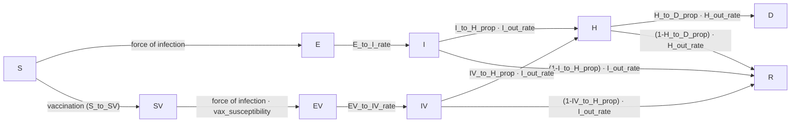

# MA_vax_standalone modeling methodology

Massachusetts, 2025–2026 influenza season. Age-structured SEIR model with a
parallel vaccinated arm, calibrated to daily hospital admissions via Bayesian
MCMC (`emcee`). This document describes the model in `MA_vax_standalone/model.py`, the
fitting procedure in `MA_vax_standalone/fit_bayesian.py`, and the calibrated parameters
from the run in `MA_vax_standalone/outputs_2026-07-30_age_ihr_scale_no_V_infec/`.

**Model version note:** this run uses `IV_relative_infectiousness = 1.0` —
i.e. breakthrough infections in vaccinated individuals (`IV`) are assumed
**equally as infectious** as unvaccinated infections (`I`), a change from an
earlier version of `model.py` that set this to 0.5 (half as infectious).
See §2.1 and §7 for how this changed the fit. An earlier calibration under
the old (0.5) assumption is preserved in
`MA_vax_standalone/outputs_2026-07-30_age_ihr_scale/` for comparison.

---

## 1. Model structure

### 1.1 Compartments

Nine compartments, each stratified by 7 age groups
(`0`, `1-4`, `5-12`, `13-17`, `18-49`, `50-64`, `65+`):

| Compartment | Meaning |
|---|---|
| `S`  | Susceptible, unvaccinated |
| `E`  | Exposed (latent), unvaccinated |
| `I`  | Infectious, unvaccinated |
| `R`  | Recovered/removed (either arm) |
| `SV` | Susceptible, vaccinated |
| `EV` | Exposed (latent), vaccinated |
| `IV` | Infectious, vaccinated |
| `H`  | Hospitalized (either arm) |
| `D`  | Dead (either arm) |

The vaccinated arm (`SV → EV → IV → H/R`) is a structural mirror of the
unvaccinated arm (`S → E → I → H/R`), with its own susceptibility and
severity parameters. `H`, `R`, and `D` are shared pooled compartments — once
someone is hospitalized (or recovers), the model no longer tracks their
vaccination history.

### 1.2 Compartment diagram



### 1.3 Force of infection

Contacts come from three fixed age×age matrices (`total_C`, `school_C`,
`work_C`, from `model_config_MA.json`, Mistry et al. 2021 synthetic contact
matrices). The *effective* contact matrix on day `t` removes school/work
contacts on days school/work is not in session (per
`MA_school_work_calendar.csv`):

```
C(t) = total_C − (1 − is_school(t))·school_C − (1 − is_work(t))·work_C
```

Transmission rate is modulated by absolute humidity (Shaman–Kohn-style
forcing — lower humidity → higher transmission) and by the fitted
time-varying multiplier `m(t)` (§3.3):

```
beta_adj(t) = beta_baseline · m(t) · (1 + humidity_impact · exp(−180 · humidity(t)))
```

The weighted infectious proportion (vaccinated and unvaccinated infectious
individuals are weighted by `I_relative_infectiousness`/
`IV_relative_infectiousness` respectively — currently equal, §2.1) feeds
through the contact matrix to give each age group's force of infection:

```
wtd_inf_prop(t) = (I·I_relative_infectiousness + IV·IV_relative_infectiousness) / population
foi(t) = beta_adj(t) · (C(t) @ wtd_inf_prop(t))          # shape (7,)

S_to_E  = foi(t) · relative_suscept        · S
SV_to_EV = foi(t) · vax_susceptibility     · SV
```

`vax_susceptibility` (age-specific, < 1) is the residual susceptibility of a
vaccinated individual — i.e. `1 − vax_susceptibility` is the model's implied
VE against infection.

### 1.4 Progression, hospitalization, and death

Standard linear (first-order) per-day rates, symmetric across the two arms
except where noted:

```
E_to_I  = E_to_I_rate · E                EV_to_IV = EV_to_IV_rate · EV
I_to_H  = I_out_rate · I_to_H_prop · I    IV_to_H  = I_out_rate · IV_to_H_prop · IV
I_to_R  = I_out_rate · (1−I_to_H_prop)·I  IV_to_R  = I_out_rate · (1−IV_to_H_prop)·IV
H_to_D  = H_out_rate · H_to_D_prop · H
H_to_R  = H_out_rate · (1−H_to_D_prop)·H
```

`IV_to_H_prop < I_to_H_prop` for every age group in the baseline parameters
— i.e. vaccination also reduces hospitalization risk *given* infection
(VE against severe disease), on top of reducing infection risk.

### 1.5 Vaccination flow

Daily vaccine doses (`MA_flu_daily_vaccinations_proportions_array.csv`, an
age-specific daily proportion) are shifted forward by
`vax_transfer_delay_days` (14 days, time from dose to effective immunity) and
applied as an exact `S → SV` count each day, capped so it can never exceed
the available `S`:

```
base(t) = S + SV                      # "susceptible" pool (default), or
        = total population            # "population" pool (alternate mode)
S_to_SV(t) = min(round(vax_prop(t) · base(t)), S)
```

Under the repo default (`vax_pool = "susceptible"`) the base is `S + SV` —
the whole not-yet-infected pool, vaccinated or not. Vaccinating someone moves
them from `S` to `SV` but keeps them in the base, so the base is *not* eroded
by vaccination itself; only infection (and the `min(…, S)` cap once `S` runs
low) shrinks it. A flat input proportion therefore vaccinates a roughly
constant head-count per day rather than a decaying one.

Note this is the pool the proportion is *applied to*, not the pool coverage
is *reported against*: §5 reports `sum(S_to_SV) / population`, and those
numbers come in below the raw schedule's cumulative sum because infection
depletes `S` before some doses can land.

This is a modeling choice, not a data property. The alternate `"population"`
mode uses the full age-group population as the base — including people
already infected or recovered, who cannot in fact be moved out of `S` — and
is available by flipping one line in `model.py`.

### 1.6 Numerical scheme

Deterministic: explicit Euler, one step per day (`_simulate_core`). A
separate stochastic variant (`_simulate_detailed_core`, chain-binomial, used
by the counterfactual/scenario tooling but not by the emcee fit itself)
supports finer sub-daily steps; the vaccination flow stays a deterministic
scheduled count in both variants since it comes from external delivery data
rather than a hazard rate.

### 1.7 Initial conditions

At `start_date` (2025-09-01), `S = population − E0_counts`, `E = E0_counts`
(age-specific seed counts fit via a single scalar `E0_scale` multiplier, §3),
and all other compartments are zero.

---

## 2. Fixed (non-fitted) input parameters

These are held at their default values throughout calibration — only
`beta_baseline`, `humidity_impact`, `E0_scale`, and `ihr_scale` (§3) are
free parameters.

### 2.1 Scalar parameters

| Parameter | Value | Meaning |
|---|---|---|
| `start_date` | 2025-09-01 | Simulation start |
| `num_days` | 250 | Simulation length (through ~2026-05-08) |
| `relative_suscept` | 1.0 | Susceptibility multiplier, unvaccinated arm |
| `I_relative_infectiousness` | 1.0 | Infectiousness weight, unvaccinated `I` |
| `IV_relative_infectiousness` | 1.0 | Infectiousness weight, vaccinated `IV` — breakthrough infections are equally as infectious as unvaccinated ones (changed from 0.5 in an earlier model version; see note at top of document) |
| `E_to_I_rate` | 0.5 /day | ≈2-day latent period |
| `EV_to_IV_rate` | 0.5 /day | Same, vaccinated arm |
| `I_out_rate` | 0.333 /day | ≈3-day infectious period |
| `H_out_rate` | 0.17 /day | ≈6-day hospital stay |
| `vax_transfer_delay_days` | 14 | Days from dose to modeled immunity |
| `vax_pool` | `"susceptible"` | Daily proportion applies to `S + SV` (not-yet-infected pool), not total population (§1.5) |

### 2.2 Age-stratified fixed parameters

| Age group | Population | `I_to_H_prop`¹ | `IV_to_H_prop`¹ | `H_to_D_prop` | `vax_susceptibility` | `E0_counts` |
|---|---:|---:|---:|---:|---:|---:|
| 0 | 70,067 | 0.00697 | 0.00636 | 0.0174 | 0.57 | 2 |
| 1-4 | 280,268 | 0.00697 | 0.00636 | 0.0174 | 0.57 | 8 |
| 5-12 | 606,291 | 0.00274 | 0.00250 | 0.0117 | 0.57 | 17 |
| 13-17 | 411,782 | 0.00274 | 0.00250 | 0.0117 | 0.57 | 12 |
| 18-49 | 2,978,204 | 0.00561 | 0.00511 | 0.0263 | 0.79 | 85 |
| 50-64 | 1,424,434 | 0.01060 | 0.00966 | 0.0630 | 0.79 | 41 |
| 65+ | 1,221,349 | 0.09091 | 0.06273 | 0.0799 | 1.00 | 35 |

¹ `I_to_H_prop`/`IV_to_H_prop` shown here are the **pre-fit baseline
values** — the calibration scales these by the fitted `ihr_scale` (§3–4),
so the values actually used in the calibrated model are these numbers ×
`ihr_scale` for that age group. `vax_susceptibility = 1.0` for 65+ means the
model assumes **no infection-blocking effect** of vaccination in that age
group (only the severity effect via `IV_to_H_prop < I_to_H_prop` applies).

Contact matrices (`total_C`, `school_C`, `work_C`, 7×7 by age group),
humidity time series, and the school/work calendar are treated as fixed,
externally-supplied inputs (see §6, Data sources).

---

## 3. Fitting method: `emcee` (affine-invariant ensemble MCMC)

### 3.1 What's being fit

The free parameters are:

| Parameter | Prior | Role |
|---|---|---|
| `beta_baseline` | Uniform(0.02, 0.06) | Baseline transmission rate |
| `humidity_impact` | Uniform(0, 1) | Strength of humidity forcing |
| `log10(E0_scale)` | Uniform(log10 0.2, log10 5) | Log-uniform multiplier on the initial `E0_counts` seed |
| `ihr_scale` (× 7, one per age group) | Uniform(0.1, 2.0) | Multiplies both `I_to_H_prop` and `IV_to_H_prop` for that age group |
| `dlogm_1 … dlogm_8` | N(0, τ=0.25) | Month-to-month increments of `log m(t)` (§3.3) |
| `phi` | Uniform(0.1, 100) | Negative-Binomial dispersion (likelihood nuisance parameter, not a model input) |

This particular run (`outputs_2026-07-30_age_ihr_scale_no_V_infec`) used
`--age-specific-ihr`, so `ihr_scale` is fit **per age group** (7 values)
rather than as one shared scalar — necessary because the likelihood is also
evaluated per age group (below), which otherwise barely constrains 7 extra
free dimensions if only the age-summed total were fit.

Total dimensionality: 3 (structural) + 7 (age-specific IHR) + 8 (monthly
m(t) increments) + 1 (phi) = 19 parameters (this run used monthly knots
Sep–Apr for 250 days, i.e. 9 knots / 8 increments).

### 3.2 Likelihood

Observed data: daily hospital admissions **by age group**
(`MA_flu_daily_hospitalizations.csv`), modeled with a Negative-Binomial
(NB2) observation model — chosen over Poisson to allow overdispersion
(variance > mean), common in surveillance count data:

```
mu = simulated new_H (per age group, per day)
Var(obs) = mu + mu² / phi              # phi → ∞ recovers Poisson

log L = Σ_{age, day} [ ln Γ(obs+φ) − ln Γ(φ) − ln Γ(obs+1)
                        + φ·(ln φ − ln(φ+μ))
                        + obs·(ln μ − ln(φ+μ)) ]
```

`gammaln` (log-gamma) is used rather than a factorial/binomial form because
the observed series is 7-day-smoothed and not integer-valued — the NB2
log-density above is well-defined for any non-negative real `obs`.

An optional per-day weight (`weights` column in the observed CSV, defaulting
to 1) rescales each day's log-likelihood contribution and is renormalized
to mean 1 — used to up-weight specific periods (e.g. the epidemic peak)
without changing the overall likelihood scale.

### 3.3 Time-varying transmission multiplier `m(t)`

Rather than assume constant transmission, `beta_baseline` is modulated by a
smoothly-varying `m(t) = exp(g(t))`, where `g` is a random walk anchored at
`g=0` on the first knot (the 1st of each simulated month) and
piecewise-linearly interpolated between knots:

```
g[k] = g[k-1] + dlogm_k          (g[0] = 0)
m(t) = exp(interp(t, knot_days, g))
```

This is the model's device for absorbing non-pharmaceutical / behavioral /
strain-related transmission changes the mechanistic model doesn't otherwise
capture (school breaks, holiday gatherings, etc.) without free-form
overfitting: the `N(0, τ)` prior on each increment is the only thing
preventing `m(t)` from tracking the data arbitrarily closely, so `τ`
(0.25 here) is the key smoothness/overfitting knob. This is **not** a
mechanistic term — it should be read as "how much transmission needs to
have moved, beyond what humidity/contacts explain, to reconcile the model
with the data," not as an independently-measured behavioral signal.

### 3.4 Posterior sampling and post-processing

- 32+ walkers (bumped automatically to `≥ 2×ndim + 2` — for this 19-dim
  fit, that's ≥40 walkers) run for up to 4000 steps via `emcee`'s
  affine-invariant ensemble sampler, in parallel worker processes.
- **Burn-in and thinning** are set from the integrated autocorrelation time
  (`emcee.get_autocorr_time`): burn-in = 3× the max per-parameter
  autocorrelation time (capped at half the chain), thinning = 0.5× the min.
- **Stuck-walker rejection**: after burn-in, walkers whose mean log-posterior
  sits more than 5 MADs below the ensemble median are dropped (a coarser
  75th-percentile fallback applies if that would drop more than a quarter
  of walkers) — guards against walkers trapped in a low-probability mode of
  a non-convex 19-dimensional posterior.
- **Point estimates**: two are reported for every parameter table this
  pipeline writes —
  - `"mean"`: posterior mean of each parameter, marginally. Cheap and
    stable, but for a correlated posterior can land on a parameter
    *combination* the sampler never actually visited (this is documented in
    the code and in `counterfactual_notebook.py` as a caveat — a mean-point
    run can peak noticeably higher than the data even when the posterior
    predictive median tracks it well).
  - `"best"`: the single posterior draw with the highest log-posterior
    (not the mean of anything) — preserves whatever correlation structure
    exists between parameters. This is what `counterfactual.py` /
    `run_counterfactual_tables.py` use by default, and what the coverage
    table in §5 below uses.

### 3.5 Assumptions and caveats

- The likelihood assumes the *deterministic* model trajectory is the true
  mean of a Negative-Binomial observation process — process noise (e.g.
  finite-population stochasticity in transmission) is not itself modeled;
  all variance is attributed to observation-level overdispersion (`phi`).
- Uniform priors on all structural parameters (except log-uniform on
  `E0_scale`) are essentially uninformative within their bounds — the
  bounds themselves (e.g. `ihr_scale ∈ [0.1, 2.0]`) encode the belief that
  the true IHR is within 10×–2× of the literature-based baseline, not a
  belief about where in that range it falls.
- `m(t)`'s random-walk prior is a smoothness assumption, not a mechanistic
  one (§3.3) — it should not be over-interpreted as a measured behavioral
  or immunological signal.
- Contact matrices, humidity forcing functional form
  (`exp(-180·humidity)`), and the school/work calendar are all held fixed
  and unfit — model fit quality is conditional on those being correctly
  specified.
- A companion `pyabc` (ABC-SMC, likelihood-free, weighted-RMSE distance) fit
  is available in the same pipeline as a cross-check (see `fit_bayesian.py`);
  the `outputs_2026-07-30_age_ihr_scale_no_V_infec` run only performed the
  `emcee` fit, so no `pyabc` comparison files exist for this particular
  calibration (unlike the earlier `outputs_2026-07-30_age_ihr_scale` run,
  which has both).

---

## 4. Fitted parameters (`emcee`, run `outputs_2026-07-30_age_ihr_scale_no_V_infec`)

Posterior mean ± 90% credible interval (5th–95th percentile), from
`fit_summary_emcee.csv`:

| Parameter | Mean | 5% | 95% |
|---|---:|---:|---:|
| `beta_baseline` | 0.0223 | 0.0205 | 0.0246 |
| `humidity_impact` | 0.202 | 0.017 | 0.416 |
| `E0_scale`¹ | 2.97 | 1.42 | 4.78 |
| `ihr_scale` — 0 | 0.89 | 0.53 | 1.27 |
| `ihr_scale` — 1-4 | 1.10 | 0.67 | 1.53 |
| `ihr_scale` — 5-12 | 0.65 | 0.42 | 0.87 |
| `ihr_scale` — 13-17 | 0.49 | 0.29 | 0.70 |
| `ihr_scale` — 18-49 | 0.34 | 0.21 | 0.47 |
| `ihr_scale` — 50-64 | 0.50 | 0.31 | 0.69 |
| `ihr_scale` — 65+ | 0.69 | 0.42 | 0.95 |
| `phi` (NB dispersion) | 33.9 | 26.1 | 43.5 |

¹ `E0_scale = 10^(log10_E0_scale)`; the raw fit reports
`log10_E0_scale = 0.473 [0.153, 0.679]`, converted here for readability.

The 8 monthly `dlogm_1…dlogm_8` increments are summarized visually as
`m(t)` in §4.1 below rather than as a table (their individual values are
not independently interpretable — only the resulting `m(t)` curve is).

**Highest-posterior-support ("best") point** — a single sampled parameter
vector, used by the counterfactual/scenario tooling and by the coverage
table in §5 (`fit_parameters_best_emcee.csv`):

| Parameter | Value |
|---|---:|
| `beta_baseline` | 0.0210 |
| `humidity_impact` | 0.410 |
| `E0_scale` | 1.57 |
| `phi` | 38.7 |
| `ihr_scale` — 0 | 1.12 |
| `ihr_scale` — 1-4 | 1.18 |
| `ihr_scale` — 5-12 | 0.75 |
| `ihr_scale` — 13-17 | 0.52 |
| `ihr_scale` — 18-49 | 0.37 |
| `ihr_scale` — 50-64 | 0.52 |
| `ihr_scale` — 65+ | 0.77 |

Note the "best" point's `beta_baseline`/`humidity_impact`/`E0_scale` differ
noticeably from the posterior means above — expected given the correlation
caveat in §3.4 (e.g. `humidity_impact` and `beta_baseline` trade off against
each other, so the marginal mean of each needn't correspond to a jointly
plausible combination).

### 4.1 Fitted time-varying transmission multiplier m(t)

Posterior-mean `m(t)` curve (`fit_beta_multiplier_emcee.csv`):


Under this model version, `m(t)` stays **at or above 1.0 for essentially
the whole season** — rising from 1.0 through September into a first local
peak (~1.57) around Oct 1, easing back to ~1.29 by Nov 1, then climbing
sharply through November to a sharp peak of ~2.75 around Dec 1 (the main
epidemic wave), falling back through December–January to a February trough
near 1.0, and then climbing again through March–April to a second,
broader elevated plateau (~1.6–1.8) that holds (via `np.interp` clamping
past the last knot) through the end of the simulation. This is a
substantially different shape from the earlier (`IV_relative_infectiousness
= 0.5`) run's `m(t)`, which dipped *below* 1 for the first two months and
peaked lower (~1.7) — see §7 for why.

Only `fit_posterior_predictive.png` (overall fit quality) is available for
this run — no `fit_beta_multiplier.png` (m(t) uncertainty band), no
`fit_posterior_predictive_by_age.png`, and no `fit_corner_emcee.png` (full
pairwise posterior correlations), since this folder only contains the
core `emcee` summary/parameter/multiplier CSVs plus the posterior-predictive
figure. For those diagnostics under the earlier assumption, see
`outputs_2026-07-30_age_ihr_scale/`.

---

## 5. Cumulative vaccination coverage

Cumulative proportion of each age group vaccinated over the season
(`sum(S_to_SV) / population`), computed from the calibrated baseline run
(`fit_folder=outputs_2026-07-30_age_ihr_scale_no_V_infec`, `method=emcee`,
`point=best` — the same base inputs `counterfactual_notebook.py` uses by
default):

| Age group | Population | Baseline cumulative coverage |
|---|---:|---:|
| 0 | 70,067 | 44.7% |
| 1-4 | 280,268 | 89.4% |
| 5-12 | 606,291 | 69.2% |
| 13-17 | 411,782 | 53.9% |
| 18-49 | 2,978,204 | 38.6% |
| 50-64 | 1,424,434 | 57.9% |
| 65+ | 1,221,349 | 71.0% |
| **All (population-weighted)** | **6,992,395** | **53.8%** |

(Essentially unchanged from the earlier `IV_relative_infectiousness=0.5`
run's coverage — vaccination scheduling itself doesn't depend on
`IV_relative_infectiousness`; the tiny shifts come only from the slightly
different epidemic trajectory changing how much `S` has been depleted by
infection when each day's dose is scheduled, under the `vax_pool =
"susceptible"` capping rule, §1.5.)

Coverage under the fitted 2025-2026 schedule spans a wide range: five of the
seven age groups sit below the 70% target — 18-49 lowest at 38.6%, then 0
(44.7%), 13-17 (53.9%), 50-64 (57.9%) and 5-12 (69.2%) — while **1-4 (89.4%)
is well above it and 65+ (71.0%) is already at it**.

This matters for how `counterfactual_notebook.py`'s Table S.A.3/S.A.6 "scale
to 70% coverage" rows should be read. `coverage_multiplier_for_target`
(`counterfactual.py`) bisects to *exactly* 0.70 and is not floored at 1.0, so
the multiplier it returns is below 1 for any group already above target:

- For the five groups below 70%, the scenario does what its name suggests —
  it closes a real coverage gap (the largest, 18-49, needs roughly a 2x
  multiplier), and those rows are the ones driving the large averted-
  hospitalization totals.
- For **1-4** the scenario *reduces* vaccination (multiplier ≈ 0.8), so its
  row measures the harm of cutting uptake to 70%, not a benefit — expect the
  sign to be opposite to the other rows.
- For **65+** the multiplier is ≈ 1.0, so its row is close to a no-op and
  should not be read as evidence that vaccinating the elderly does little.

If the intent is "raise every group to at least 70%, leave the rest alone",
`coverage_70pct_scenario` needs a `max(mult, 1.0)` floor; as written it
targets 70% in both directions.

Note also that these numbers are not a simple read of the raw input schedule:
under `vax_pool="susceptible"` (§1.5) each day's dose count is taken against
`S + SV`, but is then capped at whatever remains in `S`, so doses scheduled
after infection has drawn down `S` are partly lost. That is why the realized
coverage here sits below the cumulative sum of the input proportions.

---

## 6. Data sources

| Input | Source |
|---|---|
| Age-specific vaccination coverage | [midas-network/flu-scenario-modeling-hub_resources](https://github.com/midas-network/flu-scenario-modeling-hub_resources/blob/main/Rd6_datasets/Age_Specific_Coverage_Flu_RD1_2025_26_Sc_A_B.csv) |
| Hospital admissions (calibration target) | [midas-network/flu-scenario-modeling-hub](https://github.com/midas-network/flu-scenario-modeling-hub/blob/main/target-data/time-series.csv) |
| Population by age group | US Census (`tidycensus`), via `generic_core/examples/massachusetts_vax/data/clt_get_population.R` |
| Contact matrices | Mistry et al. 2021 synthetic contact matrices, via `generic_core/examples/massachusetts_vax/data/download_contact_matrices.py` (epydemix-data) |
| Absolute humidity | gridMET daily specific-humidity NetCDFs, MA-averaged, via `generic_core/examples/massachusetts_vax/data/extract_ma_humidity.py` |
| School/work calendar | `MA_school_work_calendar.csv` (not separately sourced here) |

---

## 7. Things to flag when presenting this

- **Setting `IV_relative_infectiousness = 1.0` (breakthrough infections as
  transmissible as unvaccinated ones) moved the fit substantially**, not
  just the m(t) curve's shape (§4.1): posterior-mean `beta_baseline` dropped
  from 0.0348 to 0.0223 (removing the vaccinated-arm infectiousness discount
  effectively adds transmission, so a lower baseline is needed to match the
  same hospitalization data) and every `ihr_scale` shifted down by a
  similar factor (e.g. 18-49: 0.58 → 0.34). This is expected — `beta_baseline`,
  `ihr_scale`, and `IV_relative_infectiousness` all trade off against each
  other in fitting the same hospitalization curve — but it means the two
  runs' fitted parameters are **not directly comparable in isolation**; only
  full-model outputs (posterior predictive hospitalizations, `m(t)` — which
  itself also shifted markedly, §4.1) should be compared between them.
- **`ihr_scale` is doing a lot of work and correlates with age-specific
  severity assumptions.** Several age groups' fitted `ihr_scale` sit well
  away from 1 (1-4: ~1.7×, 18-49: ~0.58×) — this could reflect genuine
  age-specific mis-calibration in the literature-based baseline IHRs, or it
  could be compensating for some other age-specific model misspecification
  (e.g. contact-matrix structure, reporting differences by age). Worth a
  sensitivity check before treating these as literal severity corrections.
- **VE sensitivity scenarios (`VE_SCENARIOS` in `counterfactual.py`) are
  explicitly flagged in the code as placeholder-ish** — worth stating
  plainly if this methodology doc accompanies counterfactual tables, since
  a naive uniform VE scale can push `IV_to_H_prop` above `I_to_H_prop` for
  some age groups under `low_ve` (i.e., implies *negative* severity VE).
- **The posterior mean vs. "best" (MAP) point can disagree materially**
  (§4) — any downstream report should say clearly which point estimate was
  used, since the two can imply different epidemic peak timing/height.
- **This is a deterministic-calibration + separately-stochastic-scenario
  pipeline.** The `emcee` fit itself always runs the deterministic model;
  stochastic (chain-binomial) replications only enter downstream, in the
  counterfactual/scenario tooling, for uncertainty bands on *scenario
  comparisons* — not for the calibration itself.
- **`m(t)` is a statistical smoothing device, not a mechanistic term** —
  worth restating in any presentation of §3.3/§4.1 so it isn't read as an
  independently-estimated behavioral signal.
