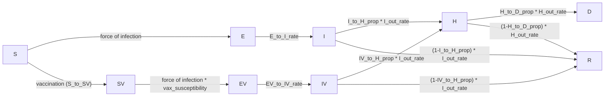
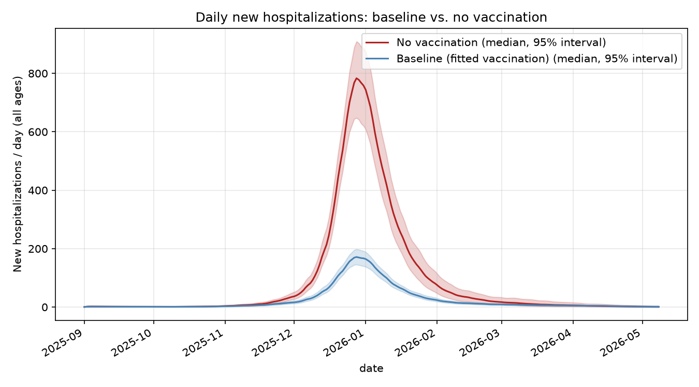
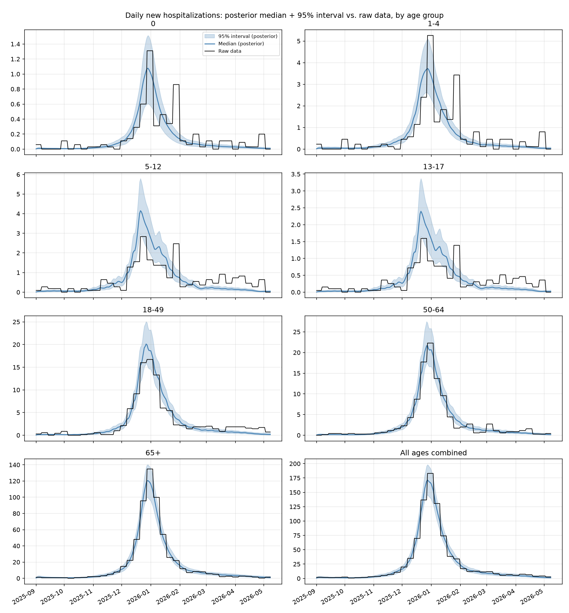
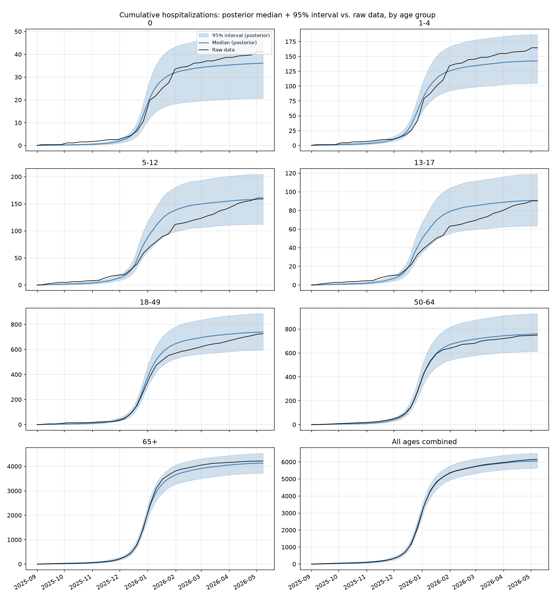
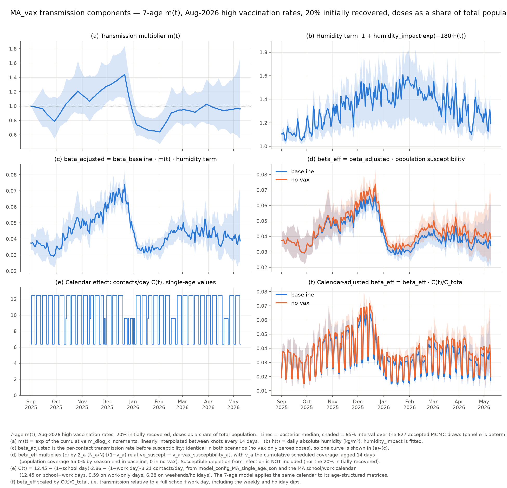

# MA_vax, Aug-2026 high vaccination rates with 20% initially recovered: vaccination-impact report

Massachusetts, 2025–2026 influenza season. Age-structured SEIR model with a
parallel vaccinated arm, calibrated to daily hospital admissions by age
group via Bayesian MCMC. This report documents the model, the fit, and the
resulting vaccination-impact analysis for the variant that starts the season
with **20% of every age group already recovered (immune)**, run with the
archived August-2026 ("OLD high vax") vaccination schedule, in which each
day's scheduled doses are a proportion of the **total population** of the age
group, all delivered to people still in `S` (§1.4).

Compared with the earlier high-vax fit (`model_config_2026-08-high-vax-rates.json`,
reported in `../report.md`), the compartments, transitions, fixed parameters,
contact matrices, humidity and calendar inputs, vaccination schedule, fit
targets and priors are unchanged. Two things differ: the 20% initial `R`, and
the dose rule above. A companion run with 20% initial `R` but the original dose
rule (doses as a proportion of `S + SV`, `report_MA_vax_old_vax_initial_R_20pct.md`) delivered only
~77% of the scheduled doses. This run delivers 97.5%, close to the
main MA_vax scenario. The calibration was re-run from scratch; §7 compares all three.

Files: `model_config_MA_vax_old_vax_initial_R_20pct_vax_total_pop.json`, `fit_config_MA_vax_old_vax_initial_R_20pct.json` (shared with the companion run),
`fitted_params_MA_vax_old_vax_initial_R_20pct_vax_total_pop.json`,
`run_simulations_MA_vax_old_vax_initial_R_20pct_vax_total_pop_param_set_stochastic.py`, and the outputs listed in §8.

---

## 1. Model structure

### 1.1 Compartments

Nine compartments, each stratified by 7 age groups
(`0`, `1-4`, `5-12`, `13-17`, `18-49`, `50-64`, `65+`):

| Compartment | Meaning |
|---|---|
| `S`  | Susceptible, unvaccinated |
| `E`  | Exposed (latent), unvaccinated |
| `I`  | Infectious, unvaccinated |
| `R`  | Recovered/removed (either arm) |
| `SV` | Susceptible, vaccinated |
| `EV` | Exposed (latent), vaccinated |
| `IV` | Infectious, vaccinated |
| `H`  | Hospitalized (either arm) |
| `D`  | Dead (either arm) |

The vaccinated arm (`SV → EV → IV → H/R`) mirrors the unvaccinated arm
(`S → E → I → H/R`), with its own susceptibility and severity parameters.
`H`, `R`, `D` are shared, pooled compartments — once hospitalized (or
recovered), an individual's vaccination history is no longer tracked.



### 1.2 Force of infection

Contacts come from fixed age×age contact matrices (Mistry et al. 2021
synthetic contact matrices), with school/work contacts removed on
non-school/work days:

```
C(t) = total_C − (1 − is_school(t))·school_C − (1 − is_work(t))·work_C
beta_adj(t) = beta_baseline · m(t) · (1 + humidity_impact · exp(−180 · humidity(t)))
wtd_inf_prop(t) = (I·I_relative_infectiousness + IV·IV_relative_infectiousness) / population
foi(t) = beta_adj(t) · (C(t) @ wtd_inf_prop(t))
S_to_E   = foi(t) · relative_suscept   · S
SV_to_EV = foi(t) · vax_susceptibility · SV
```

`m(t)` is a smoothly time-varying transmission multiplier (§2.3) that
absorbs behavioral/seasonal variation the mechanistic terms above don't
otherwise capture. `IV_relative_infectiousness = 1.0` — breakthrough
infections (in vaccinated individuals) are assumed exactly as transmissible
as unvaccinated infections. `vax_susceptibility` (age-specific, ≤ 1) is the
residual susceptibility of a vaccinated individual; `1 − vax_susceptibility`
is the model's implied vaccine effectiveness (VE) against infection.

### 1.3 Progression, hospitalization, death

```
E_to_I  = E_to_I_rate · E                 EV_to_IV = EV_to_IV_rate · EV
I_to_H  = I_out_rate · I_to_H_prop · I     IV_to_H  = I_out_rate · IV_to_H_prop · IV
I_to_R  = I_out_rate · (1−I_to_H_prop)·I   IV_to_R  = I_out_rate · (1−IV_to_H_prop)·IV
H_to_D  = H_out_rate · H_to_D_prop · H
H_to_R  = H_out_rate · (1−H_to_D_prop)·H
```

`IV_to_H_prop < I_to_H_prop` for every age group — vaccination reduces
hospitalization risk *given* infection (severity VE), on top of reducing
infection risk.

### 1.4 Vaccination flow

Daily doses (an age-specific proportion of the population, with a 14-day
delay between dose and effective immunity) are applied as an exact `S → SV`
count each day, capped at whatever remains in `S`:

```
base(t) = S + SV
S_to_SV(t) = min(round(vax_prop(t) · base(t)), S)
```

The base pool (`S + SV`) is not eroded by vaccination itself — only
infection depletes it — so a roughly flat input proportion vaccinates a
roughly constant head-count per day, until `S` starts running low late in
the season.

**Dose rule in this run (`dose_pool = "total_population"`).** The base pool
above is replaced by the whole age group:

```
S_to_SV(t) = min(round(vax_prop(t) · N), S)      N = S + E + I + R + SV + EV + IV + H + D
```

With the default pool (`S + SV`), the 20% seeded into `R` would shrink every
day's dose count by about a fifth. Here the full scheduled count is given, and all of it goes to
people still in `S`, i.e. vaccination effectively targets the
non-immune. Scheduled coverage is therefore reached as a share of the whole
age group, as in the main MA_vax scenario, and the cap only binds where the
schedule asks for more doses than there are susceptibles left (1-4, scheduled
at 90.7% coverage with only 80% of the group starting in `S`; see the
dose-accounting appendix).

### 1.5 Numerical scheme

Explicit Euler integration with 7 sub-steps per day. The calibration and
every simulation in this report use deterministic transitions (§3). The
outflow groups from `I`, `IV` and `H` are declared as `multinom` groups in
this config (vs. `multinom_deterministic` in the earlier config). That label
is informational only: at run time every group uses the simulation-wide
transition type, and the two configs give bit-identical trajectories.
Vaccination is a deterministic scheduled count in all cases.

### 1.6 Initial conditions

At the start of the simulation (2025-09-01): `R = 20%` of each age group's
population (prior immunity, 1,398,479 people in total, 20% of the state),
`E = E0` (age-specific seed counts, scaled by a single fitted multiplier,
§2.3), `S = population − E0 − R0`, and all other compartments start at zero.

---

## 2. Parameters

### 2.1 Fixed scalar parameters

| Parameter | Value | Meaning |
|---|---|---|
| `num_days` | 250 | Simulation length (2025-09-01 through 2026-05-08) |
| `relative_suscept` | 1.0 | Susceptibility multiplier, unvaccinated arm |
| `I_relative_infectiousness` | 1.0 | Infectiousness weight, unvaccinated `I` |
| `IV_relative_infectiousness` | 1.0 | Infectiousness weight, vaccinated `IV` |
| `E_to_I_rate` | 0.5 /day | ~2-day latent period |
| `EV_to_IV_rate` | 0.5 /day | Same, vaccinated arm |
| `I_out_rate` | 0.333 /day | ~3-day infectious period |
| `H_out_rate` | 0.17 /day | ~6-day hospital stay |
| `vax_transfer_delay_days` | 14 | Days from dose to modeled immunity |

### 2.2 Age-stratified fixed parameters

| Age group | Population | Hospitalization risk, given infection¹ | Hospitalization risk, given breakthrough infection¹ | Death risk, given hospitalization | Residual susceptibility if vaccinated | Initial infections seeded (E)¹ | Initially recovered (R) |
|---|---:|---:|---:|---:|---:|---:|---:|
| 0 | 70,067 | 0.697% | 0.636% | 1.74% | 0.57 | 2 | 14,013 (20%) |
| 1-4 | 280,268 | 0.697% | 0.636% | 1.74% | 0.57 | 8 | 56,054 (20%) |
| 5-12 | 606,291 | 0.274% | 0.250% | 1.17% | 0.57 | 17 | 121,258 (20%) |
| 13-17 | 411,782 | 0.274% | 0.250% | 1.17% | 0.57 | 12 | 82,356 (20%) |
| 18-49 | 2,978,204 | 0.561% | 0.511% | 2.63% | 0.79 | 85 | 595,641 (20%) |
| 50-64 | 1,424,434 | 1.060% | 0.966% | 6.30% | 0.79 | 41 | 284,887 (20%) |
| 65+ | 1,221,349 | 9.091% | 6.273% | 7.99% | 1.00 | 35 | 244,270 (20%) |

¹ These are pre-fit baseline values. The calibration scales both
hospitalization-risk columns by a fitted age-specific multiplier (§2.3), and
the seed counts by a single multiplier, so the values actually used are
these figures × those multipliers. The ratio of the two hospitalization-risk
columns, i.e. vaccine effectiveness against hospitalization given infection,
is unchanged by the scaling. A residual susceptibility of 1.00 for 65+ means
the fitted baseline assumes **no infection-blocking effect** of vaccination
in that age group (only the severity effect applies there).

### 2.3 Fitting method

Free parameters were estimated with an affine-invariant ensemble Markov
Chain Monte Carlo sampler (emcee; 4000 iterations per walker, 58 walkers — the
fitter raises the configured 40 to twice the 29 sampled dimensions), run in
parallel. The free parameters and their priors:

| Parameter | Prior | Role |
|---|---|---|
| `beta_baseline` | Uniform(0.015, 0.06) | Baseline transmission rate |
| `humidity_impact` | Uniform(1e-08, 1.0) | Strength of humidity forcing |
| Initial-seed multiplier | Log-uniform(0.1, 10.0) | Multiplies the age-specific initial-infection seed counts |
| Hospitalization-risk multiplier (× 7, one per age group) | Uniform(0.1, 2.0) | Multiplies both hospitalization-risk columns (§2.2) for that age group |
| `m(t)` log-increments (× 18, one per 14-day knot) | Normal(0, 0.25) | Random-walk steps in log-transmission (§1.2) |
| `phi` | — | Negative-Binomial dispersion (likelihood nuisance parameter, not a model input) |

**Likelihood**: a Negative-Binomial (NB2) observation model jointly across
8 targets — daily hospital admissions **by age group** (7 time series) plus a
single scalar **end-of-season cumulative hospitalizations by age** target.
The vaccination schedule used during the fit is the archived "OLD high vax"
schedule, the same one the simulations use.

**Posterior sampling**: the first 1700 iterations were discarded as
burn-in, and the remaining chain thinned to every 200th sample, leaving
627 posterior draws (no walkers dropped). Two point estimates are reported:
the **posterior mean** (marginal mean of each parameter) and the **"best"
point** (the single draw with the highest log-posterior, which keeps the
correlation between parameters).

### 2.4 Fitted parameters

Posterior mean and 90% credible interval (5th–95th percentile) across the 627
posterior draws, the "best" point, and for reference the posterior means of
the companion 20% run with doses as a share of `S + SV`, and of the earlier
high-vax fit (no initial immunity):

| Parameter | Posterior mean | 5% | 95% | "Best" point | 20% R, doses of S + SV: posterior mean | No initial immunity: posterior mean |
|---|---:|---:|---:|---:|---:|---:|
| `beta_baseline` | 0.0342 | 0.0305 | 0.0384 | 0.0323 | 0.0391 | 0.0367 |
| `humidity_impact` | 0.685 | 0.348 | 0.957 | 0.523 | 0.621 | 0.595 |
| Initial-seed multiplier | 3.18 | 1.19 | 6.04 | 5.39 | 2.33 | 1.80 |
| `phi` (NB dispersion) | 95 | 22 | 295 | 88 | 128 | 116 |
| Hospitalization-risk multiplier — 0 | 1.46 | 0.95 | 1.94 | 1.37 | 1.57 | 1.45 |
| Hospitalization-risk multiplier — 1-4 | 1.68 | 1.28 | 1.96 | 1.62 | 1.65 | 1.63 |
| Hospitalization-risk multiplier — 5-12 | 1.39 | 0.94 | 1.83 | 1.07 | 1.35 | 1.31 |
| Hospitalization-risk multiplier — 13-17 | 1.01 | 0.69 | 1.40 | 0.90 | 0.97 | 0.96 |
| Hospitalization-risk multiplier — 18-49 | 0.51 | 0.37 | 0.68 | 0.45 | 0.54 | 0.52 |
| Hospitalization-risk multiplier — 50-64 | 0.70 | 0.50 | 0.96 | 0.52 | 0.73 | 0.70 |
| Hospitalization-risk multiplier — 65+ | 0.94 | 0.69 | 1.23 | 0.80 | 0.95 | 0.93 |

With every scheduled dose landing on a susceptible, 68% of those who
start in `S` end up vaccinated (vs. 54% with the `S + SV` rule), so
vaccination suppresses much more transmission in the fitted baseline. To
reproduce the same observed admissions, the fit infers stronger
transmission, but through `m(t)` and the initial seed rather than
`beta_baseline`. `beta_baseline` is actually lower (0.0342 vs.
0.0391), while the seed multiplier rises to 3.18. The
season-average median `m(t)` is 0.98 (vs. 0.88), and the peak of
`beta_adjusted` is 0.0738 (vs. 0.0690); see §6. The
hospitalization-risk multipliers barely move (all within
0.11 of the other two fits), because the admissions they are fitted to are
the same.

### 2.5 Cumulative vaccination coverage

Cumulative proportion of each age group vaccinated over the season,
according to the vaccination schedule (summed over the 250-day window):

| Age group | Population | Cumulative coverage (scheduled) |
|---|---:|---:|
| 0 | 70,067 | 45.4% |
| 1-4 | 280,268 | 90.7% |
| 5-12 | 606,291 | 71.4% |
| 13-17 | 411,782 | 55.3% |
| 18-49 | 2,978,204 | 40.5% |
| 50-64 | 1,424,434 | 60.4% |
| 65+ | 1,221,349 | 73.2% |
| **All (population-weighted)** | **6,992,395** | **55.9%** |

Four groups sit below a 70% mark (0, 13-17, 18-49, 50-64); 1-4, 5-12, 65+ are above it.
This matters for the "scale to 70% coverage" rows in the appendix (Tables S.A.3/S.A.6):
only the four groups below the mark are scaled up.

The model delivers 54.5% coverage overall vs. 55.9% scheduled
(2.5% of scheduled doses not delivered, vs. 3.3% in the earlier fit
and 22.9% in the `S + SV`-pool 20% run). Most of the remaining gap is 1-4, whose
90.7% schedule exceeds the 80% of the group that starts in `S`
(79.1% delivered). Every "per 100,000 doses"
panel divides by the **scheduled** count (see the appendix).

---

## 3. Vaccination-impact results

Every table in this section reports a **median and 95% interval across 627
simulations**: one deterministic simulation per posterior parameter draw
(§2.3), re-using the same draw for every scenario compared within a table so
that the comparison is paired. The intervals reflect **calibration
uncertainty**, not epidemic-process noise.

### New daily hospitalizations: baseline vs. no vaccination

Total-population new hospitalizations per day, posterior median and 95%
interval across the 627 parameter draws:



The fitted vaccination program cuts the peak in daily new hospitalizations
to under a third of what it would otherwise be (median peak ≈ 171/day
baseline vs. ≈ 783/day with no vaccination, both on 2025-12-28), and
the season total from a median of 22,761 to 6,054 admissions.
It reduces the epidemic's height without changing its timing.

### Table S.A.1 — Hospitalizations averted, infection vs. severity protection

Decomposes the total hospitalizations averted by vaccination into two
channels: protection against getting infected at all, and — *given* a
breakthrough infection still happens — protection against that infection
becoming severe enough to need hospitalization.

**Infection protection** (no vaccination → infection-protection-only, i.e. VE against infection retained but VE against severity zeroed out)

| Age group | Hospitalizations Averted | % Hospitalizations Averted | Averted per 100,000 Population | Averted per 100,000 Doses |
|---|---|---|---|---|
| 0 | 101 [61 – 132] | 73.1% [68.5% – 76.4%] | 143.7 [86.9 – 188.5] | 317.0 [191.5 – 415.5] |
| 1-4 | 581 [445 – 689] | 79.1% [75.2% – 81.8%] | 207.3 [158.9 – 245.8] | 228.6 [175.2 – 271.0] |
| 5-12 | 525 [346 – 679] | 75.8% [70.9% – 79.1%] | 86.6 [57.0 – 112.0] | 121.2 [79.8 – 156.8] |
| 13-17 | 250 [164 – 357] | 72.7% [67.3% – 76.4%] | 60.7 [39.9 – 86.7] | 109.7 [72.2 – 156.8] |
| 18-49 | 1,542 [1,146 – 2,006] | 67.1% [61.0% – 71.2%] | 51.8 [38.5 – 67.4] | 127.7 [94.9 – 166.2] |
| 50-64 | 1,762 [1,295 – 2,342] | 68.9% [63.3% – 72.7%] | 123.7 [90.9 – 164.4] | 204.9 [150.6 – 272.4] |
| 65+ | 10,601 [8,156 – 12,935] | 66.5% [61.0% – 70.3%] | 868.0 [667.8 – 1059.1] | 1185.7 [912.2 – 1446.7] |
| **All** | **15,370 [12,126 – 18,459]** | **67.7% [62.1% – 71.4%]** | **219.8 [173.4 – 264.0]** | **393.3 [310.3 – 472.4]** |

**Severity protection** (infection-protection-only → full baseline, i.e. adding back VE against severity)

| Age group | Hospitalizations Averted | % Hospitalizations Averted | Averted per 100,000 Population | Averted per 100,000 Doses |
|---|---|---|---|---|
| 0 | 1 [1 – 1] | 0.7% [0.7% – 0.9%] | 1.5 [0.8 – 2.0] | 3.2 [1.9 – 4.4] |
| 1-4 | 11 [8 – 14] | 1.5% [1.3% – 1.7%] | 3.8 [2.8 – 5.0] | 4.2 [3.1 – 5.5] |
| 5-12 | 8 [6 – 10] | 1.2% [1.0% – 1.4%] | 1.3 [1.0 – 1.7] | 1.9 [1.3 – 2.4] |
| 13-17 | 4 [2 – 5] | 1.0% [0.9% – 1.2%] | 0.9 [0.6 – 1.1] | 1.5 [1.1 – 2.1] |
| 18-49 | 22 [17 – 26] | 0.9% [0.8% – 1.1%] | 0.7 [0.6 – 0.9] | 1.8 [1.4 – 2.2] |
| 50-64 | 36 [29 – 44] | 1.4% [1.2% – 1.7%] | 2.5 [2.1 – 3.1] | 4.2 [3.4 – 5.2] |
| 65+ | 1,208 [1,089 – 1,329] | 7.6% [6.7% – 8.9%] | 98.9 [89.2 – 108.8] | 135.1 [121.8 – 148.7] |
| **All** | **1,289 [1,172 – 1,410]** | **5.7% [5.0% – 6.6%]** | **18.4 [16.8 – 20.2]** | **33.0 [30.0 – 36.1]** |

**Total** (no vaccination → full baseline)

| Age group | Hospitalizations Averted | % Hospitalizations Averted | Averted per 100,000 Population | Averted per 100,000 Doses |
|---|---|---|---|---|
| 0 | 102 [61 – 133] | 73.9% [69.4% – 77.0%] | 145.2 [87.8 – 190.2] | 320.2 [193.5 – 419.5] |
| 1-4 | 591 [454 – 703] | 80.6% [76.9% – 83.1%] | 210.9 [161.9 – 250.7] | 232.6 [178.4 – 276.4] |
| 5-12 | 534 [351 – 689] | 77.0% [72.4% – 80.2%] | 88.0 [57.9 – 113.7] | 123.2 [81.1 – 159.1] |
| 13-17 | 253 [167 – 362] | 73.7% [68.5% – 77.3%] | 61.5 [40.5 – 87.9] | 111.1 [73.3 – 159.0] |
| 18-49 | 1,563 [1,165 – 2,031] | 68.0% [62.1% – 72.0%] | 52.5 [39.1 – 68.2] | 129.5 [96.6 – 168.3] |
| 50-64 | 1,799 [1,328 – 2,381] | 70.3% [65.0% – 74.0%] | 126.3 [93.3 – 167.2] | 209.3 [154.5 – 277.0] |
| 65+ | 11,835 [9,253 – 14,223] | 74.1% [69.8% – 77.1%] | 969.0 [757.6 – 1164.5] | 1323.7 [1034.9 – 1590.7] |
| **All** | **16,663 [13,378 – 19,732]** | **73.3% [68.7% – 76.4%]** | **238.3 [191.3 – 282.2]** | **426.4 [342.4 – 505.0]** |

As in the earlier fit, almost all of the averted burden comes from
**blocking infection** (15,370 [12,126 – 18,459] of 16,663 [13,378 – 19,732]), not from
reducing severity given a breakthrough (1,289 [1,172 – 1,410], nearly all in 65+).
The total is larger than in both other runs (13,584 [10,817 – 15,997] with no
initial immunity, 12,284 [9,539 – 14,405] with the `S + SV` rule), and so is the
per-dose figure (426.4 [342.4 – 505.0] per 100,000 scheduled doses, vs.
347.6 [276.8 – 409.4] and 314.4 [244.1 – 368.6]). Every dose now reaches a susceptible,
and the fitted counterfactual epidemic is larger (§2.4), so there is more to avert.

### Table S.A.2 — Hospitalizations averted by age group vaccinated

Each column vaccinates a single age group only (all others left
unvaccinated) and compares to no vaccination at all; "All" is the full
baseline schedule. Rows are the age group in which hospitalizations are
counted, so off-diagonal cells show the indirect (transmission-blocking)
benefit to *other* age groups from vaccinating this one.

**Hospitalizations averted (count)**

| Age group (counted) | 0 vaccinated | 1-4 vaccinated | 5-12 vaccinated | 13-17 vaccinated | 18-49 vaccinated | 50-64 vaccinated | 65+ vaccinated | All vaccinated |
|---|---|---|---|---|---|---|---|---|
| 0 | 28 [17 – 37] | 12 [7 – 16] | 34 [20 – 45] | 19 [11 – 26] | 26 [15 – 34] | 12 [7 – 16] | 0 [0 – 0] | 102 [61 – 133] |
| 1-4 | 4 [3 – 4] | 332 [255 – 395] | 192 [141 – 223] | 97 [70 – 114] | 125 [91 – 146] | 61 [44 – 71] | 0 [0 – 0] | 591 [454 – 703] |
| 5-12 | 2 [2 – 3] | 48 [29 – 64] | 352 [231 – 457] | 86 [52 – 117] | 95 [58 – 130] | 48 [29 – 65] | 0 [0 – 0] | 534 [351 – 689] |
| 13-17 | 1 [1 – 2] | 19 [12 – 28] | 71 [44 – 104] | 134 [88 – 191] | 47 [29 – 70] | 25 [16 – 37] | 0 [0 – 0] | 253 [167 – 362] |
| 18-49 | 10 [7 – 13] | 160 [112 – 218] | 501 [350 – 683] | 306 [212 – 420] | 578 [421 – 764] | 208 [146 – 284] | 0 [0 – 0] | 1,563 [1,165 – 2,031] |
| 50-64 | 10 [7 – 14] | 168 [117 – 232] | 551 [384 – 766] | 352 [244 – 487] | 439 [309 – 611] | 612 [452 – 813] | 0 [0 – 0] | 1,799 [1,328 – 2,381] |
| 65+ | 71 [52 – 90] | 1,187 [869 – 1,519] | 3,780 [2,757 – 4,820] | 2,361 [1,709 – 3,025] | 2,880 [2,107 – 3,678] | 1,725 [1,275 – 2,195] | 3,654 [2,998 – 4,271] | 11,835 [9,253 – 14,223] |
| **All** | **126 [96 – 152]** | **1,929 [1,491 – 2,340]** | **5,474 [4,080 – 6,854]** | **3,353 [2,476 – 4,224]** | **4,188 [3,130 – 5,261]** | **2,689 [2,048 – 3,363]** | **3,654 [2,998 – 4,271]** | **16,663 [13,378 – 19,732]** |

**% reduction in hospitalizations**

| Age group (counted) | 0 vaccinated | 1-4 vaccinated | 5-12 vaccinated | 13-17 vaccinated | 18-49 vaccinated | 50-64 vaccinated | 65+ vaccinated | All vaccinated |
|---|---|---|---|---|---|---|---|---|
| 0 | 20.6% [20.0% – 21.0%] | 8.8% [7.8% – 9.7%] | 24.5% [21.2% – 27.3%] | 14.0% [12.0% – 15.8%] | 18.5% [16.1% – 20.6%] | 8.9% [7.6% – 10.0%] | 0.0% [0.0% – 0.0%] | 73.9% [69.4% – 77.0%] |
| 1-4 | 0.5% [0.4% – 0.6%] | 45.2% [43.7% – 46.5%] | 25.9% [22.4% – 28.8%] | 13.1% [11.2% – 15.0%] | 16.9% [14.5% – 19.0%] | 8.2% [7.0% – 9.3%] | 0.0% [0.0% – 0.0%] | 80.6% [76.9% – 83.1%] |
| 5-12 | 0.4% [0.3% – 0.4%] | 6.9% [5.9% – 7.8%] | 50.8% [47.5% – 53.5%] | 12.4% [10.5% – 14.3%] | 13.7% [11.5% – 15.9%] | 6.9% [5.7% – 8.0%] | 0.0% [0.0% – 0.0%] | 77.0% [72.4% – 80.2%] |
| 13-17 | 0.3% [0.3% – 0.4%] | 5.5% [4.6% – 6.3%] | 20.4% [17.3% – 23.5%] | 38.9% [36.3% – 40.9%] | 13.8% [11.5% – 15.9%] | 7.4% [6.2% – 8.5%] | 0.0% [0.0% – 0.0%] | 73.7% [68.5% – 77.3%] |
| 18-49 | 0.4% [0.4% – 0.5%] | 6.9% [5.9% – 7.8%] | 21.6% [18.3% – 24.5%] | 13.2% [11.2% – 15.1%] | 25.1% [22.5% – 27.2%] | 9.0% [7.6% – 10.2%] | 0.0% [0.0% – 0.0%] | 68.0% [62.1% – 72.0%] |
| 50-64 | 0.4% [0.3% – 0.4%] | 6.6% [5.6% – 7.4%] | 21.6% [18.3% – 24.4%] | 13.7% [11.6% – 15.6%] | 17.2% [14.7% – 19.3%] | 23.9% [22.3% – 25.2%] | 0.0% [0.0% – 0.0%] | 70.3% [65.0% – 74.0%] |
| 65+ | 0.4% [0.4% – 0.5%] | 7.4% [6.5% – 8.3%] | 23.7% [20.6% – 26.4%] | 14.8% [12.7% – 16.5%] | 18.1% [15.7% – 20.0%] | 10.8% [9.5% – 11.9%] | 22.9% [22.7% – 23.0%] | 74.1% [69.8% – 77.1%] |
| **All** | **0.6% [0.5% – 0.6%]** | **8.5% [7.6% – 9.1%]** | **24.1% [20.9% – 26.7%]** | **14.7% [12.7% – 16.5%]** | **18.5% [16.1% – 20.5%]** | **11.8% [10.5% – 13.1%]** | **16.0% [15.2% – 16.8%]** | **73.3% [68.7% – 76.4%]** |

**Hospitalizations averted per 100,000 population**

| Age group (counted) | 0 vaccinated | 1-4 vaccinated | 5-12 vaccinated | 13-17 vaccinated | 18-49 vaccinated | 50-64 vaccinated | 65+ vaccinated | All vaccinated |
|---|---|---|---|---|---|---|---|---|
| 0 | 40.5 [24.4 – 52.6] | 17.5 [10.2 – 22.9] | 48.4 [27.9 – 63.8] | 27.7 [15.9 – 36.8] | 36.5 [21.2 – 48.3] | 17.5 [10.1 – 23.2] | 0.0 [0.0 – 0.0] | 145.2 [87.8 – 190.2] |
| 1-4 | 1.3 [1.0 – 1.6] | 118.4 [90.9 – 140.9] | 68.4 [50.1 – 79.5] | 34.7 [25.0 – 40.8] | 44.6 [32.3 – 52.0] | 21.7 [15.6 – 25.3] | 0.0 [0.0 – 0.0] | 210.9 [161.9 – 250.7] |
| 5-12 | 0.4 [0.2 – 0.5] | 7.9 [4.8 – 10.6] | 58.0 [38.1 – 75.4] | 14.2 [8.6 – 19.3] | 15.7 [9.5 – 21.4] | 7.9 [4.8 – 10.8] | 0.0 [0.0 – 0.0] | 88.0 [57.9 – 113.7] |
| 13-17 | 0.3 [0.2 – 0.4] | 4.6 [2.9 – 6.7] | 17.1 [10.7 – 25.1] | 32.4 [21.4 – 46.4] | 11.5 [7.1 – 16.9] | 6.2 [3.8 – 9.0] | 0.0 [0.0 – 0.0] | 61.5 [40.5 – 87.9] |
| 18-49 | 0.3 [0.2 – 0.4] | 5.4 [3.8 – 7.3] | 16.8 [11.8 – 22.9] | 10.3 [7.1 – 14.1] | 19.4 [14.1 – 25.7] | 7.0 [4.9 – 9.5] | 0.0 [0.0 – 0.0] | 52.5 [39.1 – 68.2] |
| 50-64 | 0.7 [0.5 – 1.0] | 11.8 [8.2 – 16.3] | 38.7 [27.0 – 53.8] | 24.7 [17.1 – 34.2] | 30.9 [21.7 – 42.9] | 42.9 [31.8 – 57.1] | 0.0 [0.0 – 0.0] | 126.3 [93.3 – 167.2] |
| 65+ | 5.8 [4.2 – 7.4] | 97.2 [71.1 – 124.4] | 309.5 [225.7 – 394.7] | 193.3 [139.9 – 247.6] | 235.8 [172.5 – 301.2] | 141.3 [104.4 – 179.7] | 299.2 [245.5 – 349.7] | 969.0 [757.6 – 1164.5] |
| **All** | **1.8 [1.4 – 2.2]** | **27.6 [21.3 – 33.5]** | **78.3 [58.3 – 98.0]** | **48.0 [35.4 – 60.4]** | **59.9 [44.8 – 75.2]** | **38.5 [29.3 – 48.1]** | **52.3 [42.9 – 61.1]** | **238.3 [191.3 – 282.2]** |

**Hospitalizations averted per 100,000 doses**

Off-diagonal cells divide by the doses scheduled for the **column's** age group
(the only group vaccinated in that scenario). The `All` column keeps each
row's own dose count, matching Table S.A.1.

| Age group (counted) | 0 vaccinated | 1-4 vaccinated | 5-12 vaccinated | 13-17 vaccinated | 18-49 vaccinated | 50-64 vaccinated | 65+ vaccinated | All vaccinated |
|---|---|---|---|---|---|---|---|---|
| 0 | 89.3 [53.9 – 115.9] | 4.8 [2.8 – 6.3] | 7.8 [4.5 – 10.3] | 8.5 [4.9 – 11.3] | 2.1 [1.2 – 2.8] | 1.4 [0.8 – 1.9] | 0.0 [0.0 – 0.0] | 320.2 [193.5 – 419.5] |
| 1-4 | 11.7 [8.7 – 13.7] | 130.6 [100.3 – 155.3] | 44.3 [32.4 – 51.4] | 42.7 [30.8 – 50.2] | 10.3 [7.5 – 12.1] | 7.1 [5.1 – 8.3] | 0.0 [0.0 – 0.0] | 232.6 [178.4 – 276.4] |
| 5-12 | 7.7 [4.7 – 10.4] | 18.7 [11.6 – 25.3] | 81.2 [53.4 – 105.6] | 37.7 [23.0 – 51.2] | 7.9 [4.8 – 10.8] | 5.6 [3.4 – 7.6] | 0.0 [0.0 – 0.0] | 123.2 [81.1 – 159.1] |
| 13-17 | 3.4 [2.1 – 5.0] | 7.4 [4.6 – 10.9] | 16.3 [10.1 – 23.9] | 58.6 [38.6 – 83.8] | 3.9 [2.4 – 5.8] | 3.0 [1.8 – 4.3] | 0.0 [0.0 – 0.0] | 111.1 [73.3 – 159.0] |
| 18-49 | 30.8 [21.8 – 41.7] | 63.0 [44.2 – 85.6] | 115.7 [80.8 – 157.6] | 134.3 [93.3 – 184.2] | 47.9 [34.9 – 63.3] | 24.1 [17.0 – 33.0] | 0.0 [0.0 – 0.0] | 129.5 [96.6 – 168.3] |
| 50-64 | 30.9 [21.5 – 42.9] | 65.9 [45.9 – 91.3] | 127.2 [88.7 – 176.8] | 154.4 [107.0 – 213.8] | 36.4 [25.6 – 50.6] | 71.1 [52.6 – 94.6] | 0.0 [0.0 – 0.0] | 209.3 [154.5 – 277.0] |
| 65+ | 222.4 [162.6 – 284.2] | 466.9 [341.7 – 597.5] | 872.8 [636.5 – 1112.9] | 1036.5 [750.2 – 1327.7] | 238.7 [174.5 – 304.8] | 200.7 [148.3 – 255.3] | 408.6 [335.3 – 477.7] | 1323.7 [1034.9 – 1590.7] |
| **All** | **397.5 [301.4 – 477.3]** | **758.7 [586.4 – 920.4]** | **1263.8 [941.9 – 1582.5]** | **1471.8 [1086.7 – 1854.0]** | **347.0 [259.4 – 436.0]** | **312.8 [238.2 – 391.2]** | **408.6 [335.3 – 477.7]** | **426.4 [342.4 – 505.0]** |

Per dose, the indirect benefit is dominated by what it does for **65+**:
vaccinating 13-17 averts 1036.5 [750.2 – 1327.7] hospitalizations per 100,000 doses
in the 65+ group alone, against 58.6 [38.6 – 83.8] in 13-17 itself. This is
why the `All` row ranks 13-17 (1471.8) and 5-12
(1263.8) far above the groups that carry the burden directly.
65+ is the only group with zero indirect effect on every other group, since
its vaccine has no infection-blocking effect (§2.2).

### Table S.A.4 — Vaccine-effectiveness sensitivity scenarios

Implied vaccine effectiveness under three VE presets — a parameter table, not
a simulation result, and identical to the earlier fit (VE parameters are
not fitted). `Baseline VE (fitted)` is the reference point; `Low VE`/`High VE`
bracket it.

| Scenario | Age group | VE against infection | VE against hospitalization (overall) | VE against hospitalization, given infection |
|---|---|---|---|---|
| Low VE | 0 | 33% | 33% | 0% |
| Low VE | 1-4 | 33% | 33% | 0% |
| Low VE | 5-12 | 33% | 33% | 0% |
| Low VE | 13-17 | 33% | 33% | 0% |
| Low VE | 18-49 | 6% | 10% | 4% |
| Low VE | 50-64 | 6% | 10% | 4% |
| Low VE | 65+ | 0% | 21% | 21% |
| Baseline VE (fitted) | 0 | 43% | 48% | 9% |
| Baseline VE (fitted) | 1-4 | 43% | 48% | 9% |
| Baseline VE (fitted) | 5-12 | 43% | 48% | 9% |
| Baseline VE (fitted) | 13-17 | 43% | 48% | 9% |
| Baseline VE (fitted) | 18-49 | 21% | 28% | 9% |
| Baseline VE (fitted) | 50-64 | 21% | 28% | 9% |
| Baseline VE (fitted) | 65+ | 0% | 31% | 31% |
| High VE | 0 | 51% | 78% | 55% |
| High VE | 1-4 | 51% | 78% | 55% |
| High VE | 5-12 | 51% | 78% | 55% |
| High VE | 13-17 | 51% | 78% | 55% |
| High VE | 18-49 | 34% | 44% | 16% |
| High VE | 50-64 | 34% | 44% | 16% |
| High VE | 65+ | 14% | 39% | 29% |

65+ has 0% VE against infection in the baseline and in `Low VE` (residual
susceptibility 1.00), so only the severity channel operates there; `High VE`
scales it to 0.86 (14% VE against infection).

### Table S.A.5 — Hospitalizations averted across VE scenarios

Compares each VE sensitivity scenario against no vaccination at all.

**Hospitalizations averted (count)**

| Age group | Low VE | Baseline VE (fitted) | High VE |
|---|---|---|---|
| 0 | 71 [42 – 93] | 102 [61 – 133] | 120 [73 – 157] |
| 1-4 | 436 [336 – 512] | 591 [454 – 703] | 685 [526 – 824] |
| 5-12 | 383 [248 – 503] | 534 [351 – 689] | 628 [418 – 804] |
| 13-17 | 176 [114 – 254] | 253 [167 – 362] | 303 [205 – 427] |
| 18-49 | 967 [697 – 1,291] | 1,563 [1,165 – 2,031] | 1,901 [1,461 – 2,435] |
| 50-64 | 1,107 [798 – 1,510] | 1,799 [1,328 – 2,381] | 2,164 [1,647 – 2,820] |
| 65+ | 8,185 [6,292 – 10,060] | 11,835 [9,253 – 14,223] | 13,800 [11,101 – 16,321] |
| **All** | **11,338 [8,848 – 13,762]** | **16,663 [13,378 – 19,732]** | **19,636 [16,189 – 22,803]** |

**% reduction in hospitalizations**

| Age group | Low VE | Baseline VE (fitted) | High VE |
|---|---|---|---|
| 0 | 51.2% [46.6% – 54.9%] | 73.9% [69.4% – 77.0%] | 87.5% [84.8% – 89.2%] |
| 1-4 | 59.2% [54.9% – 62.4%] | 80.6% [76.9% – 83.1%] | 93.5% [92.1% – 94.5%] |
| 5-12 | 55.3% [50.3% – 59.2%] | 77.0% [72.4% – 80.2%] | 90.3% [88.0% – 91.8%] |
| 13-17 | 51.1% [45.9% – 55.3%] | 73.7% [68.5% – 77.3%] | 87.9% [85.0% – 89.8%] |
| 18-49 | 41.9% [36.5% – 46.3%] | 68.0% [62.1% – 72.0%] | 82.7% [78.7% – 85.3%] |
| 50-64 | 43.3% [38.0% – 47.5%] | 70.3% [65.0% – 74.0%] | 84.8% [81.4% – 87.0%] |
| 65+ | 51.3% [47.1% – 54.8%] | 74.1% [69.8% – 77.1%] | 86.5% [83.7% – 88.3%] |
| **All** | **49.9% [45.3% – 53.5%]** | **73.3% [68.7% – 76.4%]** | **86.3% [83.4% – 88.1%]** |

**Hospitalizations averted per 100,000 population**

| Age group | Low VE | Baseline VE (fitted) | High VE |
|---|---|---|---|
| 0 | 101.2 [60.2 – 132.2] | 145.2 [87.8 – 190.2] | 171.9 [103.7 – 224.2] |
| 1-4 | 155.7 [119.9 – 182.7] | 210.9 [161.9 – 250.7] | 244.5 [187.7 – 293.9] |
| 5-12 | 63.1 [40.8 – 83.0] | 88.0 [57.9 – 113.7] | 103.5 [69.0 – 132.7] |
| 13-17 | 42.7 [27.6 – 61.6] | 61.5 [40.5 – 87.9] | 73.5 [49.9 – 103.7] |
| 18-49 | 32.5 [23.4 – 43.4] | 52.5 [39.1 – 68.2] | 63.8 [49.0 – 81.8] |
| 50-64 | 77.7 [56.0 – 106.0] | 126.3 [93.3 – 167.2] | 151.9 [115.6 – 198.0] |
| 65+ | 670.2 [515.2 – 823.7] | 969.0 [757.6 – 1164.5] | 1129.9 [908.9 – 1336.3] |
| **All** | **162.2 [126.5 – 196.8]** | **238.3 [191.3 – 282.2]** | **280.8 [231.5 – 326.1]** |

Even under the pessimistic `Low VE` assumption, the vaccination schedule
still averts 49.9% of hospitalizations overall (86.3% under `High VE`).

---

## 4. Baseline fit check — posterior-uncertainty simulation vs. raw data

The baseline scenario, one deterministic simulation per posterior draw (the
same 627 runs used in §3), against the raw data it was fit to.

### Cumulative hospitalizations, by age group

Simulated (per-draw season total, median and 95% interval) vs. raw daily
hospital admissions, summed over the simulation window
(2025-09-01 – 2026-05-08):

| Age group | Simulated (median) | Simulated 95% interval | Raw data | % difference (median) |
|---|---:|---:|---:|---:|
| 0 | 36.1 | 20.7 – 48.7 | 41.1 | -12.1% |
| 1-4 | 142.5 | 104.8 – 186.8 | 164.6 | -13.4% |
| 5-12 | 158.3 | 112.2 – 204.7 | 160.5 | -1.4% |
| 13-17 | 90.8 | 63.5 – 118.9 | 90.3 | 0.5% |
| 18-49 | 738.6 | 595.2 – 885.2 | 726.0 | 1.7% |
| 50-64 | 760.2 | 613.5 – 929.1 | 749.6 | 1.4% |
| 65+ | 4136.6 | 3719.6 – 4533.7 | 4222.3 | -2.0% |
| **All** | **6053.9** | **5640.2 – 6507.4** | **6154.4** | **-1.6%** |

The fit tracks the data closely overall (-1.6% on the total),
with the raw value inside the 95% interval for every age group.
The largest relative miss is in age 1-4 (-13.4%, only
22 admissions off in absolute terms).

### Daily new hospitalizations by age group



### Cumulative hospitalizations by age group



The same comparison in the layout of the other fits' `fit_comparison_output_*`
folders is in `../../fit_comparison_output_MA_vax_old_vax_initial_R_20pct_vax_total_pop/`. Its intervals are
narrower than `fit_comparison_output_baseline/`, because that folder was built
from a run with stochastic transitions; this one reflects parameter
uncertainty only.

---

## 5. Attack rate and effective IHR by age group

Median [95% interval]. Attack rate = share of the age group infected over the
season, `(N − R(0) − S(T) − SV(T)) / N`: it includes seeded infections and
**excludes the 20% seeded as recovered**, and is expressed as a share of the
**whole** age group. Divide by 0.8 for the share of those who started out
susceptible. Effective IHR = hospitalization-risk multiplier × `I_to_H_prop`
(unvaccinated) or × `IV_to_H_prop` (vaccinated), across the posterior draws.

| Age group | Attack rate, baseline | Attack rate, no vaccination | Effective IHR, unvaccinated | Effective IHR, vaccinated |
|---|---|---|---|---|
| 0 | 5.2% [3.8-7.3] | 19.2% [15.9-23.5] | 1.021% [0.593-1.375] | 0.931% [0.541-1.254] |
| 1-4 | 4.7% [3.5-6.6] | 22.3% [18.8-26.9] | 1.198% [0.842-1.381] | 1.093% [0.768-1.260] |
| 5-12 | 7.2% [5.4-10.3] | 30.0% [25.8-35.2] | 0.384% [0.233-0.524] | 0.350% [0.213-0.478] |
| 13-17 | 8.4% [6.3-11.8] | 30.7% [26.4-36.0] | 0.272% [0.171-0.406] | 0.248% [0.156-0.370] |
| 18-49 | 9.0% [6.7-12.6] | 27.3% [23.1-32.7] | 0.285% [0.195-0.400] | 0.260% [0.178-0.364] |
| 50-64 | 7.6% [5.6-10.7] | 24.4% [20.5-29.6] | 0.732% [0.493-1.066] | 0.667% [0.449-0.971] |
| 65+ | 5.2% [3.8-7.3] | 15.4% [12.7-19.1] | 8.490% [5.960-11.482] | 5.858% [4.112-7.923] |
| **All** | **7.6% [5.7-10.8]** | **24.8% [21.0-29.8]** | **n/a** | **n/a** |

---

## 6. Transmission components



Posterior median and 95% band of `m(t)`, the humidity term, `beta_adjusted`,
`beta_eff` (with population susceptibility from vaccination), the calendar
effect and the calendar-adjusted `beta_eff`. As noted on the figure, `beta_eff`
accounts for vaccination only: it includes neither depletion from infection
nor the 20% initially recovered. The time series are in
`../../transmission_components/transmission_components_MA_vax_old_vax_initial_R_20pct_vax_total_pop.csv`.

---

## 7. Comparison of the three high-vax fits

Same vaccination schedule, VE assumptions and fit targets in all three; each
was calibrated separately.

| Quantity | No initial immunity (earlier high-vax fit) | 20% R, doses of S + SV | 20% R, doses of total population (this report) |
|---|---|---|---|
| Initially recovered (R) | 0% | 20% of every age group | 20% of every age group |
| Daily doses are a proportion of | S + SV (= whole population at start) | S + SV (80% of population at start) | total population |
| `beta_baseline`, posterior mean | 0.0367 | 0.0391 | 0.0342 |
| Initial-seed multiplier, posterior mean | 1.80 | 2.33 | 3.18 |
| Attack rate, baseline (all ages, share of total population) | 7.5% [5.4-11.6] | 7.3% [5.4-11.0] | 7.6% [5.7-10.8] |
| Attack rate, no vaccination | 22.0% [18.0-29.0] | 19.9% [16.6-25.3] | 24.8% [21.0-29.8] |
| Hospitalizations averted by vaccination (S.A.1/S.A.2 total) | 13,584 [10,817 – 15,997] | 12,284 [9,539 – 14,405] | 16,663 [13,378 – 19,732] |
| % of hospitalizations averted (S.A.1 total) | 69.1% [64.1% – 72.5%] | 66.9% [61.4% – 70.3%] | 73.3% [68.7% – 76.4%] |
| … via infection protection (% of no-vax burden) | 64.1% [58.4% – 68.1%] | 61.7% [55.3% – 65.5%] | 67.7% [62.1% – 71.4%] |
| … via severity protection (% of no-vax burden) | 4.9% [4.4% – 5.8%] | 5.3% [4.7% – 6.2%] | 5.7% [5.0% – 6.6%] |
| Averted per 100,000 scheduled doses | 347.6 [276.8 – 409.4] | 314.4 [244.1 – 368.6] | 426.4 [342.4 – 505.0] |
| % averted, Low VE (S.A.5) | 47.3% [42.3% – 51.1%] | 45.0% [40.0% – 48.5%] | 49.9% [45.3% – 53.5%] |
| % averted, High VE (S.A.5) | 81.8% [78.2% – 84.1%] | 80.3% [76.2% – 82.6%] | 86.3% [83.4% – 88.1%] |
| Additional averted at 70% coverage floor (S.A.3 All) | 1,613 [1,472 – 1,753] | 1,575 [1,401 – 1,707] | 1,934 [1,757 – 2,074] |
| Scheduled doses not delivered | 3.3% | 22.9% | 2.5% |
| Delivered coverage (scheduled 55.9%) | 54.0% | 43.1% | 54.5% |

All three fits reproduce the observed admissions comparably well (season
total within 2% of the data in each), so the data alone can't tell them apart.
The dose rule matters more than the initial immunity itself:

- **20% R with the `S + SV` rule** effectively lowers coverage (only 43% of the
  population is vaccinated). The estimates move *down* a little relative to
  no initial immunity (66.9% vs. 69.1% averted; 314 vs. 348 per 100,000 doses).
- **20% R with the total-population rule** (this run) keeps delivered coverage
  near the schedule and concentrates it on susceptibles. The estimates move
  *up* (73.3% averted; 426 per 100,000 doses), with a larger
  inferred no-vaccination epidemic.

In other words, the vaccination-impact estimate is sensitive to *who* is
assumed to get the doses when part of the population is already immune.
Random allocation (the `S + SV` rule, where immune people's share of doses is
wasted) and allocation targeted at the non-immune (this run) bracket the
answer.

---

## 8. Data sources and outputs

| Input | Source |
|---|---|
| Age-specific vaccination coverage | MIDAS Flu Scenario Modeling Hub resources, age-specific coverage dataset (archived Aug-2026 version, `MA_flu_daily_vaccinations_proportions_array - OLD high vax.csv`) |
| Hospital admissions (calibration target) | MIDAS Flu Scenario Modeling Hub, target-data time series |
| Population by age group | US Census (`tidycensus`) |
| Contact matrices | Mistry et al. 2021 synthetic contact matrices |
| Absolute humidity | gridMET daily specific-humidity data, averaged over Massachusetts |
| School/work calendar | Constructed school/work-day calendar for the state, for each day of the season |

| Output | Produced by |
|---|---|
| `fitted_params_MA_vax_old_vax_initial_R_20pct_vax_total_pop.json` | `run_fitting_MA_vax_old_vax_initial_R_20pct_vax_total_pop.py` |
| `simulation_output_MA_vax_old_vax_initial_R_20pct_vax_total_pop_param_set_stochastic/` | `run_simulations_MA_vax_old_vax_initial_R_20pct_vax_total_pop_param_set_stochastic.py` |
| `counterfactual_tables_from_db_MA_vax_old_vax_initial_R_20pct_vax_total_pop_param_set_stochastic/` | `../../build_counterfactual_tables_from_db.py` |
| `MA_vax_old_vax_initial_R_20pct_vax_total_pop_param_set_stochastic__metric_timeseries.csv`, `../../fit_comparison_output_MA_vax_old_vax_initial_R_20pct_vax_total_pop/` | `../../export_metric_timeseries_MA_vax.py`, `../../plot_fit_vs_actual.py` |
| `../../transmission_components/*_MA_vax_old_vax_initial_R_20pct_vax_total_pop.*` | `../../plot_transmission_components_MA_vax.py --only MA_vax_old_vax_initial_R_20pct_vax_total_pop` |
| `report_assets_MA_vax_old_vax_initial_R_20pct_vax_total_pop/`, this report | `build_report_assets_MA_vax_old_vax_initial_R_20pct.py --tag MA_vax_old_vax_initial_R_20pct_vax_total_pop`, `build_report_MA_vax_old_vax_initial_R_20pct_vax_total_pop.py` |

---

## 9. Notes

- **The confidence intervals reflect calibration uncertainty, not
  epidemic-process noise**: one deterministic run per posterior draw.
- **`m(t)` is a statistical smoothing device, not a mechanistic term**: it
  absorbs whatever transmission variation contacts and humidity don't explain.
- **The 20% initial immunity and the dose rule are assumptions, not
  estimates**: both are fixed in the config, and the data fit equally well
  under all three combinations in §7. Treat the differences there as
  sensitivity to these assumptions.
- **All doses go to susceptibles here**: nobody in the initially recovered
  20% is vaccinated. This is the most favourable allocation for vaccine
  impact; the `S + SV`-pool companion run is the random-allocation counterpart.
- **The "scale to 70% coverage" scenarios treat 70% as a floor, not a
  quota**: 1-4, 5-12, 65+ are already above it and keep their baseline schedule,
  contributing all-zero columns. Coverage here is scheduled coverage of the
  whole age group, including the initially recovered.
- **"Per 100,000 doses" counts scheduled doses, not delivered doses**:
  2.5% of scheduled doses are not delivered in the model, mostly
  in 1-4 (see the appendix).

---

## Appendix: Tables S.A.3 and S.A.6

### Table S.A.3 — Additional hospitalizations averted at 70% coverage

Each column scales a single age group's vaccination schedule up to 70%
cumulative scheduled coverage; "All" scales every eligible age group. Compared
against the baseline vaccination scenario. 70% is a **floor**: the four groups
below it (0, 13-17, 18-49, 50-64) are scaled up, and the three already above it
(1-4, 5-12, 65+) keep their baseline schedule and give exact-zero columns.

**Hospitalizations averted (count)**

| Age group (counted) | 0 vaccinated | 1-4 vaccinated | 5-12 vaccinated | 13-17 vaccinated | 18-49 vaccinated | 50-64 vaccinated | 65+ vaccinated | All vaccinated |
|---|---|---|---|---|---|---|---|---|
| 0 | 5 [3 – 7] | 0 [0 – 0] | 0 [0 – 0] | 2 [1 – 3] | 8 [5 – 11] | 1 [1 – 1] | 0 [0 – 0] | 15 [9 – 20] |
| 1-4 | 1 [1 – 1] | 0 [0 – 0] | 0 [0 – 0] | 9 [7 – 12] | 32 [23 – 40] | 4 [3 – 5] | 0 [0 – 0] | 43 [32 – 55] |
| 5-12 | 1 [0 – 1] | 0 [0 – 0] | 0 [0 – 0] | 11 [8 – 14] | 33 [23 – 42] | 4 [3 – 5] | 0 [0 – 0] | 45 [32 – 58] |
| 13-17 | 0 [0 – 0] | 0 [0 – 0] | 0 [0 – 0] | 16 [11 – 22] | 19 [13 – 25] | 2 [2 – 3] | 0 [0 – 0] | 34 [24 – 45] |
| 18-49 | 3 [3 – 4] | 0 [0 – 0] | 0 [0 – 0] | 50 [40 – 61] | 215 [175 – 261] | 22 [18 – 27] | 0 [0 – 0] | 269 [219 – 327] |
| 50-64 | 3 [2 – 4] | 0 [0 – 0] | 0 [0 – 0] | 51 [41 – 64] | 171 [138 – 213] | 46 [37 – 57] | 0 [0 – 0] | 250 [201 – 309] |
| 65+ | 17 [15 – 19] | 0 [0 – 0] | 0 [0 – 0] | 283 [242 – 319] | 929 [811 – 1,028] | 132 [114 – 147] | 0 [0 – 0] | 1,270 [1,115 – 1,403] |
| **All** | **30 [27 – 33]** | **0 [0 – 0]** | **0 [0 – 0]** | **424 [375 – 463]** | **1,411 [1,277 – 1,521]** | **212 [190 – 231]** | **0 [0 – 0]** | **1,934 [1,757 – 2,074]** |

**% reduction in hospitalizations**

| Age group (counted) | 0 vaccinated | 1-4 vaccinated | 5-12 vaccinated | 13-17 vaccinated | 18-49 vaccinated | 50-64 vaccinated | 65+ vaccinated | All vaccinated |
|---|---|---|---|---|---|---|---|---|
| 0 | 14.7% [14.5% – 14.9%] | 0.0% [0.0% – 0.0%] | 0.0% [0.0% – 0.0%] | 6.8% [6.0% – 7.3%] | 23.5% [21.9% – 24.7%] | 2.8% [2.6% – 3.0%] | 0.0% [0.0% – 0.0%] | 41.1% [39.3% – 42.4%] |
| 1-4 | 0.5% [0.4% – 0.5%] | 0.0% [0.0% – 0.0%] | 0.0% [0.0% – 0.0%] | 6.7% [6.0% – 7.2%] | 22.4% [20.8% – 23.6%] | 2.7% [2.5% – 2.9%] | 0.0% [0.0% – 0.0%] | 30.2% [28.3% – 31.8%] |
| 5-12 | 0.4% [0.4% – 0.4%] | 0.0% [0.0% – 0.0%] | 0.0% [0.0% – 0.0%] | 6.9% [6.1% – 7.4%] | 20.6% [18.8% – 22.0%] | 2.6% [2.3% – 2.8%] | 0.0% [0.0% – 0.0%] | 28.6% [26.4% – 30.3%] |
| 13-17 | 0.4% [0.3% – 0.4%] | 0.0% [0.0% – 0.0%] | 0.0% [0.0% – 0.0%] | 17.7% [16.8% – 18.4%] | 20.8% [18.9% – 22.3%] | 2.7% [2.4% – 2.9%] | 0.0% [0.0% – 0.0%] | 37.1% [35.0% – 38.8%] |
| 18-49 | 0.4% [0.4% – 0.5%] | 0.0% [0.0% – 0.0%] | 0.0% [0.0% – 0.0%] | 6.8% [6.0% – 7.4%] | 29.2% [27.5% – 30.5%] | 3.0% [2.7% – 3.2%] | 0.0% [0.0% – 0.0%] | 36.7% [34.6% – 38.3%] |
| 50-64 | 0.4% [0.4% – 0.4%] | 0.0% [0.0% – 0.0%] | 0.0% [0.0% – 0.0%] | 6.8% [6.0% – 7.3%] | 22.7% [21.0% – 24.0%] | 6.1% [5.8% – 6.4%] | 0.0% [0.0% – 0.0%] | 33.1% [31.0% – 34.6%] |
| 65+ | 0.4% [0.4% – 0.4%] | 0.0% [0.0% – 0.0%] | 0.0% [0.0% – 0.0%] | 6.9% [6.1% – 7.4%] | 22.5% [20.9% – 23.7%] | 3.2% [2.9% – 3.4%] | 0.0% [0.0% – 0.0%] | 30.8% [28.9% – 32.3%] |
| **All** | **0.5% [0.5% – 0.5%]** | **0.0% [0.0% – 0.0%]** | **0.0% [0.0% – 0.0%]** | **7.0% [6.3% – 7.5%]** | **23.3% [21.7% – 24.5%]** | **3.5% [3.2% – 3.7%]** | **0.0% [0.0% – 0.0%]** | **31.9% [29.9% – 33.4%]** |

**Hospitalizations averted per 100,000 population**

| Age group (counted) | 0 vaccinated | 1-4 vaccinated | 5-12 vaccinated | 13-17 vaccinated | 18-49 vaccinated | 50-64 vaccinated | 65+ vaccinated | All vaccinated |
|---|---|---|---|---|---|---|---|---|
| 0 | 7.6 [4.4 – 10.2] | 0.0 [0.0 – 0.0] | 0.0 [0.0 – 0.0] | 3.5 [2.0 – 4.5] | 12.0 [7.0 – 15.8] | 1.5 [0.9 – 1.9] | 0.0 [0.0 – 0.0] | 21.1 [12.2 – 28.1] |
| 1-4 | 0.2 [0.2 – 0.3] | 0.0 [0.0 – 0.0] | 0.0 [0.0 – 0.0] | 3.4 [2.5 – 4.2] | 11.4 [8.4 – 14.4] | 1.4 [1.0 – 1.7] | 0.0 [0.0 – 0.0] | 15.4 [11.3 – 19.6] |
| 5-12 | 0.1 [0.1 – 0.1] | 0.0 [0.0 – 0.0] | 0.0 [0.0 – 0.0] | 1.8 [1.3 – 2.3] | 5.4 [3.8 – 6.9] | 0.7 [0.5 – 0.9] | 0.0 [0.0 – 0.0] | 7.4 [5.2 – 9.6] |
| 13-17 | 0.1 [0.1 – 0.1] | 0.0 [0.0 – 0.0] | 0.0 [0.0 – 0.0] | 3.9 [2.8 – 5.2] | 4.6 [3.2 – 6.2] | 0.6 [0.4 – 0.8] | 0.0 [0.0 – 0.0] | 8.2 [5.7 – 10.9] |
| 18-49 | 0.1 [0.1 – 0.1] | 0.0 [0.0 – 0.0] | 0.0 [0.0 – 0.0] | 1.7 [1.3 – 2.0] | 7.2 [5.9 – 8.8] | 0.7 [0.6 – 0.9] | 0.0 [0.0 – 0.0] | 9.0 [7.4 – 11.0] |
| 50-64 | 0.2 [0.2 – 0.3] | 0.0 [0.0 – 0.0] | 0.0 [0.0 – 0.0] | 3.6 [2.9 – 4.5] | 12.0 [9.7 – 15.0] | 3.2 [2.6 – 4.0] | 0.0 [0.0 – 0.0] | 17.6 [14.1 – 21.7] |
| 65+ | 1.4 [1.2 – 1.6] | 0.0 [0.0 – 0.0] | 0.0 [0.0 – 0.0] | 23.2 [19.8 – 26.1] | 76.0 [66.4 – 84.2] | 10.8 [9.3 – 12.0] | 0.0 [0.0 – 0.0] | 104.0 [91.3 – 114.9] |
| **All** | **0.4 [0.4 – 0.5]** | **0.0 [0.0 – 0.0]** | **0.0 [0.0 – 0.0]** | **6.1 [5.4 – 6.6]** | **20.2 [18.3 – 21.7]** | **3.0 [2.7 – 3.3]** | **0.0 [0.0 – 0.0]** | **27.7 [25.1 – 29.7]** |

**Hospitalizations averted per 100,000 additional doses**

Denominators are the *additional* doses each scenario schedules,
`max(0, 70% − scheduled coverage) × population`: 17,270 for age 0, 60,431 for 13-17, 877,865 for 18-49, 137,410 for 50-64, and zero for the
three groups already above 70% (shown as `—`). The `All` column's denominator
is the total 1,092,976 additional doses.

| Age group (counted) | 0 vaccinated | 1-4 vaccinated | 5-12 vaccinated | 13-17 vaccinated | 18-49 vaccinated | 50-64 vaccinated | 65+ vaccinated | All vaccinated |
|---|---|---|---|---|---|---|---|---|
| 0 | 30.8 [17.7 – 41.3] | — | — | 4.0 [2.4 – 5.3] | 1.0 [0.6 – 1.3] | 0.7 [0.4 – 1.0] | — | 1.4 [0.8 – 1.8] |
| 1-4 | 4.0 [2.9 – 5.0] | — | — | 15.7 [11.7 – 19.6] | 3.6 [2.7 – 4.6] | 2.8 [2.1 – 3.5] | — | 3.9 [2.9 – 5.0] |
| 5-12 | 3.7 [2.6 – 4.7] | — | — | 18.0 [12.6 – 23.1] | 3.7 [2.6 – 4.8] | 3.0 [2.1 – 3.8] | — | 4.1 [2.9 – 5.3] |
| 13-17 | 1.9 [1.4 – 2.6] | — | — | 26.5 [18.7 – 35.7] | 2.1 [1.5 – 2.9] | 1.8 [1.3 – 2.4] | — | 3.1 [2.2 – 4.1] |
| 18-49 | 18.5 [14.8 – 22.5] | — | — | 82.5 [65.6 – 100.4] | 24.4 [19.9 – 29.7] | 16.0 [12.8 – 19.5] | — | 24.6 [20.1 – 30.0] |
| 50-64 | 17.4 [13.9 – 21.7] | — | — | 85.2 [67.9 – 106.4] | 19.5 [15.8 – 24.3] | 33.6 [27.2 – 41.7] | — | 22.9 [18.4 – 28.3] |
| 65+ | 99.5 [86.1 – 111.4] | — | — | 468.5 [400.7 – 527.4] | 105.8 [92.4 – 117.1] | 95.7 [83.0 – 106.8] | — | 116.2 [102.0 – 128.4] |
| **All** | **175.9 [156.9 – 190.7]** | **—** | **—** | **701.1 [621.3 – 765.6]** | **160.8 [145.5 – 173.2]** | **154.0 [138.6 – 167.9]** | **—** | **177.0 [160.8 – 189.8]** |

Per additional dose, raising **13-17** to 70% is by far the best buy:
701.1 [621.3 – 765.6] hospitalizations averted per 100,000 doses, against
175.9 for age 0 and 160.8 for 18-49, and
468.5 of that lands in **65+**, not in 13-17 itself. 18-49 dominates the
*absolute* totals only because it absorbs 877,865 of the 1,092,976 additional doses.

### Table S.A.6 — Additional hospitalizations averted at 70% coverage, across VE scenarios

For each VE sensitivity scenario, compares that scenario's own baseline
vaccination to the 70%-coverage floor applied to every eligible age group.

**Hospitalizations averted (count)**

| Age group | Low VE | Baseline VE (fitted) | High VE |
|---|---|---|---|
| 0 | 13 [8 – 17] | 15 [9 – 20] | 10 [6 – 14] |
| 1-4 | 32 [25 – 38] | 43 [32 – 55] | 18 [13 – 24] |
| 5-12 | 31 [20 – 41] | 45 [32 – 58] | 25 [17 – 32] |
| 13-17 | 28 [19 – 39] | 34 [24 – 45] | 21 [15 – 28] |
| 18-49 | 174 [132 – 220] | 269 [219 – 327] | 202 [161 – 244] |
| 50-64 | 167 [123 – 219] | 250 [201 – 309] | 179 [144 – 220] |
| 65+ | 848 [663 – 1,022] | 1,270 [1,115 – 1,403] | 919 [826 – 1,020] |
| **All** | **1,296 [1,033 – 1,530]** | **1,934 [1,757 – 2,074]** | **1,374 [1,264 – 1,492]** |

**% reduction in hospitalizations**

| Age group | Low VE | Baseline VE (fitted) | High VE |
|---|---|---|---|
| 0 | 19.1% [17.5% – 20.4%] | 41.1% [39.3% – 42.4%] | 57.5% [55.8% – 58.9%] |
| 1-4 | 10.8% [9.2% – 12.1%] | 30.2% [28.3% – 31.8%] | 38.0% [35.7% – 40.1%] |
| 5-12 | 10.2% [8.4% – 11.6%] | 28.6% [26.4% – 30.3%] | 36.7% [34.5% – 38.6%] |
| 13-17 | 16.6% [14.6% – 18.2%] | 37.1% [35.0% – 38.8%] | 50.6% [48.5% – 52.5%] |
| 18-49 | 13.0% [11.2% – 14.4%] | 36.7% [34.6% – 38.3%] | 50.6% [48.9% – 52.1%] |
| 50-64 | 11.5% [9.8% – 12.9%] | 33.1% [31.0% – 34.6%] | 45.9% [44.2% – 47.3%] |
| 65+ | 11.0% [9.3% – 12.2%] | 30.8% [28.9% – 32.3%] | 42.7% [41.0% – 44.1%] |
| **All** | **11.4% [9.7% – 12.7%]** | **31.9% [29.9% – 33.4%]** | **44.0% [42.5% – 45.6%]** |

**Hospitalizations averted per 100,000 population**

| Age group | Low VE | Baseline VE (fitted) | High VE |
|---|---|---|---|
| 0 | 18.3 [11.1 – 23.7] | 21.1 [12.2 – 28.1] | 14.2 [8.1 – 19.5] |
| 1-4 | 11.5 [8.8 – 13.6] | 15.4 [11.3 – 19.6] | 6.5 [4.7 – 8.6] |
| 5-12 | 5.2 [3.4 – 6.7] | 7.4 [5.2 – 9.6] | 4.1 [2.9 – 5.3] |
| 13-17 | 6.8 [4.6 – 9.5] | 8.2 [5.7 – 10.9] | 5.2 [3.6 – 6.8] |
| 18-49 | 5.8 [4.4 – 7.4] | 9.0 [7.4 – 11.0] | 6.8 [5.4 – 8.2] |
| 50-64 | 11.7 [8.7 – 15.4] | 17.6 [14.1 – 21.7] | 12.6 [10.1 – 15.4] |
| 65+ | 69.4 [54.3 – 83.7] | 104.0 [91.3 – 114.9] | 75.2 [67.6 – 83.5] |
| **All** | **18.5 [14.8 – 21.9]** | **27.7 [25.1 – 29.7]** | **19.6 [18.1 – 21.3]** |

The 70% floor averts 1,934 additional hospitalizations under the
fitted VE (31.9% of the remaining burden), 1,296 under `Low VE`
and 1,374 under `High VE`. The count is lower under `High VE`
than under the fitted VE because the baseline schedule has already
prevented more of the burden, even though the percentage reduction is larger.

---

## Appendix: dose accounting — scheduled vs. delivered doses

**Scheduled** doses are what the vaccination schedule reports: the daily
proportions of §2.5, summed over the season and multiplied by the whole
age group's population. **Delivered** doses are what the model records as an
actual `S → SV` transition. With the total-population dose rule (§1.4) the two
differ only where the cap binds, i.e. where the intended recipient is no longer
in `S`:

1. **Schedule above the susceptible share**: 1-4 is scheduled at 90.7%
   coverage, but only 80% of the group starts in `S` (and some are infected
   before their dose). The excess cannot be delivered.
2. **Infection during the season** (as in the earlier fit): the cap skips
   people infected before their dose would have arrived.

Both are real doses that are bought and administered, so every "per
100,000 doses" figure divides by the scheduled count. (Age 0 shows a
handful *more* delivered than scheduled: daily counts are rounded to whole
people, and the rounding adds up over the season.)

Baseline schedule, median across the 627 posterior draws:

| Age group | Population | Scheduled doses | Delivered doses (median) | Scheduled but not delivered | % not delivered | Scheduled coverage | Delivered coverage |
|---|---:|---:|---:|---:|---:|---:|---:|
| 0 | 70,067 | 31,777 | 31,787 | -10 | -0.0% | 45.4% | 45.4% |
| 1-4 | 280,268 | 254,216 | 221,572 | 32,645 | 12.8% | 90.7% | 79.1% |
| 5-12 | 606,291 | 433,128 | 429,737 | 3,391 | 0.8% | 71.4% | 70.9% |
| 13-17 | 411,782 | 227,816 | 226,884 | 932 | 0.4% | 55.3% | 55.1% |
| 18-49 | 2,978,204 | 1,206,878 | 1,181,355 | 25,523 | 2.1% | 40.5% | 39.7% |
| 50-64 | 1,424,434 | 859,693 | 842,877 | 16,816 | 2.0% | 60.4% | 59.2% |
| 65+ | 1,221,349 | 894,101 | 876,988 | 17,113 | 1.9% | 73.2% | 71.8% |
| **All** | **6,992,395** | **3,907,610** | **3,811,200** | **96,410** | **2.5%** | **55.9%** | **54.5%** |

2.5% of scheduled doses are not delivered overall (3.3% in the earlier fit,
22.9% in the `S + SV`-pool 20% run). 1-4 accounts for 32,645 of the
96,410; outside 1-4 the pattern tracks the attack rate as
before, highest in 18-49 and 50-64.

---

## Appendix: vaccine-efficacy mechanism check

Flow-level rate ratios (vaccinated rate / unvaccinated rate, so **lower
means more protection**) from the "Vaccinate `<age>` only" scenarios
(diagonal) and the full baseline (`All`). They check that the simulated
vaccinated and unvaccinated arms behave as the parameters imply. They depend
on the VE parameters, not on the fit, and are within ~1 point of the earlier fit.
(The CSVs are named `VAX_CHECK_*_reduction.csv`, but every entry is a ratio.)

**Naive infection attack-rate ratio** (whole season: `SV_to_EV / (SV(0) + S_to_SV)`
vs. `S_to_E / (S(0) − S_to_SV)`). This is biased, because it mixes people
vaccinated before and after the epidemic peak; it is shown as the naive-analysis
comparison point.

| Age group | 0 vaccinated | 1-4 vaccinated | 5-12 vaccinated | 13-17 vaccinated | 18-49 vaccinated | 50-64 vaccinated | 65+ vaccinated | All vaccinated |
|---|---|---|---|---|---|---|---|---|
| 0 | 37.0% [36.5% – 37.4%] | — | — | — | — | — | — | 35.1% [34.4% – 35.8%] |
| 1-4 | — | 13.9% [11.5% – 17.3%] | — | — | — | — | — | 4.7% [3.5% – 6.8%] |
| 5-12 | — | — | 18.3% [17.5% – 19.0%] | — | — | — | — | 16.1% [15.3% – 17.0%] |
| 13-17 | — | — | — | 37.0% [36.2% – 37.7%] | — | — | — | 33.5% [32.4% – 34.7%] |
| 18-49 | — | — | — | — | 50.5% [49.7% – 51.2%] | — | — | 48.4% [47.3% – 49.4%] |
| 50-64 | — | — | — | — | — | 38.8% [38.0% – 39.6%] | — | 37.1% [36.0% – 38.0%] |
| 65+ | — | — | — | — | — | — | 32.2% [31.2% – 33.1%] | 31.0% [30.0% – 31.9%] |

**Matched-cohort infection attack-rate ratio**, the estimate comparable to
real-world VE. It is ≈ `vax_susceptibility` (0.57 / 0.79 / 1.00) as expected.

| Age group | 0 vaccinated | 1-4 vaccinated | 5-12 vaccinated | 13-17 vaccinated | 18-49 vaccinated | 50-64 vaccinated | 65+ vaccinated | All vaccinated |
|---|---|---|---|---|---|---|---|---|
| 0 | 59.9% [59.4% – 60.7%] | — | — | — | — | — | — | 57.8% [57.6% – 58.2%] |
| 1-4 | — | 68.4% [12.7% – 72.9%] | — | — | — | — | — | 69.0% [3.9% – 72.4%] |
| 5-12 | — | — | 60.2% [59.5% – 61.2%] | — | — | — | — | 58.3% [57.9% – 58.9%] |
| 13-17 | — | — | — | 61.0% [60.3% – 62.1%] | — | — | — | 58.5% [58.1% – 59.2%] |
| 18-49 | — | — | — | — | 81.3% [80.8% – 82.0%] | — | — | 79.8% [79.6% – 80.2%] |
| 50-64 | — | — | — | — | — | 81.2% [80.7% – 81.8%] | — | 79.7% [79.5% – 80.1%] |
| 65+ | — | — | — | — | — | — | 99.8% [99.8% – 99.8%] | 99.8% [99.8% – 99.8%] |

**Hospitalization-given-infection rate ratio** (`IV_to_H / SV_to_EV` vs. `I_to_H / S_to_E`),
≈ `IV_to_H_prop / I_to_H_prop` (0.91 for ages under 65, 0.69 for 65+).

| Age group | 0 vaccinated | 1-4 vaccinated | 5-12 vaccinated | 13-17 vaccinated | 18-49 vaccinated | 50-64 vaccinated | 65+ vaccinated | All vaccinated |
|---|---|---|---|---|---|---|---|---|
| 0 | 91.1% [91.0% – 91.2%] | — | — | — | — | — | — | 90.9% [90.6% – 91.1%] |
| 1-4 | — | 90.8% [90.4% – 91.1%] | — | — | — | — | — | 90.2% [89.3% – 90.8%] |
| 5-12 | — | — | 91.0% [90.7% – 91.1%] | — | — | — | — | 90.8% [90.4% – 91.0%] |
| 13-17 | — | — | — | 91.1% [91.0% – 91.2%] | — | — | — | 90.9% [90.7% – 91.1%] |
| 18-49 | — | — | — | — | 91.0% [90.9% – 91.1%] | — | — | 90.9% [90.7% – 91.0%] |
| 50-64 | — | — | — | — | — | 91.0% [90.9% – 91.1%] | — | 90.8% [90.5% – 91.0%] |
| 65+ | — | — | — | — | — | — | 68.8% [68.7% – 68.9%] | 68.5% [68.0% – 68.8%] |
