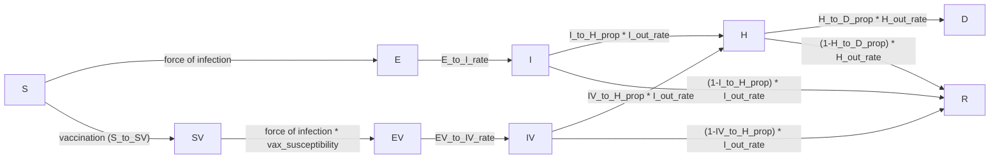
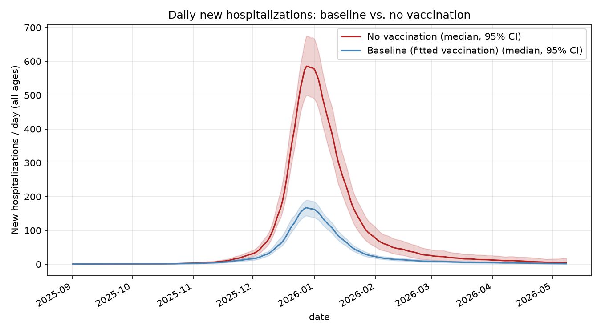
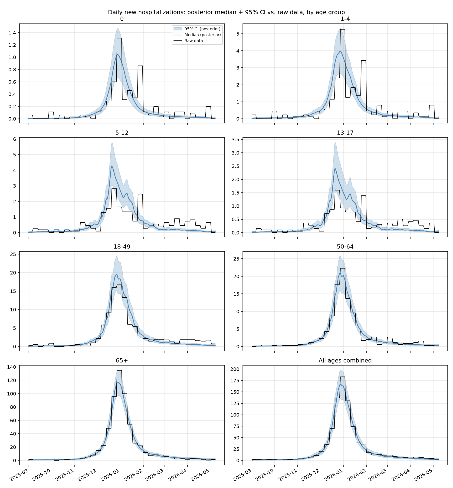
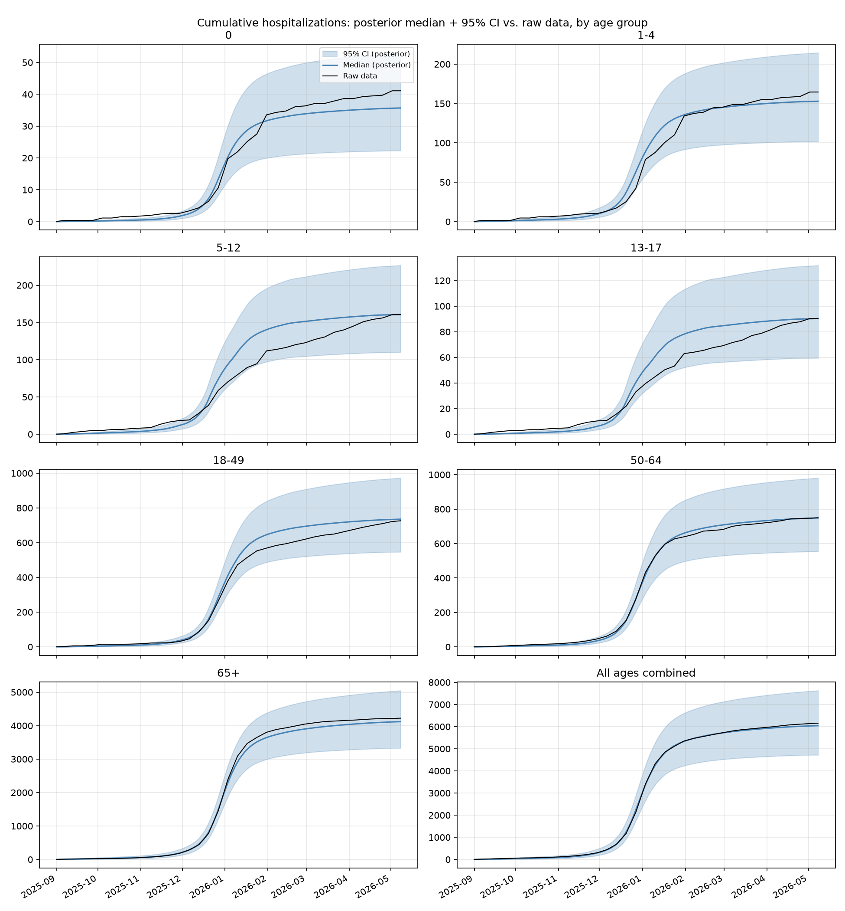

# MA_vax: vaccination-impact analysis report

Massachusetts, 2025–2026 influenza season. Age-structured SEIR model with a
parallel vaccinated arm, calibrated to daily hospital admissions by age
group via Bayesian MCMC. This report documents the model, the fit, and the
resulting vaccination-impact analysis.

---

## 1. Model structure

### 1.1 Compartments

Nine compartments, each stratified by 7 age groups
(`0`, `1-4`, `5-12`, `13-17`, `18-49`, `50-64`, `65+`):

| Compartment | Meaning |
|---|---|
| `S`  | Susceptible, unvaccinated |
| `E`  | Exposed (latent), unvaccinated |
| `I`  | Infectious, unvaccinated |
| `R`  | Recovered/removed (either arm) |
| `SV` | Susceptible, vaccinated |
| `EV` | Exposed (latent), vaccinated |
| `IV` | Infectious, vaccinated |
| `H`  | Hospitalized (either arm) |
| `D`  | Dead (either arm) |

The vaccinated arm (`SV → EV → IV → H/R`) mirrors the unvaccinated arm
(`S → E → I → H/R`), with its own susceptibility and severity parameters.
`H`, `R`, `D` are shared, pooled compartments — once hospitalized (or
recovered), an individual's vaccination history is no longer tracked.



### 1.2 Force of infection

Contacts come from fixed age×age contact matrices (Mistry et al. 2021
synthetic contact matrices), with school/work contacts removed on
non-school/work days:

```
C(t) = total_C − (1 − is_school(t))·school_C − (1 − is_work(t))·work_C
beta_adj(t) = beta_baseline · m(t) · (1 + humidity_impact · exp(−180 · humidity(t)))
wtd_inf_prop(t) = (I·I_relative_infectiousness + IV·IV_relative_infectiousness) / population
foi(t) = beta_adj(t) · (C(t) @ wtd_inf_prop(t))
S_to_E   = foi(t) · relative_suscept   · S
SV_to_EV = foi(t) · vax_susceptibility · SV
```

`m(t)` is a smoothly time-varying transmission multiplier (§2.3) that
absorbs behavioral/seasonal variation the mechanistic terms above don't
otherwise capture. `IV_relative_infectiousness = 1.0` — breakthrough
infections (in vaccinated individuals) are assumed exactly as transmissible
as unvaccinated infections. `vax_susceptibility` (age-specific, ≤ 1) is the
residual susceptibility of a vaccinated individual; `1 − vax_susceptibility`
is the model's implied vaccine effectiveness (VE) against infection.

### 1.3 Progression, hospitalization, death

```
E_to_I  = E_to_I_rate · E                 EV_to_IV = EV_to_IV_rate · EV
I_to_H  = I_out_rate · I_to_H_prop · I     IV_to_H  = I_out_rate · IV_to_H_prop · IV
I_to_R  = I_out_rate · (1−I_to_H_prop)·I   IV_to_R  = I_out_rate · (1−IV_to_H_prop)·IV
H_to_D  = H_out_rate · H_to_D_prop · H
H_to_R  = H_out_rate · (1−H_to_D_prop)·H
```

`IV_to_H_prop < I_to_H_prop` for every age group — vaccination reduces
hospitalization risk *given* infection (severity VE), on top of reducing
infection risk.

### 1.4 Vaccination flow

Daily doses (an age-specific proportion of the population, with a 14-day
delay between dose and effective immunity) are applied as an exact `S → SV`
count each day, capped at whatever remains in `S`:

```
base(t) = S + SV
S_to_SV(t) = min(round(vax_prop(t) · base(t)), S)
```

The base pool (`S + SV`) is not eroded by vaccination itself — only
infection depletes it — so a roughly flat input proportion vaccinates a
roughly constant head-count per day, until `S` starts running low late in
the season.

### 1.5 Numerical scheme

Deterministic simulations use explicit Euler integration with 7 sub-steps
per day. Stochastic simulations (used for confidence intervals throughout
this report) use a chain-binomial scheme at the same sub-daily resolution.
Vaccination itself stays a deterministic scheduled count in both, since it
comes from an external delivery schedule rather than a hazard rate.

### 1.6 Initial conditions

At the start of the simulation (2025-09-01): `S = population − E0`,
`E = E0` (age-specific seed counts, scaled by a single fitted multiplier,
§2.3), and all other compartments start at zero.

---

## 2. Parameters

### 2.1 Fixed scalar parameters

| Parameter | Value | Meaning |
|---|---|---|
| `num_days` | 250 | Simulation length (through ~2026-05-08) |
| `relative_suscept` | 1.0 | Susceptibility multiplier, unvaccinated arm |
| `I_relative_infectiousness` | 1.0 | Infectiousness weight, unvaccinated `I` |
| `IV_relative_infectiousness` | 1.0 | Infectiousness weight, vaccinated `IV` |
| `E_to_I_rate` | 0.5 /day | ~2-day latent period |
| `EV_to_IV_rate` | 0.5 /day | Same, vaccinated arm |
| `I_out_rate` | 0.333 /day | ~3-day infectious period |
| `H_out_rate` | 0.17 /day | ~6-day hospital stay |
| `vax_transfer_delay_days` | 14 | Days from dose to modeled immunity |

### 2.2 Age-stratified fixed parameters

| Age group | Population | Hospitalization risk, given infection¹ | Hospitalization risk, given breakthrough infection¹ | Death risk, given hospitalization | Residual susceptibility if vaccinated | Initial infections seeded¹ |
|---|---:|---:|---:|---:|---:|---:|
| 0 | 70,067 | 0.697% | 0.636% | 1.74% | 0.57 | 2 |
| 1-4 | 280,268 | 0.697% | 0.636% | 1.74% | 0.57 | 8 |
| 5-12 | 606,291 | 0.274% | 0.250% | 1.17% | 0.57 | 17 |
| 13-17 | 411,782 | 0.274% | 0.250% | 1.17% | 0.57 | 12 |
| 18-49 | 2,978,204 | 0.561% | 0.511% | 2.63% | 0.79 | 85 |
| 50-64 | 1,424,434 | 1.060% | 0.966% | 6.30% | 0.79 | 41 |
| 65+ | 1,221,349 | 9.091% | 6.273% | 7.99% | 1.00 | 35 |

¹ These are pre-fit baseline values — the calibration scales both hospitalization-risk columns by a fitted age-specific multiplier (§2.3), so the values actually used in the calibrated model are these figures × that multiplier and the vaccine effectiveness against hospitalization remains the same. 
A residual susceptibility of 1.00 for 65+ means the fitted baseline assumes **no infection-blocking effect** of vaccination in that age group (only the severity effect applies there). This holds for the `Low VE` sensitivity scenario too, but not for `High VE`, which scales it to 0.86 — see Table S.A.4.

### 2.3 Fitting method

Free parameters were estimated with an affine-invariant ensemble Markov
Chain Monte Carlo sampler (40 walkers, 4000 iterations per walker), run in
parallel. The free parameters and their priors:

| Parameter | Prior | Role |
|---|---|---|
| `beta_baseline` | Uniform(0.015, 0.06) | Baseline transmission rate |
| `humidity_impact` | Uniform(0, 1) | Strength of humidity forcing |
| Initial-seed multiplier | Log-uniform(0.1, 10) | Multiplies the age-specific initial-infection seed counts |
| Hospitalization-risk multiplier (× 7, one per age group) | Uniform(0.1, 2.0) | Multiplies both hospitalization-risk columns (§2.2) for that age group |
| `m(t)` log-increments (× 18, one per 14-day knot) | Normal(0, 0.25) | Month-to-month-ish random-walk steps in log-transmission (§1.2) |
| `phi` | — | Negative-Binomial dispersion (likelihood nuisance parameter, not a model input) |

**Likelihood**: a Negative-Binomial (NB2) observation model, chosen over
Poisson to allow overdispersion, jointly across 8 targets — daily hospital
admissions **by age group** (7 time series) plus a single scalar
**end-of-season cumulative hospitalizations by age** target.

**Posterior sampling**: the first 1700 iterations were discarded as
burn-in, and the remaining chain thinned to every 200th sample, leaving 638
posterior draws. Two point estimates are used in this report:

- **Posterior mean**: the marginal mean of each parameter. Cheap and
  stable, but for a correlated posterior can land on a parameter
  *combination* the sampler never actually visited.
- **"Best" point**: the single posterior draw with the highest
  log-posterior — not the mean of anything, so it preserves whatever
  correlation structure exists between parameters.

These two can disagree materially (§2.4) — a reminder that the marginal
mean of a correlated posterior needn't correspond to a jointly plausible
parameter combination. `m(t)`'s random-walk prior is a smoothness
assumption, not a mechanistic one — it should not be over-interpreted as an
independently-measured behavioral signal, only as "how much transmission
needs to have moved, beyond what humidity/contacts explain, to reconcile
the model with the data."

### 2.4 Fitted parameters

Posterior mean ± 90% credible interval (5th–95th percentile) across the 638
posterior draws, vs. the "best" (highest-posterior-density) point:

| Parameter | Posterior mean | 5% | 95% | "Best" point |
|---|---:|---:|---:|---:|
| `beta_baseline` | 0.0367 | 0.0314 | 0.0419 | 0.0379 |
| `humidity_impact` | 0.595 | 0.297 | 0.910 | 0.876 |
| Initial-seed multiplier | 1.80 | 0.58 | 3.98 | 1.37 |
| Hospitalization-risk multiplier — 0 | 1.45 | 0.94 | 1.91 | 1.67 |
| Hospitalization-risk multiplier — 1-4 | 1.63 | 1.16 | 1.96 | 1.76 |
| Hospitalization-risk multiplier — 5-12 | 1.31 | 0.86 | 1.82 | 1.22 |
| Hospitalization-risk multiplier — 13-17 | 0.96 | 0.62 | 1.41 | 0.97 |
| Hospitalization-risk multiplier — 18-49 | 0.52 | 0.34 | 0.70 | 0.47 |
| Hospitalization-risk multiplier — 50-64 | 0.70 | 0.46 | 0.96 | 0.65 |
| Hospitalization-risk multiplier — 65+ | 0.93 | 0.66 | 1.24 | 0.94 |
| `phi` (NB dispersion) | 116 | 25 | 357 | 254 |

The 18 `m(t)` log-increments aren't independently interpretable as a table
— they're summarized visually through the fit check in §4 instead.

### 2.5 Cumulative vaccination coverage

Cumulative proportion of each age group actually vaccinated over the season
(reported vaccination-schedule data, summed over the season):

| Age group | Population | Cumulative coverage |
|---|---:|---:|
| 0 | 70,067 | 45.4% |
| 1-4 | 280,268 | 90.7% |
| 5-12 | 606,291 | 71.4% |
| 13-17 | 411,782 | 55.3% |
| 18-49 | 2,978,204 | 40.5% |
| 50-64 | 1,424,434 | 60.4% |
| 65+ | 1,221,349 | 73.2% |
| **All (population-weighted)** | **6,992,395** | **55.9%** |

Coverage spans a wide range: four of the seven age groups sit below a 70%
mark — 18-49 lowest at 40.5%, then 0 (45.4%), 13-17 (55.3%) and 50-64
(60.4%) — while **1-4 (90.7%) is well above it, and 5-12 (71.4%) and 65+
(73.2%) are just above it**. This matters for how the "scale to 70%
coverage" rows in the appendix (Table S.A.3/S.A.6) should be read: only the
four groups below the mark are scaled up, and the three already above it are
left exactly as they are, contributing all-zero columns.

The figures above are what the vaccination **schedule** reports. The doses that
actually land are fewer — the §1.4 cap declines to vaccinate someone who has
already been infected — putting simulated coverage 0.6 to 2.3 percentage
points lower per age group. Those undelivered doses are not saved: in the
real world they are still bought and administered, into arms that no longer
benefit, at least in our model where the recovered and diceased compartments
are final. The appendix reconciles the two figures age group by age group, and
every "per 100,000 doses" panel in this report divides by the **scheduled**
count for that reason.

---

## 3. Vaccination-impact results

Every table in this section reports a **median and 95% interval across 638
simulations** — one simulation per posterior parameter draw (§2.3),
re-using the same draw for every scenario being compared within a table so
that the comparison is paired (variance from the parameter draw itself
cancels out of the *difference* between scenarios). These intervals
therefore reflect **calibration uncertainty** — how much the vaccination-
impact conclusions would change under a different (but similarly plausible)
fit to the same data — not day-to-day epidemic-process noise.

### New daily hospitalizations: baseline vs. no vaccination

Total-population new hospitalizations per day, posterior median and 95%
interval across the 638 parameter draws (§2.3, same posterior-uncertainty
basis as the rest of this section), comparing the fitted baseline
vaccination schedule against a counterfactual with no vaccination at all:



The fitted vaccination program cuts the peak in daily new hospitalizations
to roughly **a third** of what it would otherwise be (median peak ≈
165/day baseline vs. ≈ 585/day with no vaccination, both around
2025-12-28) and reduces the epidemic's height without changing its timing.

### Table S.A.1 — Hospitalizations averted, infection vs. severity protection

Decomposes the total hospitalizations averted by vaccination into two
channels: protection against getting infected at all, and — *given* a
breakthrough infection still happens — protection against that infection
becoming severe enough to need hospitalization.

**Infection protection** (no vaccination → infection-protection-only, i.e. VE against infection retained but VE against severity zeroed out)

| Age group | % Hospitalizations Averted | Averted per 100,000 Population | Averted per 100,000 Doses |
|---|---|---|---|
| 0 | 69.0% [63.8% – 72.5%] | 116.8 [75.1 – 152.6] | 257.6 [165.6 – 336.5] |
| 1-4 | 74.5% [70.0% – 77.6%] | 168.4 [125.3 – 203.0] | 185.7 [138.1 – 223.7] |
| 5-12 | 71.8% [66.2% – 75.6%] | 70.3 [47.2 – 94.5] | 98.4 [66.1 – 132.2] |
| 13-17 | 69.1% [63.0% – 73.2%] | 49.9 [33.4 – 73.3] | 90.2 [60.4 – 132.5] |
| 18-49 | 64.0% [57.6% – 68.3%] | 44.7 [31.9 – 59.3] | 110.4 [78.7 – 146.2] |
| 50-64 | 65.4% [59.5% – 69.4%] | 102.8 [72.9 – 136.3] | 170.3 [120.7 – 225.9] |
| 65+ | 63.0% [57.1% – 67.0%] | 701.6 [542.4 – 852.1] | 958.4 [740.9 – 1163.9] |
| **All** | **64.1% [58.4% – 68.1%]** | **180.3 [141.2 – 214.5]** | **322.7 [252.6 – 383.8]** |

**Severity protection** (infection-protection-only → full baseline, i.e. adding back VE against severity)

| Age group | % Hospitalizations Averted | Averted per 100,000 Population | Averted per 100,000 Doses |
|---|---|---|---|
| 0 | 0.6% [0.6% – 0.8%] | 1.1 [0.7 – 1.6] | 2.4 [1.6 – 3.4] |
| 1-4 | 1.3% [1.1% – 1.5%] | 2.9 [2.0 – 3.9] | 3.2 [2.2 – 4.3] |
| 5-12 | 1.0% [0.9% – 1.2%] | 1.0 [0.7 – 1.3] | 1.4 [1.0 – 1.8] |
| 13-17 | 0.9% [0.7% – 1.0%] | 0.6 [0.4 – 0.9] | 1.1 [0.8 – 1.6] |
| 18-49 | 0.8% [0.7% – 0.9%] | 0.6 [0.5 – 0.7] | 1.4 [1.1 – 1.7] |
| 50-64 | 1.2% [1.1% – 1.4%] | 1.9 [1.5 – 2.3] | 3.2 [2.5 – 3.9] |
| 65+ | 6.7% [6.0% – 7.7%] | 74.4 [67.5 – 81.1] | 101.6 [92.2 – 110.8] |
| **All** | **4.9% [4.4% – 5.8%]** | **13.9 [12.7 – 15.0]** | **24.9 [22.7 – 26.9]** |


**Total** (no vaccination → full baseline)

| Age group | % Hospitalizations Averted | Averted per 100,000 Population | Averted per 100,000 Doses |
|---|---|---|---|
| 0 | 69.6% [64.6% – 73.0%] | 117.9 [76.0 – 154.0] | 259.9 [167.7 – 339.5] |
| 1-4 | 75.8% [71.5% – 78.8%] | 171.2 [127.5 – 206.9] | 188.8 [140.6 – 228.1] |
| 5-12 | 72.8% [67.4% – 76.5%] | 71.3 [48.1 – 95.8] | 99.8 [67.4 – 134.1] |
| 13-17 | 70.0% [64.1% – 74.0%] | 50.5 [33.9 – 74.1] | 91.3 [61.3 – 134.0] |
| 18-49 | 64.8% [58.6% – 69.0%] | 45.3 [32.4 – 59.9] | 111.7 [80.0 – 147.7] |
| 50-64 | 66.6% [60.9% – 70.5%] | 104.7 [74.6 – 138.6] | 173.5 [123.6 – 229.7] |
| 65+ | 69.7% [64.8% – 72.9%] | 776.3 [621.4 – 927.4] | 1060.4 [848.8 – 1266.8] |
| **All** | **69.1% [64.1% – 72.5%]** | **194.3 [154.7 – 228.8]** | **347.6 [276.8 – 409.4]** |

Almost all of the averted burden comes from **blocking infection**, not
from reducing severity given a breakthrough.

### Table S.A.2 — Hospitalizations averted by age group vaccinated

Each column vaccinates a single age group only (all others left
unvaccinated) and compares to no vaccination at all; "All" is the full
baseline schedule. Rows are the age group in which hospitalizations are
counted, so off-diagonal cells show the indirect (transmission-blocking)
benefit to *other* age groups from vaccinating this one.

**% reduction in hospitalizations**

| Age group (counted) | 0 vaccinated | 1-4 vaccinated | 5-12 vaccinated | 13-17 vaccinated | 18-49 vaccinated | 50-64 vaccinated | 65+ vaccinated | All vaccinated |
|---|---|---|---|---|---|---|---|---|
| 0 | 16.9% [16.3% – 17.3%] | 8.5% [7.4% – 9.5%] | 24.4% [20.7% – 27.3%] | 14.1% [11.8% – 16.0%] | 18.1% [15.3% – 20.3%] | 8.8% [7.4% – 10.0%] | 0.0% [-0.0% – 0.0%] | 69.6% [64.6% – 73.0%] |
| 1-4 | 0.5% [0.4% – 0.5%] | 38.8% [37.0% – 40.2%] | 25.8% [21.8% – 29.0%] | 13.4% [11.1% – 15.4%] | 16.8% [14.0% – 19.1%] | 8.3% [6.8% – 9.5%] | 0.0% [-0.0% – 0.0%] | 75.8% [71.5% – 78.8%] |
| 5-12 | 0.4% [0.3% – 0.4%] | 7.1% [5.8% – 8.1%] | 46.6% [42.5% – 49.7%] | 13.1% [10.5% – 15.2%] | 14.3% [11.4% – 16.8%] | 7.3% [5.8% – 8.6%] | 0.0% [-0.0% – 0.0%] | 72.8% [67.4% – 76.5%] |
| 13-17 | 0.3% [0.3% – 0.4%] | 5.8% [4.6% – 6.8%] | 21.5% [17.3% – 24.9%] | 35.1% [32.0% – 37.5%] | 14.4% [11.4% – 16.9%] | 7.7% [6.1% – 9.0%] | 0.0% [-0.0% – 0.0%] | 70.0% [64.1% – 74.0%] |
| 18-49 | 0.4% [0.4% – 0.5%] | 7.0% [5.8% – 8.0%] | 22.2% [18.4% – 25.4%] | 13.6% [11.2% – 15.7%] | 23.7% [20.7% – 26.0%] | 9.1% [7.5% – 10.4%] | 0.0% [-0.0% – 0.0%] | 64.8% [58.6% – 69.0%] |
| 50-64 | 0.4% [0.3% – 0.4%] | 6.6% [5.5% – 7.6%] | 22.0% [18.3% – 25.0%] | 14.0% [11.6% – 16.0%] | 17.1% [14.3% – 19.4%] | 21.3% [19.5% – 22.7%] | 0.0% [-0.0% – 0.0%] | 66.6% [60.9% – 70.5%] |
| 65+ | 0.4% [0.4% – 0.5%] | 7.3% [6.2% – 8.1%] | 23.5% [20.0% – 26.3%] | 14.6% [12.4% – 16.5%] | 17.6% [14.9% – 19.7%] | 10.4% [8.9% – 11.6%] | 18.3% [18.1% – 18.5%] | 69.7% [64.8% – 72.9%] |
| **All** | **0.5% [0.5% – 0.6%]** | **8.2% [7.2% – 8.9%]** | **23.9% [20.2% – 26.8%]** | **14.7% [12.3% – 16.6%]** | **18.0% [15.2% – 20.2%]** | **11.3% [9.6% – 12.6%]** | **12.7% [12.1% – 13.3%]** | **69.1% [64.1% – 72.5%]** |

**Hospitalizations averted per 100,000 population**

| Age group (counted) | 0 vaccinated | 1-4 vaccinated | 5-12 vaccinated | 13-17 vaccinated | 18-49 vaccinated | 50-64 vaccinated | 65+ vaccinated | All vaccinated |
|---|---|---|---|---|---|---|---|---|
| 0 | 28.6 [18.5 – 37.4] | 14.5 [8.9 – 18.9] | 41.4 [25.4 – 53.9] | 23.9 [14.4 – 31.2] | 30.7 [18.8 – 40.1] | 14.9 [9.1 – 19.6] | 0.0 [-0.0 – 0.0] | 117.9 [76.0 – 154.0] |
| 1-4 | 1.1 [0.8 – 1.3] | 87.6 [65.2 – 105.9] | 58.6 [41.7 – 69.4] | 30.4 [21.5 – 36.0] | 38.0 [27.0 – 45.1] | 18.8 [13.1 – 22.3] | 0.0 [-0.0 – 0.0] | 171.2 [127.5 – 206.9] |
| 5-12 | 0.4 [0.2 – 0.5] | 6.9 [4.3 – 9.6] | 45.5 [30.3 – 61.4] | 12.7 [7.8 – 18.0] | 14.0 [8.5 – 19.9] | 7.1 [4.3 – 10.1] | 0.0 [-0.0 – 0.0] | 71.3 [48.1 – 95.8] |
| 13-17 | 0.2 [0.1 – 0.4] | 4.1 [2.5 – 6.6] | 15.3 [9.4 – 24.1] | 25.3 [16.9 – 37.3] | 10.3 [6.3 – 16.5] | 5.5 [3.4 – 8.9] | 0.0 [-0.0 – 0.0] | 50.5 [33.9 – 74.1] |
| 18-49 | 0.3 [0.2 – 0.4] | 4.9 [3.2 – 6.8] | 15.5 [10.2 – 21.6] | 9.5 [6.3 – 13.3] | 16.5 [11.5 – 22.5] | 6.3 [4.2 – 8.9] | 0.0 [-0.0 – 0.0] | 45.3 [32.4 – 59.9] |
| 50-64 | 0.6 [0.4 – 0.8] | 10.4 [6.8 – 14.3] | 34.4 [22.6 – 47.4] | 21.8 [14.4 – 30.1] | 26.8 [17.7 – 37.0] | 33.5 [23.8 – 44.3] | 0.0 [-0.0 – 0.0] | 104.7 [74.6 – 138.6] |
| 65+ | 4.8 [3.5 – 6.0] | 80.9 [59.4 – 102.7] | 261.5 [190.6 – 332.0] | 163.1 [118.4 – 208.2] | 195.0 [142.7 – 249.0] | 115.7 [85.7 – 146.5] | 203.5 [171.0 – 235.0] | 776.3 [621.4 – 927.4] |
| **All** | **1.5 [1.1 – 1.8]** | **23.0 [17.4 – 28.0]** | **67.3 [49.1 – 84.1]** | **41.3 [29.8 – 52.6]** | **50.6 [36.7 – 63.9]** | **31.8 [23.5 – 39.7]** | **35.5 [29.9 – 41.1]** | **194.3 [154.7 – 228.8]** |

**Hospitalizations averted per 100,000 doses**

Each cell divides hospitalizations averted in the **row's** age group by the
doses scheduled for the **column's** age group, so off-diagonal cells are the
indirect benefit per dose spent on the vaccinated group. The `All vaccinated` column
has no single targeted group, so there each row keeps its own age group's
dose count, matching Table S.A.1's per-dose columns.

| Age group (counted) | 0 vaccinated | 1-4 vaccinated | 5-12 vaccinated | 13-17 vaccinated | 18-49 vaccinated | 50-64 vaccinated | 65+ vaccinated | All vaccinated |
|---|---|---|---|---|---|---|---|---|
| 0 | 63.0 [40.9 – 82.6] | 4.0 [2.4 – 5.2] | 6.7 [4.1 – 8.7] | 7.3 [4.4 – 9.6] | 1.8 [1.1 – 2.3] | 1.2 [0.7 – 1.6] | 0.0 [-0.0 – 0.0] | 259.9 [167.7 – 339.5] |
| 1-4 | 9.7 [6.9 – 11.5] | 96.6 [71.9 – 116.7] | 37.9 [27.0 – 44.9] | 37.4 [26.4 – 44.3] | 8.8 [6.3 – 10.5] | 6.1 [4.3 – 7.3] | 0.0 [-0.0 – 0.0] | 188.8 [140.6 – 228.1] |
| 5-12 | 6.7 [4.2 – 9.5] | 16.4 [10.2 – 23.0] | 63.7 [42.4 – 85.9] | 33.8 [20.7 – 47.9] | 7.0 [4.3 – 10.0] | 5.0 [3.0 – 7.1] | 0.0 [-0.0 – 0.0] | 99.8 [67.4 – 134.1] |
| 13-17 | 3.0 [1.9 – 4.9] | 6.7 [4.1 – 10.7] | 14.6 [8.9 – 22.9] | 45.8 [30.5 – 67.4] | 3.5 [2.1 – 5.6] | 2.6 [1.6 – 4.2] | 0.0 [-0.0 – 0.0] | 91.3 [61.3 – 134.0] |
| 18-49 | 27.6 [18.3 – 38.3] | 57.2 [38.0 – 79.9] | 106.7 [70.4 – 148.7] | 124.4 [81.9 – 174.3] | 40.8 [28.4 – 55.4] | 22.0 [14.4 – 30.8] | 0.0 [-0.0 – 0.0] | 111.7 [80.0 – 147.7] |
| 50-64 | 27.0 [17.7 – 37.5] | 58.2 [38.2 – 80.4] | 113.1 [74.4 – 155.8] | 136.6 [89.7 – 188.1] | 31.6 [20.9 – 43.7] | 55.5 [39.4 – 73.4] | 0.0 [-0.0 – 0.0] | 173.5 [123.6 – 229.7] |
| 65+ | 182.7 [134.5 – 231.7] | 388.9 [285.2 – 493.4] | 737.3 [537.5 – 936.2] | 874.6 [634.8 – 1116.1] | 197.3 [144.4 – 252.0] | 164.3 [121.7 – 208.1] | 278.0 [233.6 – 321.1] | 1060.4 [848.8 – 1266.8] |
| **All** | **320.1 [241.0 – 387.8]** | **631.9 [478.7 – 769.3]** | **1086.6 [793.3 – 1356.9]** | **1266.2 [915.8 – 1614.5]** | **293.2 [212.8 – 370.3]** | **258.3 [191.3 – 322.8]** | **278.0 [233.6 – 321.1]** | **347.6 [276.8 – 409.4]** |

Off-diagonal entries confirm real indirect effects — e.g. vaccinating 5-12
alone reduces hospitalizations in 0 by 24.4% and in 1-4 by 25.8%, both
larger than several of those groups' own-age direct effects, consistent
with school-age children acting as a major transmission hub in the contact
structure. 65+ is the only group with zero indirect effect on
every other group.

Per dose, the indirect benefit is dominated by what it does for **65+**: vaccinating
 13-17 averts 874.6 [634.8 – 1116.1] hospitalizations per 100,000
doses in the 65+ group alone, against 45.8 [30.5 – 67.4] in 13-17 itself. This
is why the `All` row — hospitalizations averted across the whole population
per dose — ranks 13-17 (1266.2) and 5-12 (1086.6) far above the groups that
carry the burden directly.

### Table S.A.4 — Vaccine-effectiveness sensitivity scenarios

Implied vaccine effectiveness under three illustrative VE presets — a
parameter table, not a simulation result. `Baseline VE (fitted)` is the model's
fitted VE (included here as the reference point, not itself a sensitivity
scenario); `Low VE`/`High VE` bracket it and correspond to the estimated
lower and upper bound of VE. The ratio of low/high VE to baseline remains
constant across parameter sets.

| Scenario | Age group | VE against infection | VE against hospitalization (overall) | VE against hospitalization, given infection |
|---|---|---|---|---|
| Low VE | 0 | 33% | 33% | 0% |
| Low VE | 1-4 | 33% | 33% | 0% |
| Low VE | 5-12 | 33% | 33% | 0% |
| Low VE | 13-17 | 33% | 33% | 0% |
| Low VE | 18-49 | 6% | 10% | 4% |
| Low VE | 50-64 | 6% | 10% | 4% |
| Low VE | 65+ | 0% | 21% | 21% |
| Baseline VE (fitted) | 0 | 43% | 48% | 9% |
| Baseline VE (fitted) | 1-4 | 43% | 48% | 9% |
| Baseline VE (fitted) | 5-12 | 43% | 48% | 9% |
| Baseline VE (fitted) | 13-17 | 43% | 48% | 9% |
| Baseline VE (fitted) | 18-49 | 21% | 28% | 9% |
| Baseline VE (fitted) | 50-64 | 21% | 28% | 9% |
| Baseline VE (fitted) | 65+ | 0% | 31% | 31% |
| High VE | 0 | 51% | 78% | 55% |
| High VE | 1-4 | 51% | 78% | 55% |
| High VE | 5-12 | 51% | 78% | 55% |
| High VE | 13-17 | 51% | 78% | 55% |
| High VE | 18-49 | 34% | 44% | 16% |
| High VE | 50-64 | 34% | 44% | 16% |
| High VE | 65+ | 14% | 39% | 29% |

Also note **65+ has 0% VE against infection in the fitted baseline and in
`Low VE`** — residual susceptibility is 1.00 for that age group in both
(§2.2), so only the severity-protection channel operates there. `High VE` is
the exception: it scales residual susceptibility to 0.86, giving 65+ a 14% VE
against infection, so that scenario is the only one in which vaccinating 65+
blocks any transmission at all. This is why 65+ shows an all-zero indirect
effect on every other age group throughout Table S.A.2, which is built on the
fitted baseline.

### Table S.A.5 — Hospitalizations averted across VE scenarios

Compares each VE sensitivity scenario (§ above) against no vaccination at all.

**% reduction in hospitalizations**

| Age group | Low VE | Baseline VE (fitted) | High VE |
|---|---|---|---|
| 0 | 48.6% [43.5% – 52.3%] | 69.6% [64.6% – 73.0%] | 82.9% [79.6% – 85.2%] |
| 1-4 | 55.6% [50.7% – 59.3%] | 75.8% [71.5% – 78.8%] | 89.1% [86.8% – 90.6%] |
| 5-12 | 52.7% [46.8% – 57.0%] | 72.8% [67.4% – 76.5%] | 85.9% [82.7% – 88.1%] |
| 13-17 | 49.2% [43.1% – 53.7%] | 70.0% [64.1% – 74.0%] | 83.6% [79.8% – 86.1%] |
| 18-49 | 41.3% [35.3% – 45.8%] | 64.8% [58.6% – 69.0%] | 78.5% [73.8% – 81.5%] |
| 50-64 | 42.2% [36.5% – 46.4%] | 66.6% [60.9% – 70.5%] | 80.4% [76.3% – 83.0%] |
| 65+ | 48.4% [43.6% – 52.0%] | 69.7% [64.8% – 72.9%] | 81.9% [78.4% – 84.2%] |
| **All** | **47.3% [42.3% – 51.1%]** | **69.1% [64.1% – 72.5%]** | **81.8% [78.2% – 84.1%]** |

**Hospitalizations averted per 100,000 population**

| Age group | Low VE | Baseline VE (fitted) | High VE |
|---|---|---|---|
| 0 | 82.4 [52.1 – 106.9] | 117.9 [76.0 – 154.0] | 140.1 [90.7 – 183.4] |
| 1-4 | 126.2 [92.1 – 150.1] | 171.2 [127.5 – 206.9] | 201.2 [150.3 – 244.1] |
| 5-12 | 51.3 [33.4 – 69.8] | 71.3 [48.1 – 95.8] | 84.1 [58.5 – 112.2] |
| 13-17 | 35.3 [23.1 – 53.2] | 50.5 [33.9 – 74.1] | 60.6 [41.4 – 87.1] |
| 18-49 | 28.9 [19.7 – 39.3] | 45.3 [32.4 – 59.9] | 54.9 [40.9 – 71.5] |
| 50-64 | 66.2 [45.1 – 89.7] | 104.7 [74.6 – 138.6] | 126.3 [91.8 – 164.7] |
| 65+ | 539.2 [414.0 – 659.2] | 776.3 [621.4 – 927.4] | 912.4 [748.1 – 1073.2] |
| **All** | **133.0 [102.4 – 161.5]** | **194.3 [154.7 – 228.8]** | **229.4 [188.5 – 266.7]** |

Even under the pessimistic `Low VE` assumption, the fitted vaccination
schedule still averts ~47% of hospitalizations overall — the schedule's
*coverage* (§2.5) matters roughly as much as the assumed per-dose
effectiveness across this VE range.

---

## 4. Baseline fit check — posterior-uncertainty simulation vs. raw data

This section simulates the baseline (fitted-vaccination) scenario once per
posterior parameter draw — all 638 draws (§2.3) — and reports the median
and 95% interval across draws, to check the calibrated model against the
raw data it was fit to.

### Cumulative hospitalizations, by age group

Sum of simulated (posterior median and 95% interval) vs. raw daily hospital
admissions, over the range of dates common to both series (2025-09-08 –
2026-05-17):

| Age group | Simulated (median) | Simulated 95% interval | Raw data | % difference (median) |
|---|---:|---:|---:|---:|
| 0 | 35.7 | 22.3 – 53.1 | 41.1 | -13.1% |
| 1-4 | 152.9 | 102.0 – 214.5 | 164.6 | -7.1% |
| 5-12 | 160.8 | 110.1 – 226.8 | 160.5 | 0.2% |
| 13-17 | 90.3 | 59.5 – 131.9 | 90.3 | 0.0% |
| 18-49 | 735.2 | 546.7 – 972.8 | 726.0 | 1.3% |
| 50-64 | 748.5 | 553.8 – 981.0 | 749.6 | -0.1% |
| 65+ | 4119.7 | 3328.8 – 5049.5 | 4222.3 | -2.4% |
| **All** | **6043.1** | **4723.1 – 7629.5** | **6154.4** | **-1.8%** |

The fit tracks the data closely overall (-1.8% on the total, raw value
within the 95% interval for every age group) — the largest relative miss is
in the smallest group (age 0, -13.1%, but only ~5 admissions off in
absolute terms).

### Daily new hospitalizations by age group



### Cumulative hospitalizations by age group



The posterior interval captures the single main epidemic wave (peaking
around late December/early January) well across all age groups.

---

## 5. Data sources

| Input | Source |
|---|---|
| Age-specific vaccination coverage | MIDAS Flu Scenario Modeling Hub resources, age-specific coverage dataset |
| Hospital admissions (calibration target) | MIDAS Flu Scenario Modeling Hub, target-data time series |
| Population by age group | US Census (`tidycensus`) |
| Contact matrices | Mistry et al. 2021 synthetic contact matrices |
| Absolute humidity | gridMET daily specific-humidity data, averaged over Massachusetts |
| School/work calendar | Constructed school/work-day calendar for the state, for each day of the season |

---

## 6. Notes

- **The confidence intervals in §3 reflect calibration uncertainty, not
  epidemic-process noise** — they come from re-running each scenario under
  638 different (but similarly plausible) posterior parameter draws, not
  from chain-binomial simulation noise at fixed parameters.
- **`m(t)` is a statistical smoothing device, not a mechanistic term** — the
  14-day-knot random walk in this fit absorbs whatever transmission
  variation the mechanistic model (contacts, humidity) doesn't explain; it
  should not be read as an independently-measured behavioral signal.
- **The "scale to 70% coverage" scenarios (Table S.A.3/S.A.6, appendix)
  treat 70% as a floor, not a quota** — age groups already above it (1-4 at
  90.7%, 5-12 at 71.4%, 65+ at 73.2%) keep their baseline schedule untouched
  rather than having uptake cut back, so they contribute all-zero columns.
- **"Per 100,000 doses" counts doses the schedule reports, not doses the model
  delivers** — 3.3% of scheduled doses go to people already infected (see the
  dose-accounting appendix). Those are wasted, not unspent, so they belong in
  a cost-effectiveness denominator; excluding them would flatter each scenario
  in proportion to how large its epidemic was.

---

## Appendix: Tables S.A.3 and S.A.6

### Table S.A.3 — Additional hospitalizations averted at 70% coverage

Each column scales a single age group's vaccination schedule up to 70%
cumulative coverage; "All" scales every eligible age group. Compared against
the baseline vaccination scenario. Per §2.5, 70% is treated as a **floor**:
the four groups below it (0, 13-17, 18-49, 50-64) are scaled up, and the
three already above it (1-4, 5-12, 65+) keep their baseline schedule rather
than being de-vaccinated. Those three are therefore identical to baseline and
give exact-zero columns.

**% reduction in hospitalizations**

| Age group (counted) | 0 vaccinated | 1-4 vaccinated | 5-12 vaccinated | 13-17 vaccinated | 18-49 vaccinated | 50-64 vaccinated | 65+ vaccinated | All vaccinated |
|---|---|---|---|---|---|---|---|---|
| 0 | 11.2% [11.0% – 11.4%] | 0.0% [0.0% – 0.0%] | 0.0% [0.0% – 0.0%] | 5.7% [5.2% – 6.1%] | 19.3% [17.8% – 20.3%] | 2.3% [2.1% – 2.4%] | 0.0% [0.0% – 0.0%] | 34.0% [32.3% – 35.3%] |
| 1-4 | 0.4% [0.4% – 0.4%] | 0.0% [0.0% – 0.0%] | 0.0% [0.0% – 0.0%] | 5.6% [5.1% – 6.1%] | 18.3% [16.9% – 19.4%] | 2.2% [2.0% – 2.4%] | 0.0% [0.0% – 0.0%] | 25.1% [23.3% – 26.4%] |
| 5-12 | 0.3% [0.3% – 0.4%] | 0.0% [0.0% – 0.0%] | 0.0% [0.0% – 0.0%] | 5.9% [5.2% – 6.3%] | 17.0% [15.4% – 18.2%] | 2.1% [1.9% – 2.3%] | 0.0% [0.0% – 0.0%] | 23.9% [21.9% – 25.4%] |
| 13-17 | 0.3% [0.3% – 0.3%] | 0.0% [0.0% – 0.0%] | 0.0% [0.0% – 0.0%] | 14.2% [13.4% – 14.8%] | 17.2% [15.5% – 18.4%] | 2.2% [1.9% – 2.4%] | 0.0% [0.0% – 0.0%] | 30.9% [28.8% – 32.4%] |
| 18-49 | 0.4% [0.3% – 0.4%] | 0.0% [0.0% – 0.0%] | 0.0% [0.0% – 0.0%] | 5.8% [5.1% – 6.2%] | 24.1% [22.5% – 25.2%] | 2.4% [2.2% – 2.6%] | 0.0% [0.0% – 0.0%] | 30.6% [28.6% – 32.0%] |
| 50-64 | 0.3% [0.3% – 0.3%] | 0.0% [0.0% – 0.0%] | 0.0% [0.0% – 0.0%] | 5.8% [5.2% – 6.2%] | 18.7% [17.2% – 19.8%] | 4.8% [4.6% – 5.0%] | 0.0% [0.0% – 0.0%] | 27.6% [25.6% – 28.9%] |
| 65+ | 0.3% [0.3% – 0.4%] | 0.0% [0.0% – 0.0%] | 0.0% [0.0% – 0.0%] | 5.8% [5.3% – 6.2%] | 18.5% [17.1% – 19.5%] | 2.6% [2.3% – 2.7%] | 0.0% [0.0% – 0.0%] | 25.6% [23.9% – 26.9%] |
| **All** | **0.4% [0.4% – 0.4%]** | **0.0% [0.0% – 0.0%]** | **0.0% [0.0% – 0.0%]** | **5.9% [5.3% – 6.4%]** | **19.2% [17.6% – 20.2%]** | **2.8% [2.6% – 3.0%]** | **0.0% [0.0% – 0.0%]** | **26.6% [24.7% – 27.9%]** |

**Hospitalizations averted per 100,000 population**

| Age group (counted) | 0 vaccinated | 1-4 vaccinated | 5-12 vaccinated | 13-17 vaccinated | 18-49 vaccinated | 50-64 vaccinated | 65+ vaccinated | All vaccinated |
|---|---|---|---|---|---|---|---|---|
| 0 | 5.8 [3.7 – 8.0] | 0.0 [0.0 – 0.0] | 0.0 [0.0 – 0.0] | 2.9 [1.9 – 4.0] | 9.9 [6.5 – 13.5] | 1.2 [0.8 – 1.6] | 0.0 [0.0 – 0.0] | 17.5 [11.4 – 24.1] |
| 1-4 | 0.2 [0.2 – 0.3] | 0.0 [0.0 – 0.0] | 0.0 [0.0 – 0.0] | 3.1 [2.2 – 3.9] | 10.0 [7.2 – 12.8] | 1.2 [0.9 – 1.5] | 0.0 [0.0 – 0.0] | 13.7 [9.8 – 17.6] |
| 5-12 | 0.1 [0.1 – 0.1] | 0.0 [0.0 – 0.0] | 0.0 [0.0 – 0.0] | 1.6 [1.1 – 2.0] | 4.5 [3.3 – 5.9] | 0.6 [0.4 – 0.7] | 0.0 [0.0 – 0.0] | 6.4 [4.6 – 8.3] |
| 13-17 | 0.1 [0.0 – 0.1] | 0.0 [0.0 – 0.0] | 0.0 [0.0 – 0.0] | 3.1 [2.2 – 4.2] | 3.8 [2.6 – 5.1] | 0.5 [0.3 – 0.7] | 0.0 [0.0 – 0.0] | 6.8 [4.7 – 9.2] |
| 18-49 | 0.1 [0.1 – 0.1] | 0.0 [0.0 – 0.0] | 0.0 [0.0 – 0.0] | 1.4 [1.1 – 1.8] | 5.9 [4.8 – 7.3] | 0.6 [0.5 – 0.7] | 0.0 [0.0 – 0.0] | 7.6 [6.1 – 9.3] |
| 50-64 | 0.2 [0.1 – 0.2] | 0.0 [0.0 – 0.0] | 0.0 [0.0 – 0.0] | 3.1 [2.4 – 3.8] | 9.9 [7.7 – 12.3] | 2.6 [2.0 – 3.2] | 0.0 [0.0 – 0.0] | 14.6 [11.3 – 18.0] |
| 65+ | 1.1 [1.0 – 1.3] | 0.0 [0.0 – 0.0] | 0.0 [0.0 – 0.0] | 19.6 [17.3 – 21.9] | 62.4 [56.1 – 69.2] | 8.7 [7.7 – 9.6] | 0.0 [0.0 – 0.0] | 86.7 [78.0 – 96.0] |
| **All** | **0.4 [0.3 – 0.4]** | **0.0 [0.0 – 0.0]** | **0.0 [0.0 – 0.0]** | **5.1 [4.6 – 5.6]** | **16.6 [15.1 – 18.1]** | **2.4 [2.2 – 2.7]** | **0.0 [0.0 – 0.0]** | **23.1 [21.1 – 25.1]** |

**Hospitalizations averted per 100,000 additional doses**

Denominators are the *additional* doses each scenario schedules, which reduces
to `max(0, 70% − baseline coverage) × population`: 17,270 doses for age 0,
60,431 for 13-17, 877,865 for 18-49, 137,410 for 50-64, and zero for the three
groups already above 70% (shown as `—`). Being a property of the schedule, this
is exact and identical across all 638 parameter draws. The `All ages` column
raises four groups at once, so its denominator is the **total** 1,092,976
additional doses.

Because every column divides all of its rows by that one dose count, the age
rows within a column decompose its `All` row by where the averted burden lands
— and so sum to it, up to small differences from these cells being medians of
per-replicate ratios rather than ratios of medians. 

| Age group (counted) | 0 vaccinated | 1-4 vaccinated | 5-12 vaccinated | 13-17 vaccinated | 18-49 vaccinated | 50-64 vaccinated | 65+ vaccinated | All vaccinated |
|---|---|---|---|---|---|---|---|---|
| 0 | 23.4 [15.2 – 32.4] | — | — | 3.4 [2.3 – 4.6] | 0.8 [0.5 – 1.1] | 0.6 [0.4 – 0.8] | — | 1.1 [0.7 – 1.5] |
| 1-4 | 3.4 [2.5 – 4.4] | — | — | 14.3 [10.4 – 18.0] | 3.2 [2.3 – 4.1] | 2.5 [1.8 – 3.1] | — | 3.5 [2.5 – 4.5] |
| 5-12 | 3.1 [2.2 – 4.0] | — | — | 15.6 [11.4 – 20.5] | 3.1 [2.3 – 4.1] | 2.5 [1.8 – 3.2] | — | 3.5 [2.6 – 4.6] |
| 13-17 | 1.6 [1.1 – 2.2] | — | — | 21.3 [14.9 – 28.8] | 1.8 [1.2 – 2.4] | 1.4 [1.0 – 2.0] | — | 2.6 [1.8 – 3.5] |
| 18-49 | 15.1 [11.9 – 18.8] | — | — | 70.3 [55.0 – 88.0] | 20.2 [16.2 – 24.9] | 12.9 [10.2 – 16.1] | — | 20.6 [16.6 – 25.4] |
| 50-64 | 14.2 [10.9 – 17.7] | — | — | 72.0 [55.5 – 90.1] | 16.1 [12.5 – 20.0] | 26.6 [20.8 – 32.7] | — | 19.0 [14.7 – 23.5] |
| 65+ | 81.0 [72.0 – 89.9] | — | — | 397.1 [349.2 – 442.7] | 86.9 [78.0 – 96.3] | 77.0 [68.6 – 85.5] | — | 96.9 [87.1 – 107.3] |
| **All** | **142.4 [129.2 – 155.0]** | **—** | **—** | **595.5 [530.4 – 652.0]** | **132.4 [120.1 – 144.3]** | **124.0 [111.5 – 135.2]** | **—** | **147.5 [134.7 – 160.4]** |

Per additional dose, raising **13-17** to 70% is far and away the best buy:
595.5 [530.4 – 652.0] hospitalizations averted per 100,000 doses, against 142.4
for age 0 and 132.4 for 18-49 — and 397.1 of that 595.5 lands in **65+**, not in
13-17 itself. 18-49 dominates the *absolute* totals only because it absorbs
877,865 of the 1,092,976 additional doses.

### Table S.A.6 — Additional hospitalizations averted at 70% coverage, across VE scenarios

For each VE sensitivity scenario, compares that scenario's own baseline
vaccination to the 70%-coverage floor applied to every eligible age group.

**% reduction in hospitalizations**

| Age group | Low VE | Baseline VE (fitted) | High VE |
|---|---|---|---|
| 0 | 16.3% [14.8% – 17.4%] | 34.0% [32.3% – 35.3%] | 48.4% [46.9% – 49.6%] |
| 1-4 | 9.7% [8.2% – 10.8%] | 25.1% [23.3% – 26.4%] | 33.4% [31.7% – 34.9%] |
| 5-12 | 9.3% [7.7% – 10.5%] | 23.9% [21.9% – 25.4%] | 31.8% [30.0% – 33.5%] |
| 13-17 | 14.5% [12.7% – 15.9%] | 30.9% [28.8% – 32.4%] | 42.7% [40.9% – 44.3%] |
| 18-49 | 11.7% [10.0% – 12.9%] | 30.6% [28.6% – 32.0%] | 42.8% [41.3% – 44.1%] |
| 50-64 | 10.5% [8.9% – 11.6%] | 27.6% [25.6% – 28.9%] | 38.6% [37.1% – 40.0%] |
| 65+ | 9.9% [8.4% – 10.9%] | 25.6% [23.9% – 26.9%] | 35.9% [34.4% – 37.1%] |
| **All** | **10.3% [8.7% – 11.3%]** | **26.6% [24.7% – 27.9%]** | **37.1% [35.6% – 38.4%]** |

**Hospitalizations averted per 100,000 population**

| Age group | Low VE | Baseline VE (fitted) | High VE |
|---|---|---|---|
| 0 | 14.2 [9.2 – 18.7] | 17.5 [11.4 – 24.1] | 14.0 [9.1 – 19.9] |
| 1-4 | 9.7 [7.2 – 11.8] | 13.7 [9.8 – 17.6] | 8.3 [5.7 – 10.9] |
| 5-12 | 4.3 [2.9 – 5.8] | 6.4 [4.6 – 8.3] | 4.4 [3.2 – 5.8] |
| 13-17 | 5.4 [3.7 – 7.5] | 6.8 [4.7 – 9.2] | 5.1 [3.6 – 7.0] |
| 18-49 | 4.8 [3.6 – 6.2] | 7.6 [6.1 – 9.3] | 6.5 [5.2 – 7.9] |
| 50-64 | 9.4 [6.8 – 12.4] | 14.6 [11.3 – 18.0] | 12.0 [9.6 – 14.6] |
| 65+ | 56.7 [45.5 – 66.6] | 86.7 [78.0 – 96.0] | 72.4 [65.4 – 79.3] |
| **All** | **15.2 [12.2 – 17.5]** | **23.1 [21.1 – 25.1]** | **19.0 [17.6 – 20.6]** |


---

## Appendix: dose accounting — scheduled vs. delivered doses

Two different dose counts appear in this model, and the per-100,000-doses
panels depend on which one is used.

**Scheduled** doses are what the vaccination schedule reports: the daily
vaccination proportions of §2.5, summed over the season and multiplied by
population. **Delivered** doses are what the model records as an actual
`S → SV` transition. They differ because of the cap in §1.4 — a dose is only
delivered if the intended recipient is still in `S`. Someone already infected,
recovered, or hospitalized is skipped.

That gap is not a saving. In the real world the dose is still bought, shipped
and injected; it simply arrives after the recipient has already been infected
and buys no protection. Counting only delivered doses would therefore
understate the true cost of every scenario — and understate it *most* for the
scenarios with the largest epidemics, which is exactly backwards for a
cost-effectiveness denominator. Every "per 100,000 doses" figure in this
report divides by the scheduled count.

Baseline schedule, median across the 638 posterior draws:

| Age group | Population | Scheduled doses | Delivered doses | Wasted doses | % wasted | Scheduled coverage | Delivered coverage |
|---|---|---|---|---|---|---|---|
| 0 | 70,067 | 31,777 | 31,409 | 368 | 1.2% | 45.4% | 44.8% |
| 1-4 | 280,268 | 254,216 | 251,202 | 3,015 | 1.2% | 90.7% | 89.6% |
| 5-12 | 606,291 | 433,128 | 421,409 | 11,719 | 2.7% | 71.4% | 69.5% |
| 13-17 | 411,782 | 227,816 | 222,816 | 5,000 | 2.2% | 55.3% | 54.1% |
| 18-49 | 2,978,204 | 1,206,878 | 1,154,627 | 52,251 | 4.3% | 40.5% | 38.8% |
| 50-64 | 1,424,434 | 859,693 | 827,816 | 31,877 | 3.7% | 60.4% | 58.1% |
| 65+ | 1,221,349 | 894,101 | 868,876 | 25,225 | 2.8% | 73.2% | 71.1% |
| **All** | **6,992,395** | **3,907,610** | **3,778,154** | **129,456** | **3.3%** | **55.9%** | **54.0%** |

Waste tracks infection attack rate, as expected: it is lowest in the youngest
groups (1.2% in 0 and 1-4) and highest in 18-49 (4.3%) and 50-64 (3.7%), which
between them account for 84,128 of the 129,456 wasted doses. Overall 3.3% of
the season's scheduled doses land in arms that no longer benefit, pulling
realized coverage from 55.9% down to 54.0%.

A second consequence, relevant to why the per-dose tables are built the way
they are: delivered doses are an *output* of the simulation, so they vary with
the parameter draw even when the schedule is identical — by 1.2% to 2.9%
across the posterior — and they leak between age groups, since a milder
epidemic in one group leaves more susceptibles for the cap to reach in
another. Scheduled doses have neither property.
