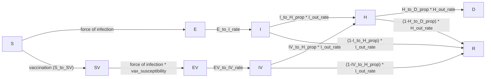

# MA_vax: vaccination-impact analysis report

Massachusetts, 2025–2026 influenza season. This report documents the model,
fit, and vaccination-impact results produced by the `generic_core`-exported
pipeline in this folder (`counterfactual_generic.py`, `run_simulations_MA_vax.py`,
`build_counterfactual_tables_from_db.py`) — i.e. the notebook-built/exported
version of the model documented in `MA_vax/methodology.md`, run against
`model_config.json` + `fitted_params.json` in this folder.

**Status of the results below:** the counterfactual tables (§3) are from
`counterfactual_tables_from_db_deterministic/` — a **single deterministic
simulation per scenario**, not the stochastic replications the final version
will use. They are included here as a placeholder with real numbers to
review the analysis structure and rough magnitudes; point estimates should
be directionally reliable but every `[X% - X%]` "confidence interval" in
these tables is degenerate (a single point repeated) and will be replaced
once `run_counterfactual_tables_generic.py`/`build_counterfactual_tables_from_db.py`
are re-run with `n_reps > 1`. The baseline-fit-check section (§4) is not a
placeholder in the same sense — it already uses all 638 posterior parameter
draws for its uncertainty band, independent of that stochastic-rerun.

## How this differs from `MA_vax/methodology.md`

`methodology.md` documents the hand-written `MA_vax/model.py` pipeline and a
specific calibration run (`outputs_2026-07-30_age_ihr_scale_no_V_infec/`).
This report uses the same model *structure* but a different, more recent
calibration, run through the Model Builder notebook's Fitting tab instead of
the standalone `fit_bayesian.py` script. Concretely:

- **Model structure and fixed parameters are unchanged** — compartments,
  transitions, age-stratified `I_to_H_prop`/`IV_to_H_prop`/`H_to_D_prop`/
  `vax_susceptibility`/population/`E0_counts`, and `IV_relative_infectiousness
  = 1.0` in `model_config.json` all match §1–§2 of `methodology.md` exactly
  (verified against `model_config.json`'s `params` block).
- **The fitted posterior is materially different from the table in
  `methodology.md` §4** — this is a separate calibration run, not a
  reproduction of it. See §2.3 below for this run's own fitted-parameter
  table; don't mix point estimates between the two documents.
- **Two fit-configuration changes**, visible in `fitted_params.json`'s
  `fit_config`:
  - The time-varying transmission multiplier `m(t)` uses **14-day knots**
    here vs. the 30-day (monthly) knots documented in methodology.md §3.3 —
    finer temporal resolution for the same random-walk smoothing device.
  - Burn-in/thinning are **fixed** (burn-in 1700 steps, thin 200) rather than
    derived from the integrated autocorrelation time as methodology.md §3.4
    describes for `fit_bayesian.py`.
- **One additional fit target**: alongside the same 7 per-age daily
  hospitalization time series (NB2 likelihood, §3.2 of methodology.md,
  unchanged), this fit also constrains a scalar **end-of-season cumulative
  hospitalizations by age** target
  (`MA_flu_end_of_season_hospitalizations_by_age.csv`) — not present in the
  documented `fit_bayesian.py` pipeline.
- **Parameter naming differs** (generic_core's config-driven fitting vs. the
  hand-written pipeline's naming): `E0_scale` → `seed_scale_E`, `ihr_scale`
  (per age) → `IHR_scale|a0`…`IHR_scale|a6`, `dlogm_k` → `m_dlog_k`. Same
  roles, different keys.
- **638 posterior draws** are stored in `fitted_params.json["accepted_params"]`
  (`method: "mcmc"`), vs. methodology.md's reference to `emcee`'s full chain —
  this is presumably a thinned/burned-in subset in the same spirit as
  methodology.md §3.4 describes, just under the generic_core fitting
  machinery.
- **Vaccination coverage is essentially unchanged** (§2.4 below vs.
  methodology.md §5, within ~0.2 percentage points per age group) — expected,
  since the vaccination schedule input doesn't depend on the fit.

Sections 1, 2.1, 2.2, 5, and 6 below are reused from `methodology.md`
largely as-is, since they describe things verified unchanged (model
structure, fixed parameters, data sources). Sections 2.3 (fitted parameters)
and everything in §3–4 (results) are new to this report.

---

## 1. Model structure

### 1.1 Compartments

Nine compartments, each stratified by 7 age groups
(`0`, `1-4`, `5-12`, `13-17`, `18-49`, `50-64`, `65+`):

| Compartment | Meaning |
|---|---|
| `S`  | Susceptible, unvaccinated |
| `E`  | Exposed (latent), unvaccinated |
| `I`  | Infectious, unvaccinated |
| `R`  | Recovered/removed (either arm) |
| `SV` | Susceptible, vaccinated |
| `EV` | Exposed (latent), vaccinated |
| `IV` | Infectious, vaccinated |
| `H`  | Hospitalized (either arm) |
| `D`  | Dead (either arm) |

The vaccinated arm (`SV → EV → IV → H/R`) mirrors the unvaccinated arm
(`S → E → I → H/R`), with its own susceptibility and severity parameters.
`H`, `R`, `D` are shared, pooled compartments — once hospitalized (or
recovered), an individual's vaccination history is no longer tracked.



### 1.2 Force of infection

Contacts come from fixed age×age matrices (Mistry et al. 2021 synthetic
contact matrices), with school/work contacts removed on non-school/work days:

```
C(t) = total_C − (1 − is_school(t))·school_C − (1 − is_work(t))·work_C
beta_adj(t) = beta_baseline · m(t) · (1 + humidity_impact · exp(−180 · humidity(t)))
wtd_inf_prop(t) = (I·I_relative_infectiousness + IV·IV_relative_infectiousness) / population
foi(t) = beta_adj(t) · (C(t) @ wtd_inf_prop(t))
S_to_E   = foi(t) · relative_suscept   · S
SV_to_EV = foi(t) · vax_susceptibility · SV
```

`IV_relative_infectiousness = 1.0` — breakthrough infections are as
transmissible as unvaccinated infections (same as the run documented in
methodology.md, not the earlier 0.5 assumption). `vax_susceptibility`
(age-specific, < 1) is the residual susceptibility of a vaccinated
individual; `1 − vax_susceptibility` is the model's implied VE against
infection.

### 1.3 Progression, hospitalization, death

```
E_to_I  = E_to_I_rate · E                 EV_to_IV = EV_to_IV_rate · EV
I_to_H  = I_out_rate · I_to_H_prop · I     IV_to_H  = I_out_rate · IV_to_H_prop · IV
I_to_R  = I_out_rate · (1−I_to_H_prop)·I   IV_to_R  = I_out_rate · (1−IV_to_H_prop)·IV
H_to_D  = H_out_rate · H_to_D_prop · H
H_to_R  = H_out_rate · (1−H_to_D_prop)·H
```

`IV_to_H_prop < I_to_H_prop` for every age group — vaccination reduces
hospitalization risk *given* infection (severity VE), on top of reducing
infection risk.

### 1.4 Vaccination flow

Daily doses (age-specific proportion, 14-day delay to effective immunity)
are applied as an exact `S → SV` count, capped at available `S`:

```
base(t) = S + SV
S_to_SV(t) = min(round(vax_prop(t) · base(t)), S)
```

The base pool (`S + SV`) is not eroded by vaccination itself — only
infection depletes it — so a flat input proportion vaccinates a roughly
constant head-count per day. See methodology.md §1.5 for the full
discussion (unchanged in this run).

### 1.5 Numerical scheme

Deterministic sims: explicit Euler, `TIMESTEPS_PER_DAY = 7` sub-steps/day.
Stochastic sims (used for the S.A.* tables' confidence intervals, once
re-run with `n_reps > 1`): chain-binomial at the same sub-daily resolution.
Vaccination stays a deterministic scheduled count in both.

### 1.6 Initial conditions

At `start_date = 2025-09-01`: `S = population − E0_counts·seed_scale_E`,
`E = E0_counts·seed_scale_E`, all other compartments zero.

---

## 2. Parameters

### 2.1 Fixed scalar parameters

| Parameter | Value | Meaning |
|---|---|---|
| `start_date` | 2025-09-01 | Simulation start |
| `num_days` | 250 | Simulation length (report/counterfactual sims) |
| `relative_suscept` | 1.0 | Susceptibility multiplier, unvaccinated arm |
| `I_relative_infectiousness` | 1.0 | Infectiousness weight, unvaccinated `I` |
| `IV_relative_infectiousness` | 1.0 | Infectiousness weight, vaccinated `IV` |
| `E_to_I_rate` | 0.5 /day | ~2-day latent period |
| `EV_to_IV_rate` | 0.5 /day | Same, vaccinated arm |
| `I_out_rate` | 0.333 /day | ~3-day infectious period |
| `H_out_rate` | 0.17 /day | ~6-day hospital stay |
| `vax_transfer_delay_days` | 14 | Days from dose to modeled immunity |

### 2.2 Age-stratified fixed parameters

| Age group | Population | `I_to_H_prop`¹ | `IV_to_H_prop`¹ | `H_to_D_prop` | `vax_susceptibility` | `E0_counts` |
|---|---:|---:|---:|---:|---:|---:|
| 0 | 70,067 | 0.00697 | 0.00636 | 0.0174 | 0.57 | 2 |
| 1-4 | 280,268 | 0.00697 | 0.00636 | 0.0174 | 0.57 | 8 |
| 5-12 | 606,291 | 0.00274 | 0.00250 | 0.0117 | 0.57 | 17 |
| 13-17 | 411,782 | 0.00274 | 0.00250 | 0.0117 | 0.57 | 12 |
| 18-49 | 2,978,204 | 0.00561 | 0.00511 | 0.0263 | 0.79 | 85 |
| 50-64 | 1,424,434 | 0.01060 | 0.00966 | 0.0630 | 0.79 | 41 |
| 65+ | 1,221,349 | 0.09091 | 0.06273 | 0.0799 | 1.00 | 35 |

¹ Pre-fit baseline values — the calibration scales these by the fitted
`IHR_scale` per age group (§2.3); the model actually uses these × `IHR_scale`.
`vax_susceptibility = 1.0` for 65+ means no modeled infection-blocking effect
of vaccination in that group (only the severity effect applies).

### 2.3 Fitted parameters (this run, `fitted_params.json`, `method = mcmc`, 638 posterior draws)

Posterior mean ± 90% credible interval (5th–95th percentile) vs. the
highest-posterior-support ("best") point:

| Parameter | Posterior mean | 5% | 95% | "Best" point |
|---|---:|---:|---:|---:|
| `beta_baseline` | 0.0367 | 0.0314 | 0.0419 | 0.0379 |
| `humidity_impact` | 0.595 | 0.297 | 0.910 | 0.876 |
| `seed_scale_E` (E0 multiplier) | 1.80 | 0.58 | 3.98 | 1.37 |
| `IHR_scale` — 0 | 1.45 | 0.94 | 1.91 | 1.67 |
| `IHR_scale` — 1-4 | 1.63 | 1.16 | 1.96 | 1.76 |
| `IHR_scale` — 5-12 | 1.31 | 0.86 | 1.82 | 1.22 |
| `IHR_scale` — 13-17 | 0.96 | 0.62 | 1.41 | 0.97 |
| `IHR_scale` — 18-49 | 0.52 | 0.34 | 0.70 | 0.47 |
| `IHR_scale` — 50-64 | 0.70 | 0.46 | 0.96 | 0.65 |
| `IHR_scale` — 65+ | 0.93 | 0.66 | 1.24 | 0.94 |
| `phi` (NB dispersion) | 116 | 25 | 357 | 254 |

The 18 `m_dlog_1…m_dlog_18` monthly-ish (14-day-knot) increments aren't
independently interpretable and are summarized visually through the fit
check in §4 rather than as a table. As in methodology.md §4, the posterior
mean and "best" point disagree materially for several parameters
(`humidity_impact`: 0.60 vs. 0.88) — a reminder that the marginal mean of a
correlated posterior needn't correspond to a jointly plausible parameter
combination. The counterfactual tables in §3 use the "best" point (single
deterministic run); the fit-check band in §4 uses all 638 draws.

### 2.4 Cumulative vaccination coverage

Cumulative proportion of each age group vaccinated over the season
(`sum(S_to_SV) / population`, baseline schedule, best-point deterministic run):

| Age group | Population | Baseline cumulative coverage |
|---|---:|---:|
| 0 | 70,067 | 44.8% |
| 1-4 | 280,268 | 89.6% |
| 5-12 | 606,291 | 69.5% |
| 13-17 | 411,782 | 54.1% |
| 18-49 | 2,978,204 | 38.8% |
| 50-64 | 1,424,434 | 58.1% |
| 65+ | 1,221,349 | 71.1% |
| **All (population-weighted)** | **6,992,395** | **54.0%** |

Matches methodology.md §5 to within ~0.2 percentage points per group — the
vaccination schedule doesn't depend on the fit, so this is expected. As
documented there: five of seven age groups sit below a 70% target (18-49
lowest at 38.8%), 1-4 (89.6%) is well above it, and 65+ (71.1%) is already
at it — relevant context for reading the "scale to 70%" scenarios in the
appendix (§5).

---

## 3. Vaccination-impact results

**All tables in this section are placeholder deterministic results** (a
single simulation per scenario, from `counterfactual_tables_from_db_deterministic/`)
— point estimates only, no real confidence intervals yet. They'll be
replaced with stochastic (multi-replication) results from the same pipeline.

### New daily hospitalizations: baseline vs. no vaccination

Total-population `I_to_H + IV_to_H`, best-point deterministic simulation,
comparing the fitted baseline vaccination schedule against a counterfactual
with no vaccination at all:


Vaccination makes the peak in daily new
hospitalizations less than a third of what it would be without vaccines (baseline ≈ 155/day vs. no-vaccination ≈ 545/day at the
December peak) without changing its
timing.

### Table S.A.1 — Hospitalizations averted, infection vs. severity protection

Compares *no vaccination* → *infection-protection-only* (VE against
infection retained, VE against severity zeroed out) → *baseline* (full VE),
by age group and aggregate. Decomposes total hospitalizations averted into
the share attributable to blocking infection vs. the share attributable to
reducing severity given a breakthrough infection.

| age_group | pct_averted_reduced_infection | per100k_averted_reduced_infection | per100k_doses_averted_reduced_infection | pct_averted_reduced_severity | per100k_averted_reduced_severity | per100k_doses_averted_reduced_severity | pct_averted_total | per100k_averted_total | per100k_doses_averted_total |
|---|---|---|---|---|---|---|---|---|---|
| 0 | 68.7% | 129.9 | 289.8 | 0.7% | 1.2 | — | 69.3% | 131.1 | 292.6 |
| 1-4 | 74.3% | 176.8 | 197.4 | 1.3% | 3.1 | — | 75.6% | 179.9 | 200.8 |
| 5-12 | 71.5% | 65.4 | 94.1 | 1.0% | 0.9 | — | 72.5% | 66.3 | 95.4 |
| 13-17 | 68.9% | 51.5 | 95.1 | 0.9% | 0.6 | — | 69.7% | 52.1 | 96.3 |
| 18-49 | 63.7% | 39.8 | 102.8 | 0.8% | 0.5 | — | 64.5% | 40.3 | 104.1 |
| 50-64 | 65.1% | 94.4 | 162.4 | 1.2% | 1.8 | — | 66.3% | 96.1 | 165.5 |
| 65+ | 62.6% | 687.0 | 965.8 | 6.7% | 73.4 | — | 69.3% | 760.3 | 1068.9 |
| All | 63.8% | 173.3 | 320.8 | 5.0% | 13.6 | — | 68.9% | 186.9 | 346.0 |

Almost all of the averted burden comes from **blocking infection**, not from
reducing severity given a breakthrough — expected given `vax_susceptibility`
is well below 1 for every group except 65+ (where `vax_susceptibility = 1.0`
by construction, so its 6.7% severity-protection share is the largest of any
age group — the *only* protective channel modeled for that group).

### Table S.A.2 — Hospitalizations averted by age group vaccinated

Each column vaccinates a single age group only (all others unvaccinated) and
compares to no vaccination; "All" is the full baseline schedule. Rows are
the age group in which hospitalizations are counted.

**Percent reduction in hospitalizations**

| age_group | 0 | 1-4 | 5-12 | 13-17 | 18-49 | 50-64 | 65+ | All |
|---|---|---|---|---|---|---|---|---|
| 0 | 16.9% | 8.5% | 24.3% | 14.0% | 18.1% | 8.8% | 0.0% | 69.3% |
| 1-4 | 0.5% | 38.7% | 25.8% | 13.4% | 16.8% | 8.3% | 0.0% | 75.6% |
| 5-12 | 0.4% | 7.1% | 46.5% | 13.1% | 14.4% | 7.3% | 0.0% | 72.5% |
| 13-17 | 0.3% | 5.8% | 21.5% | 35.1% | 14.5% | 7.8% | 0.0% | 69.7% |
| 18-49 | 0.4% | 7.0% | 22.2% | 13.6% | 23.7% | 9.1% | 0.0% | 64.5% |
| 50-64 | 0.4% | 6.6% | 21.9% | 13.9% | 17.2% | 21.3% | 0.0% | 66.3% |
| 65+ | 0.4% | 7.3% | 23.4% | 14.6% | 17.6% | 10.4% | 18.3% | 69.3% |
| All | 0.5% | 8.3% | 23.8% | 14.7% | 18.0% | 11.3% | 12.9% | 68.9% |

**Hospitalizations averted per 100K population**

| age_group | 0 | 1-4 | 5-12 | 13-17 | 18-49 | 50-64 | 65+ | All |
|---|---|---|---|---|---|---|---|---|
| 0 | 31.9 | 16.1 | 45.9 | 26.5 | 34.2 | 16.7 | 0.0 | 131.1 |
| 1-4 | 1.2 | 92.2 | 61.4 | 31.9 | 40.0 | 19.8 | 0.0 | 179.9 |
| 5-12 | 0.3 | 6.5 | 42.5 | 12.0 | 13.2 | 6.7 | 0.0 | 66.3 |
| 13-17 | 0.2 | 4.3 | 16.0 | 26.2 | 10.8 | 5.8 | 0.0 | 52.1 |
| 18-49 | 0.3 | 4.4 | 13.9 | 8.5 | 14.8 | 5.7 | 0.0 | 40.3 |
| 50-64 | 0.6 | 9.6 | 31.8 | 20.2 | 24.9 | 30.9 | 0.0 | 96.1 |
| 65+ | 4.7 | 79.7 | 256.4 | 160.0 | 192.7 | 114.4 | 200.2 | 760.3 |
| All | 1.5 | 22.4 | 64.7 | 39.8 | 48.8 | 30.6 | 35.0 | 186.9 |

**Hospitalizations averted per 100K doses**

| age_group | 0 | 1-4 | 5-12 | 13-17 | 18-49 | 50-64 | 65+ | All |
|---|---|---|---|---|---|---|---|---|
| 0 | 72.6 | — | — | — | — | — | — | 292.6 |
| 1-4 | — | 104.6 | — | — | — | — | — | 200.8 |
| 5-12 | — | — | 62.1 | — | — | — | — | 95.4 |
| 13-17 | — | — | — | 49.4 | — | — | — | 96.3 |
| 18-49 | — | — | — | — | 39.1 | — | — | 104.1 |
| 50-64 | — | — | — | — | — | 54.4 | — | 165.5 |
| 65+ | — | — | — | — | — | — | 285.4 | 1068.9 |
| All | 330.7 | 634.7 | 1090.9 | 1272.0 | 302.6 | 264.2 | 285.4 | 346.0 |

Diagonal entries (age group vaccinated = age group counted) are the direct
effect; off-diagonal entries are the indirect (transmission-blocking)
benefit to *other* age groups from vaccinating this one — e.g. vaccinating
5-12 alone reduces hospitalizations in 0 by 24.3% and in 1-4 by 25.8%,
larger than several of that group's own-age effects, consistent with school-
age children being a major transmission hub in the contact matrix. 65+ is
the only group with zero indirect effect on every other group.

### Table S.A.4 — VE sensitivity scenarios

Implied vaccine effectiveness against infection and against
hospitalization-given-infection for each preset VE scenario. These
multipliers are explicitly flagged upstream (`counterfactual_generic.py` /
`MA_vax.counterfactual`) as **placeholder-ish** — a naive uniform VE scale
can push `IV_to_H_prop` above `I_to_H_prop` for some age groups under
`low_ve` (i.e., implies *negative* severity VE); read these as illustrative
sensitivity bounds, not literature-calibrated VE estimates.

| scenario | age_group | VE_infection | VE_hosp_infection | VE_hosp_given_infection | VE_transmission_blocking |
|---|---|---|---|---|---|
| low_ve | 0 | 33% | 33% | 0% | 0% |
| low_ve | 1-4 | 33% | 33% | 0% | 0% |
| low_ve | 5-12 | 33% | 33% | 0% | 0% |
| low_ve | 13-17 | 33% | 33% | 0% | 0% |
| low_ve | 18-49 | 6% | 10% | 4% | 0% |
| low_ve | 50-64 | 6% | 10% | 4% | 0% |
| low_ve | 65+ | 0% | 21% | 21% | 0% |
| baseline_ve | 0 | 43% | 48% | 9% | 0% |
| baseline_ve | 1-4 | 43% | 48% | 9% | 0% |
| baseline_ve | 5-12 | 43% | 48% | 9% | 0% |
| baseline_ve | 13-17 | 43% | 48% | 9% | 0% |
| baseline_ve | 18-49 | 21% | 28% | 9% | 0% |
| baseline_ve | 50-64 | 21% | 28% | 9% | 0% |
| baseline_ve | 65+ | 0% | 31% | 31% | 0% |
| high_ve | 0 | 51% | 78% | 55% | 0% |
| high_ve | 1-4 | 51% | 78% | 55% | 0% |
| high_ve | 5-12 | 51% | 78% | 55% | 0% |
| high_ve | 13-17 | 51% | 78% | 55% | 0% |
| high_ve | 18-49 | 34% | 44% | 16% | 0% |
| high_ve | 50-64 | 34% | 44% | 16% | 0% |
| high_ve | 65+ | 14% | 39% | 29% | 0% |

`baseline_ve` is the model's fitted VE (not literally a "sensitivity"
scenario, included here as the reference point); `low_ve`/`high_ve` bracket
it. Note `65+` has 0% `VE_infection` in every scenario, by construction
(`vax_susceptibility = 1.0` there, §2.2).

### Table S.A.5 — Hospitalizations averted across VE scenarios

Compares each VE sensitivity scenario against no vaccination.

**Percent reduction in hospitalizations**

| age_group | low_ve | baseline_ve | high_ve |
|---|---|---|---|
| 0 | 48.4% | 69.3% | 82.6% |
| 1-4 | 55.5% | 75.6% | 88.8% |
| 5-12 | 52.6% | 72.5% | 85.6% |
| 13-17 | 49.1% | 69.7% | 83.2% |
| 18-49 | 41.2% | 64.5% | 78.1% |
| 50-64 | 42.1% | 66.3% | 80.1% |
| 65+ | 48.2% | 69.3% | 81.6% |
| All | 47.3% | 68.9% | 81.5% |

**Hospitalizations averted per 100K population**

| age_group | low_ve | baseline_ve | high_ve |
|---|---|---|---|
| 0 | 91.6 | 131.1 | 156.3 |
| 1-4 | 132.1 | 179.9 | 211.5 |
| 5-12 | 48.0 | 66.3 | 78.2 |
| 13-17 | 36.7 | 52.1 | 62.2 |
| 18-49 | 25.8 | 40.3 | 48.9 |
| 50-64 | 61.0 | 96.1 | 116.0 |
| 65+ | 529.0 | 760.3 | 894.4 |
| All | 128.3 | 186.9 | 221.2 |

Even under `low_ve`, the fitted vaccination schedule still averts ~47% of
hospitalizations overall — the schedule's coverage (§2.4) matters roughly as
much as the assumed per-dose effectiveness across this VE range.

---

## 4. Baseline fit check — posterior-uncertainty simulation vs. raw data

Unlike the S.A.* tables above (single deterministic run), this section
simulates the **baseline (fitted-vaccination) scenario once per posterior
parameter draw** — all 638 sets in `fitted_params.json["accepted_params"]`,
each run deterministically — and reports the median and 95% interval across
draws, in the same style as the Model Builder notebook's Fitting tab
(median + `fill_between` 95% CI, steelblue). This is a genuine posterior
uncertainty band, not a placeholder, and doesn't depend on the stochastic
counterfactual-table rerun mentioned in §3.

### Cumulative hospitalizations, by age group

Sum of simulated (posterior median and 95% CI) vs. raw daily hospital
admissions, over the 2025-09-08 – 2026-05-17 range common to both series:

| age_group | simulated_median | simulated_95pct_lo | simulated_95pct_hi | raw_data | pct_diff_median |
|---|---:|---:|---:|---:|---:|
| 0 | 35.7 | 22.3 | 53.1 | 41.1 | -13.1% |
| 1-4 | 152.9 | 102.0 | 214.5 | 164.6 | -7.1% |
| 5-12 | 160.8 | 110.1 | 226.8 | 160.5 | 0.2% |
| 13-17 | 90.3 | 59.5 | 131.9 | 90.3 | 0.0% |
| 18-49 | 735.2 | 546.7 | 972.8 | 726.0 | 1.3% |
| 50-64 | 748.5 | 553.8 | 981.0 | 749.6 | -0.1% |
| 65+ | 4119.7 | 3328.8 | 5049.5 | 4222.3 | -2.4% |
| **All** | **6043.1** | **4723.1** | **7629.5** | **6154.4** | **-1.8%** |

The fit tracks the data closely overall (-1.8% on the total, raw value
within the 95% band for every age group) — the largest relative miss is in
the smallest group (age 0, -13.1%, but only ~5 admissions off in absolute
terms).

### Daily new hospitalizations by age group


### Cumulative hospitalizations by age group


The posterior band captures the single main epidemic wave (peaking around
late December/early January) well across all age groups; the raw data's
step-function jumps for the youngest ages (0, 1-4) reflect sparse/low
counts and irregular reporting cadence rather than a systematic fit issue —
the median curve stays close to the smoothed trend of those steps.

---

## 5. Data sources

| Input | Source |
|---|---|
| Age-specific vaccination coverage | [midas-network/flu-scenario-modeling-hub_resources](https://github.com/midas-network/flu-scenario-modeling-hub_resources/blob/main/Rd6_datasets/Age_Specific_Coverage_Flu_RD1_2025_26_Sc_A_B.csv) |
| Hospital admissions (calibration target) | [midas-network/flu-scenario-modeling-hub](https://github.com/midas-network/flu-scenario-modeling-hub/blob/main/target-data/time-series.csv) |
| Population by age group | US Census (`tidycensus`), via `generic_core/examples/massachusetts_vax/data/clt_get_population.R` |
| Contact matrices | Mistry et al. 2021 synthetic contact matrices, via `generic_core/examples/massachusetts_vax/data/download_contact_matrices.py` (epydemix-data) |
| Absolute humidity | gridMET daily specific-humidity NetCDFs, MA-averaged, via `generic_core/examples/massachusetts_vax/data/extract_ma_humidity.py` |
| School/work calendar | `MA_school_work_calendar.csv` |

---

## 6. Things to flag when presenting this

- **The S.A.* tables in §3 are deterministic placeholders** (§3 header) —
  re-run `run_counterfactual_tables_generic.py --n-reps <N>` (or pipeline 1 +
  `build_counterfactual_tables_from_db.py`) for real confidence intervals
  before this leaves review.
- **This report's fit is a different calibration run from the one documented
  in `methodology.md`** (§0) — don't compare §2.3's parameter values to
  methodology.md §4's table directly; only full-model outputs (posterior
  predictive hospitalizations) are comparable in spirit.
- **VE sensitivity scenarios (Table S.A.4) are explicitly flagged upstream as
  placeholder-ish** — a naive uniform VE scale can imply negative severity VE
  for some age groups under `low_ve`; worth restating alongside Table S.A.4/5/6.
- **The posterior mean vs. "best" (MAP) point can disagree materially**
  (§2.3) — this report's counterfactual tables (§3) use the "best" point; say
  so explicitly if these numbers are quoted elsewhere.
- **`m(t)` is a statistical smoothing device, not a mechanistic term** — the
  14-day-knot random walk in this fit absorbs whatever transmission
  variation the mechanistic model (contacts, humidity) doesn't explain; it
  should not be read as an independently-measured behavioral signal.
- **Table S.A.3/S.A.6 "scale to 70% coverage" scenarios (appendix) target
  70% in *both* directions** — for age groups already above 70% baseline
  coverage (1-4, and 65+ which is ≈70%), the scenario *reduces* vaccination
  rather than adding to it (see appendix note).

---

## Appendix: Tables S.A.3 and S.A.6

### Table S.A.3 — Additional hospitalizations averted at 70% coverage

Each column scales a single age group's vaccination schedule to reach (a
naive cross-product estimate of) 70% cumulative coverage; "All" scales every
age group. Compared against the baseline vaccination scenario. Per §2.4,
five age groups sit below 70% baseline coverage and two (1-4, 65+) sit at or
above it — for those two, "scaling to 70%" *reduces* the schedule, so their
columns show costs of cutting uptake, not benefits of raising it (see the
negative entries for `1-4`, e.g. -13.9% within its own age group).

**Percent reduction in hospitalizations**

| age_group | 0 | 1-4 | 5-12 | 13-17 | 18-49 | 50-64 | 65+ | All |
|---|---|---|---|---|---|---|---|---|
| 0 | 11.5% | -2.7% | 0.3% | 6.2% | 20.8% | 2.9% | 0.0% | 34.6% |
| 1-4 | 0.4% | -13.9% | 0.3% | 6.1% | 19.7% | 2.8% | 0.0% | 17.4% |
| 5-12 | 0.3% | -2.5% | 0.6% | 6.3% | 18.3% | 2.6% | 0.0% | 24.4% |
| 13-17 | 0.3% | -2.1% | 0.3% | 15.5% | 18.5% | 2.8% | 0.0% | 32.1% |
| 18-49 | 0.4% | -2.4% | 0.3% | 6.3% | 26.0% | 3.0% | 0.0% | 31.7% |
| 50-64 | 0.3% | -2.2% | 0.3% | 6.3% | 20.2% | 6.1% | 0.0% | 28.8% |
| 65+ | 0.3% | -2.3% | 0.3% | 6.3% | 20.0% | 3.2% | -0.3% | 26.1% |
| All | 0.4% | -2.6% | 0.3% | 6.4% | 20.6% | 3.5% | -0.2% | 26.9% |

**Hospitalizations averted per 100K population**

| age_group | 0 | 1-4 | 5-12 | 13-17 | 18-49 | 50-64 | 65+ | All |
|---|---|---|---|---|---|---|---|---|
| 0 | 6.7 | -1.6 | 0.2 | 3.6 | 12.1 | 1.7 | 0.0 | 20.1 |
| 1-4 | 0.2 | -8.1 | 0.2 | 3.5 | 11.5 | 1.6 | 0.0 | 10.1 |
| 5-12 | 0.1 | -0.6 | 0.2 | 1.6 | 4.6 | 0.7 | 0.0 | 6.1 |
| 13-17 | 0.1 | -0.5 | 0.1 | 3.5 | 4.2 | 0.6 | 0.0 | 7.3 |
| 18-49 | 0.1 | -0.5 | 0.1 | 1.4 | 5.8 | 0.7 | 0.0 | 7.1 |
| 50-64 | 0.2 | -1.1 | 0.1 | 3.1 | 9.9 | 3.0 | 0.0 | 14.1 |
| 65+ | 1.2 | -7.8 | 0.9 | 21.2 | 67.2 | 10.9 | -1.2 | 87.9 |
| All | 0.4 | -2.2 | 0.2 | 5.4 | 17.4 | 3.0 | -0.2 | 22.8 |

**Hospitalizations averted per 100K additional doses**

| age_group | 0 | 1-4 | 5-12 | 13-17 | 18-49 | 50-64 | 65+ | All |
|---|---|---|---|---|---|---|---|---|
| 0 | 26.4 | — | 5775.3 | 10992.5 | 10571.4 | 8356.9 | — | 79.1 |
| 1-4 | 4019.6 | — | 4997.2 | 5880.6 | 6597.2 | 5237.0 | — | — |
| 5-12 | 2190.5 | — | 28.2 | 2208.1 | 2353.2 | 2433.0 | — | 767.7 |
| 13-17 | 3615.6 | — | 4235.1 | 21.8 | 3160.7 | 3679.6 | — | 44.7 |
| 18-49 | 3185.7 | — | 3126.6 | 2864.5 | 18.3 | 3055.3 | — | 22.3 |
| 50-64 | 6404.6 | — | 7019.7 | 5396.5 | 5547.8 | 25.0 | — | 115.3 |
| 65+ | 71009.1 | — | 69223.6 | 59868.7 | 60861.4 | 63803.0 | — | — |
| All | 140.0 | — | 483.2 | 548.2 | 128.7 | 121.1 | — | 139.8 |

### Table S.A.6 — Additional hospitalizations averted at 70% coverage, across VE scenarios

For each VE sensitivity scenario, compares that scenario's own baseline
vaccination to (naive) 70% coverage in every age group.

**Percent reduction in hospitalizations**

| age_group | low_ve | baseline_ve | high_ve |
|---|---|---|---|
| 0 | 16.0% | 34.6% | 49.2% |
| 1-4 | 3.2% | 17.4% | 18.9% |
| 5-12 | 9.0% | 24.4% | 32.6% |
| 13-17 | 14.8% | 32.1% | 44.2% |
| 18-49 | 11.6% | 31.7% | 44.3% |
| 50-64 | 10.4% | 28.8% | 40.4% |
| 65+ | 9.4% | 26.1% | 36.7% |
| All | 9.7% | 26.9% | 37.7% |

**Hospitalizations averted per 100K population**

| age_group | low_ve | baseline_ve | high_ve |
|---|---|---|---|
| 0 | 15.6 | 20.1 | 16.2 |
| 1-4 | 3.4 | 10.1 | 5.0 |
| 5-12 | 3.9 | 6.1 | 4.3 |
| 13-17 | 5.6 | 7.3 | 5.5 |
| 18-49 | 4.2 | 7.1 | 6.1 |
| 50-64 | 8.7 | 14.1 | 11.7 |
| 65+ | 53.3 | 87.9 | 74.1 |
| All | 13.9 | 22.8 | 19.0 |
