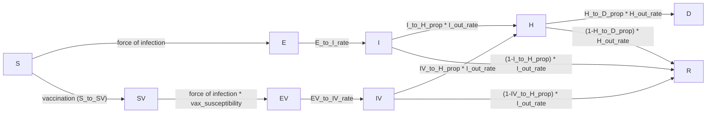

# MA_vax: vaccination-impact analysis report

Massachusetts, 2025–2026 influenza season. Age-structured SEIR model with a
parallel vaccinated arm, calibrated to daily hospital admissions by age
group via Bayesian MCMC. This report documents the model, the fit, and the
resulting vaccination-impact analysis.

---

## 1. Model structure

### 1.1 Compartments

Nine compartments, each stratified by 7 age groups
(`0`, `1-4`, `5-12`, `13-17`, `18-49`, `50-64`, `65+`):

| Compartment | Meaning |
|---|---|
| `S`  | Susceptible, unvaccinated |
| `E`  | Exposed (latent), unvaccinated |
| `I`  | Infectious, unvaccinated |
| `R`  | Recovered/removed (either arm) |
| `SV` | Susceptible, vaccinated |
| `EV` | Exposed (latent), vaccinated |
| `IV` | Infectious, vaccinated |
| `H`  | Hospitalized (either arm) |
| `D`  | Dead (either arm) |

The vaccinated arm (`SV → EV → IV → H/R`) mirrors the unvaccinated arm
(`S → E → I → H/R`), with its own susceptibility and severity parameters.
`H`, `R`, `D` are shared, pooled compartments — once hospitalized (or
recovered), an individual's vaccination history is no longer tracked.



### 1.2 Force of infection

Contacts come from fixed age×age contact matrices (Mistry et al. 2021
synthetic contact matrices), with school/work contacts removed on
non-school/work days:

```
C(t) = total_C − (1 − is_school(t))·school_C − (1 − is_work(t))·work_C
beta_adj(t) = beta_baseline · m(t) · (1 + humidity_impact · exp(−180 · humidity(t)))
wtd_inf_prop(t) = (I·I_relative_infectiousness + IV·IV_relative_infectiousness) / population
foi(t) = beta_adj(t) · (C(t) @ wtd_inf_prop(t))
S_to_E   = foi(t) · relative_suscept   · S
SV_to_EV = foi(t) · vax_susceptibility · SV
```

`m(t)` is a smoothly time-varying transmission multiplier (§2.3) that
absorbs behavioral/seasonal variation the mechanistic terms above don't
otherwise capture. `IV_relative_infectiousness = 1.0` — breakthrough
infections (in vaccinated individuals) are assumed exactly as transmissible
as unvaccinated infections. `vax_susceptibility` (age-specific, < 1) is the
residual susceptibility of a vaccinated individual; `1 − vax_susceptibility`
is the model's implied vaccine effectiveness (VE) against infection.

### 1.3 Progression, hospitalization, death

```
E_to_I  = E_to_I_rate · E                 EV_to_IV = EV_to_IV_rate · EV
I_to_H  = I_out_rate · I_to_H_prop · I     IV_to_H  = I_out_rate · IV_to_H_prop · IV
I_to_R  = I_out_rate · (1−I_to_H_prop)·I   IV_to_R  = I_out_rate · (1−IV_to_H_prop)·IV
H_to_D  = H_out_rate · H_to_D_prop · H
H_to_R  = H_out_rate · (1−H_to_D_prop)·H
```

`IV_to_H_prop < I_to_H_prop` for every age group — vaccination reduces
hospitalization risk *given* infection (severity VE), on top of reducing
infection risk.

### 1.4 Vaccination flow

Daily doses (an age-specific proportion of the population, with a 14-day
delay between dose and effective immunity) are applied as an exact `S → SV`
count each day, capped at whatever remains in `S`:

```
base(t) = S + SV
S_to_SV(t) = min(round(vax_prop(t) · base(t)), S)
```

The base pool (`S + SV`) is not eroded by vaccination itself — only
infection depletes it — so a roughly flat input proportion vaccinates a
roughly constant head-count per day, until `S` starts running low late in
the season.

### 1.5 Numerical scheme

Deterministic simulations use explicit Euler integration with 7 sub-steps
per day. Stochastic simulations (used for confidence intervals throughout
this report) use a chain-binomial scheme at the same sub-daily resolution.
Vaccination itself stays a deterministic scheduled count in both, since it
comes from an external delivery schedule rather than a hazard rate.

### 1.6 Initial conditions

At the start of the simulation (2025-09-01): `S = population − E0`,
`E = E0` (age-specific seed counts, scaled by a single fitted multiplier,
§2.3), and all other compartments start at zero.

---

## 2. Parameters

### 2.1 Fixed scalar parameters

| Parameter | Value | Meaning |
|---|---|---|
| `num_days` | 250 | Simulation length (through ~2026-05-08) |
| `relative_suscept` | 1.0 | Susceptibility multiplier, unvaccinated arm |
| `I_relative_infectiousness` | 1.0 | Infectiousness weight, unvaccinated `I` |
| `IV_relative_infectiousness` | 1.0 | Infectiousness weight, vaccinated `IV` |
| `E_to_I_rate` | 0.5 /day | ~2-day latent period |
| `EV_to_IV_rate` | 0.5 /day | Same, vaccinated arm |
| `I_out_rate` | 0.333 /day | ~3-day infectious period |
| `H_out_rate` | 0.17 /day | ~6-day hospital stay |
| `vax_transfer_delay_days` | 14 | Days from dose to modeled immunity |

### 2.2 Age-stratified fixed parameters

| Age group | Population | Hospitalization risk, given infection¹ | Hospitalization risk, given breakthrough infection¹ | Death risk, given hospitalization | Residual susceptibility if vaccinated | Initial infections seeded¹ |
|---|---:|---:|---:|---:|---:|---:|
| 0 | 70,067 | 0.697% | 0.636% | 1.74% | 0.57 | 2 |
| 1-4 | 280,268 | 0.697% | 0.636% | 1.74% | 0.57 | 8 |
| 5-12 | 606,291 | 0.274% | 0.250% | 1.17% | 0.57 | 17 |
| 13-17 | 411,782 | 0.274% | 0.250% | 1.17% | 0.57 | 12 |
| 18-49 | 2,978,204 | 0.561% | 0.511% | 2.63% | 0.79 | 85 |
| 50-64 | 1,424,434 | 1.060% | 0.966% | 6.30% | 0.79 | 41 |
| 65+ | 1,221,349 | 9.091% | 6.273% | 7.99% | 1.00 | 35 |

¹ These are pre-fit baseline values — the calibration scales both hospitalization-risk columns by a fitted age-specific multiplier (§2.3), so the values actually used in the calibrated model are these figures × that multiplier and the vaccine effectiveness against hospitalization remains the same. 
A residual susceptibility of 1.00 for 65+ means the model assumes **no infection-blocking effect** of vaccination in that age group (only the severity effect applies there).

### 2.3 Fitting method

Free parameters were estimated with an affine-invariant ensemble Markov
Chain Monte Carlo sampler (40 walkers, 4000 iterations per walker), run in
parallel. The free parameters and their priors:

| Parameter | Prior | Role |
|---|---|---|
| `beta_baseline` | Uniform(0.015, 0.06) | Baseline transmission rate |
| `humidity_impact` | Uniform(0, 1) | Strength of humidity forcing |
| Initial-seed multiplier | Log-uniform(0.1, 10) | Multiplies the age-specific initial-infection seed counts |
| Hospitalization-risk multiplier (× 7, one per age group) | Uniform(0.1, 2.0) | Multiplies both hospitalization-risk columns (§2.2) for that age group |
| `m(t)` log-increments (× 18, one per 14-day knot) | Normal(0, 0.25) | Month-to-month-ish random-walk steps in log-transmission (§1.2) |
| `phi` | — | Negative-Binomial dispersion (likelihood nuisance parameter, not a model input) |

**Likelihood**: a Negative-Binomial (NB2) observation model, chosen over
Poisson to allow overdispersion, jointly across 8 targets — daily hospital
admissions **by age group** (7 time series) plus a single scalar
**end-of-season cumulative hospitalizations by age** target.

**Posterior sampling**: the first 1700 iterations were discarded as
burn-in, and the remaining chain thinned to every 200th sample, leaving 638
posterior draws. Two point estimates are used in this report:

- **Posterior mean**: the marginal mean of each parameter. Cheap and
  stable, but for a correlated posterior can land on a parameter
  *combination* the sampler never actually visited.
- **"Best" point**: the single posterior draw with the highest
  log-posterior — not the mean of anything, so it preserves whatever
  correlation structure exists between parameters.

These two can disagree materially (§2.4) — a reminder that the marginal
mean of a correlated posterior needn't correspond to a jointly plausible
parameter combination. `m(t)`'s random-walk prior is a smoothness
assumption, not a mechanistic one — it should not be over-interpreted as an
independently-measured behavioral signal, only as "how much transmission
needs to have moved, beyond what humidity/contacts explain, to reconcile
the model with the data."

### 2.4 Fitted parameters

Posterior mean ± 90% credible interval (5th–95th percentile) across the 638
posterior draws, vs. the "best" (highest-posterior-density) point:

| Parameter | Posterior mean | 5% | 95% | "Best" point |
|---|---:|---:|---:|---:|
| `beta_baseline` | 0.0367 | 0.0314 | 0.0419 | 0.0379 |
| `humidity_impact` | 0.595 | 0.297 | 0.910 | 0.876 |
| Initial-seed multiplier | 1.80 | 0.58 | 3.98 | 1.37 |
| Hospitalization-risk multiplier — 0 | 1.45 | 0.94 | 1.91 | 1.67 |
| Hospitalization-risk multiplier — 1-4 | 1.63 | 1.16 | 1.96 | 1.76 |
| Hospitalization-risk multiplier — 5-12 | 1.31 | 0.86 | 1.82 | 1.22 |
| Hospitalization-risk multiplier — 13-17 | 0.96 | 0.62 | 1.41 | 0.97 |
| Hospitalization-risk multiplier — 18-49 | 0.52 | 0.34 | 0.70 | 0.47 |
| Hospitalization-risk multiplier — 50-64 | 0.70 | 0.46 | 0.96 | 0.65 |
| Hospitalization-risk multiplier — 65+ | 0.93 | 0.66 | 1.24 | 0.94 |
| `phi` (NB dispersion) | 116 | 25 | 357 | 254 |

The 18 `m(t)` log-increments aren't independently interpretable as a table
— they're summarized visually through the fit check in §4 instead.

### 2.5 Cumulative vaccination coverage

Cumulative proportion of each age group actually vaccinated over the season
(reported vaccination-schedule data, summed over the season):

| Age group | Population | Cumulative coverage |
|---|---:|---:|
| 0 | 70,067 | 45.4% |
| 1-4 | 280,268 | 90.7% |
| 5-12 | 606,291 | 71.4% |
| 13-17 | 411,782 | 55.3% |
| 18-49 | 2,978,204 | 40.5% |
| 50-64 | 1,424,434 | 60.4% |
| 65+ | 1,221,349 | 73.2% |
| **All (population-weighted)** | **6,992,395** | **55.9%** |

Coverage spans a wide range: five of the seven age groups sit below a 70%
mark — 18-49 lowest at 40.5%, then 0 (45.4%), 13-17 (55.3%), 50-64 (60.4%)
and 5-12 (71.4%, just over) — while **1-4 (90.7%) is well above it and 65+
(73.2%) is already just above it**. This matters for how the "scale to 70%
coverage" rows in the appendix (Table S.A.3/S.A.6) should be read: for
groups already above 70%, that scenario *reduces* vaccination rather than
adding to it (see the appendix note).

The model's simulated coverage (the vaccination doses that actually land,
after being capped by how much of the population remains unvaccinated-and-
uninfected, §1.4) comes in slightly below these reported figures — by about
0.5-1.5 percentage points per age group — since some scheduled doses arrive
after a person has already been infected.

---

## 3. Vaccination-impact results

Every table in this section reports a **median and 95% interval across 638
simulations** — one simulation per posterior parameter draw (§2.3),
re-using the same draw for every scenario being compared within a table so
that the comparison is paired (variance from the parameter draw itself
cancels out of the *difference* between scenarios). These intervals
therefore reflect **calibration uncertainty** — how much the vaccination-
impact conclusions would change under a different (but similarly plausible)
fit to the same data — not day-to-day epidemic-process noise.

### New daily hospitalizations: baseline vs. no vaccination

Total-population new hospitalizations per day, posterior median and 95%
interval across the 638 parameter draws (§2.3, same posterior-uncertainty
basis as the rest of this section), comparing the fitted baseline
vaccination schedule against a counterfactual with no vaccination at all:


The fitted vaccination program cuts the peak in daily new hospitalizations
to roughly **a third** of what it would otherwise be (median peak ≈
165/day baseline vs. ≈ 585/day with no vaccination, both around
2025-12-28) and reduces the epidemic's height without changing its timing.

### Table S.A.1 — Hospitalizations averted, infection vs. severity protection

Decomposes the total hospitalizations averted by vaccination into two
channels: protection against getting infected at all, and — *given* a
breakthrough infection still happens — protection against that infection
becoming severe enough to need hospitalization.

**Infection protection** (no vaccination → infection-protection-only, i.e. VE against infection retained but VE against severity zeroed out)

| Age group | % Hospitalizations Averted | Averted per 100,000 Population | Averted per 100,000 Doses |
|---|---|---|---|
| 0 | 69.0% [63.8% – 72.5%] | 116.8 [75.1 – 152.6] | 260.2 [168.8 – 340.2] |
| 1-4 | 74.5% [70.0% – 77.6%] | 168.4 [125.3 – 203.0] | 187.8 [139.9 – 227.1] |
| 5-12 | 71.8% [66.2% – 75.6%] | 70.3 [47.2 – 94.5] | 101.3 [68.5 – 135.8] |
| 13-17 | 69.1% [63.0% – 73.2%] | 49.9 [33.4 – 73.3] | 92.3 [62.0 – 135.1] |
| 18-49 | 64.0% [57.6% – 68.3%] | 44.7 [31.9 – 59.3] | 115.4 [83.4 – 152.3] |
| 50-64 | 65.4% [59.5% – 69.4%] | 102.8 [72.9 – 136.3] | 176.9 [126.3 – 233.9] |
| 65+ | 63.0% [57.1% – 67.0%] | 701.6 [542.4 – 852.1] | 985.9 [767.5 – 1194.4] |
| **All** | **64.1% [58.4% – 68.1%]** | **180.3 [141.2 – 214.5]** | **333.9 [263.5 – 395.3]** |

**Severity protection** (infection-protection-only → full baseline, i.e. adding back VE against severity)

| Age group | % Hospitalizations Averted | Averted per 100,000 Population | Averted per 100,000 Doses |
|---|---|---|---|
| 0 | 0.6% [0.6% – 0.8%] | 1.1 [0.7 – 1.6] | 2.5 [1.6 – 3.5] |
| 1-4 | 1.3% [1.1% – 1.5%] | 2.9 [2.0 – 3.9] | 3.3 [2.3 – 4.3] |
| 5-12 | 1.0% [0.9% – 1.2%] | 1.0 [0.7 – 1.3] | 1.4 [1.0 – 1.8] |
| 13-17 | 0.9% [0.7% – 1.0%] | 0.6 [0.4 – 0.9] | 1.2 [0.8 – 1.6] |
| 18-49 | 0.8% [0.7% – 0.9%] | 0.6 [0.5 – 0.7] | 1.5 [1.2 – 1.8] |
| 50-64 | 1.2% [1.1% – 1.4%] | 1.9 [1.5 – 2.3] | 3.3 [2.6 – 4.0] |
| 65+ | 6.7% [6.0% – 7.7%] | 74.4 [67.5 – 81.1] | 104.6 [95.1 – 114.1] |
| **All** | **4.9% [4.4% – 5.8%]** | **13.9 [12.7 – 15.0]** | **25.7 [23.4 – 27.9]** |

The infection-protection-only and full-baseline scenarios being compared
here use the *same* vaccination schedule and dose count (adding back
severity protection doesn't change who gets vaccinated) — so "Averted per
100,000 Doses" is computed against the full baseline dose count (the same
denominator the Total row below uses), not against zero additional doses.

**Total** (no vaccination → full baseline)

| Age group | % Hospitalizations Averted | Averted per 100,000 Population | Averted per 100,000 Doses |
|---|---|---|---|
| 0 | 69.6% [64.6% – 73.0%] | 117.9 [76.0 – 154.0] | 262.9 [170.4 – 343.3] |
| 1-4 | 75.8% [71.5% – 78.8%] | 171.2 [127.5 – 206.9] | 190.9 [142.3 – 231.3] |
| 5-12 | 72.8% [67.4% – 76.5%] | 71.3 [48.1 – 95.8] | 102.7 [69.6 – 137.5] |
| 13-17 | 70.0% [64.1% – 74.0%] | 50.5 [33.9 – 74.1] | 93.5 [62.9 – 136.7] |
| 18-49 | 64.8% [58.6% – 69.0%] | 45.3 [32.4 – 59.9] | 116.9 [84.7 – 154.1] |
| 50-64 | 66.6% [60.9% – 70.5%] | 104.7 [74.6 – 138.6] | 180.1 [129.5 – 237.6] |
| 65+ | 69.7% [64.8% – 72.9%] | 776.3 [621.4 – 927.4] | 1090.7 [876.9 – 1299.9] |
| **All** | **69.1% [64.1% – 72.5%]** | **194.3 [154.7 – 228.8]** | **359.4 [288.7 – 422.1]** |

Almost all of the averted burden comes from **blocking infection**, not
from reducing severity given a breakthrough.

### Table S.A.2 — Hospitalizations averted by age group vaccinated

Each column vaccinates a single age group only (all others left
unvaccinated) and compares to no vaccination at all; "All" is the full
baseline schedule. Rows are the age group in which hospitalizations are
counted, so off-diagonal cells show the indirect (transmission-blocking)
benefit to *other* age groups from vaccinating this one.

**% reduction in hospitalizations**

| Age group (counted) | 0 vaccinated | 1-4 vaccinated | 5-12 vaccinated | 13-17 vaccinated | 18-49 vaccinated | 50-64 vaccinated | 65+ vaccinated | All vaccinated |
|---|---|---|---|---|---|---|---|---|
| 0 | 16.9% [16.3% – 17.3%] | 8.5% [7.4% – 9.5%] | 24.4% [20.7% – 27.3%] | 14.1% [11.8% – 16.0%] | 18.1% [15.3% – 20.3%] | 8.8% [7.4% – 10.0%] | 0.0% [-0.0% – 0.0%] | 69.6% [64.6% – 73.0%] |
| 1-4 | 0.5% [0.4% – 0.5%] | 38.8% [37.0% – 40.2%] | 25.8% [21.8% – 29.0%] | 13.4% [11.1% – 15.4%] | 16.8% [14.0% – 19.1%] | 8.3% [6.8% – 9.5%] | 0.0% [-0.0% – 0.0%] | 75.8% [71.5% – 78.8%] |
| 5-12 | 0.4% [0.3% – 0.4%] | 7.1% [5.8% – 8.1%] | 46.6% [42.5% – 49.7%] | 13.1% [10.5% – 15.2%] | 14.3% [11.4% – 16.8%] | 7.3% [5.8% – 8.6%] | 0.0% [-0.0% – 0.0%] | 72.8% [67.4% – 76.5%] |
| 13-17 | 0.3% [0.3% – 0.4%] | 5.8% [4.6% – 6.8%] | 21.5% [17.3% – 24.9%] | 35.1% [32.0% – 37.5%] | 14.4% [11.4% – 16.9%] | 7.7% [6.1% – 9.0%] | 0.0% [-0.0% – 0.0%] | 70.0% [64.1% – 74.0%] |
| 18-49 | 0.4% [0.4% – 0.5%] | 7.0% [5.8% – 8.0%] | 22.2% [18.4% – 25.4%] | 13.6% [11.2% – 15.7%] | 23.7% [20.7% – 26.0%] | 9.1% [7.5% – 10.4%] | 0.0% [-0.0% – 0.0%] | 64.8% [58.6% – 69.0%] |
| 50-64 | 0.4% [0.3% – 0.4%] | 6.6% [5.5% – 7.6%] | 22.0% [18.3% – 25.0%] | 14.0% [11.6% – 16.0%] | 17.1% [14.3% – 19.4%] | 21.3% [19.5% – 22.7%] | 0.0% [-0.0% – 0.0%] | 66.6% [60.9% – 70.5%] |
| 65+ | 0.4% [0.4% – 0.5%] | 7.3% [6.2% – 8.1%] | 23.5% [20.0% – 26.3%] | 14.6% [12.4% – 16.5%] | 17.6% [14.9% – 19.7%] | 10.4% [8.9% – 11.6%] | 18.3% [18.1% – 18.5%] | 69.7% [64.8% – 72.9%] |
| **All** | **0.5% [0.5% – 0.6%]** | **8.2% [7.2% – 8.9%]** | **23.9% [20.2% – 26.8%]** | **14.7% [12.3% – 16.6%]** | **18.0% [15.2% – 20.2%]** | **11.3% [9.6% – 12.6%]** | **12.7% [12.1% – 13.3%]** | **69.1% [64.1% – 72.5%]** |

**Hospitalizations averted per 100,000 population**

| Age group (counted) | 0 vaccinated | 1-4 vaccinated | 5-12 vaccinated | 13-17 vaccinated | 18-49 vaccinated | 50-64 vaccinated | 65+ vaccinated | All vaccinated |
|---|---|---|---|---|---|---|---|---|
| 0 | 28.6 [18.5 – 37.4] | 14.5 [8.9 – 18.9] | 41.4 [25.4 – 53.9] | 23.9 [14.4 – 31.2] | 30.7 [18.8 – 40.1] | 14.9 [9.1 – 19.6] | 0.0 [-0.0 – 0.0] | 117.9 [76.0 – 154.0] |
| 1-4 | 1.1 [0.8 – 1.3] | 87.6 [65.2 – 105.9] | 58.6 [41.7 – 69.4] | 30.4 [21.5 – 36.0] | 38.0 [27.0 – 45.1] | 18.8 [13.1 – 22.3] | 0.0 [-0.0 – 0.0] | 171.2 [127.5 – 206.9] |
| 5-12 | 0.4 [0.2 – 0.5] | 6.9 [4.3 – 9.6] | 45.5 [30.3 – 61.4] | 12.7 [7.8 – 18.0] | 14.0 [8.5 – 19.9] | 7.1 [4.3 – 10.1] | 0.0 [-0.0 – 0.0] | 71.3 [48.1 – 95.8] |
| 13-17 | 0.2 [0.1 – 0.4] | 4.1 [2.5 – 6.6] | 15.3 [9.4 – 24.1] | 25.3 [16.9 – 37.3] | 10.3 [6.3 – 16.5] | 5.5 [3.4 – 8.9] | 0.0 [-0.0 – 0.0] | 50.5 [33.9 – 74.1] |
| 18-49 | 0.3 [0.2 – 0.4] | 4.9 [3.2 – 6.8] | 15.5 [10.2 – 21.6] | 9.5 [6.3 – 13.3] | 16.5 [11.5 – 22.5] | 6.3 [4.2 – 8.9] | 0.0 [-0.0 – 0.0] | 45.3 [32.4 – 59.9] |
| 50-64 | 0.6 [0.4 – 0.8] | 10.4 [6.8 – 14.3] | 34.4 [22.6 – 47.4] | 21.8 [14.4 – 30.1] | 26.8 [17.7 – 37.0] | 33.5 [23.8 – 44.3] | 0.0 [-0.0 – 0.0] | 104.7 [74.6 – 138.6] |
| 65+ | 4.8 [3.5 – 6.0] | 80.9 [59.4 – 102.7] | 261.5 [190.6 – 332.0] | 163.1 [118.4 – 208.2] | 195.0 [142.7 – 249.0] | 115.7 [85.7 – 146.5] | 203.5 [171.0 – 235.0] | 776.3 [621.4 – 927.4] |
| **All** | **1.5 [1.1 – 1.8]** | **23.0 [17.4 – 28.0]** | **67.3 [49.1 – 84.1]** | **41.3 [29.8 – 52.6]** | **50.6 [36.7 – 63.9]** | **31.8 [23.5 – 39.7]** | **35.5 [29.9 – 41.1]** | **194.3 [154.7 – 228.8]** |

**Hospitalizations averted per 100,000 doses**

| Age group (counted) | 0 vaccinated | 1-4 vaccinated | 5-12 vaccinated | 13-17 vaccinated | 18-49 vaccinated | 50-64 vaccinated | 65+ vaccinated | All vaccinated |
|---|---|---|---|---|---|---|---|---|
| 0 | 65.0 [42.2 – 85.2] | — | — | — | — | — | — | 262.9 [170.4 – 343.3] |
| 1-4 | — | 99.3 [74.2 – 120.4] | — | — | — | — | — | 190.9 [142.3 – 231.3] |
| 5-12 | — | — | 66.5 [45.0 – 89.3] | — | — | — | — | 102.7 [69.6 – 137.5] |
| 13-17 | — | — | — | 47.7 [31.9 – 69.7] | — | — | — | 93.5 [62.9 – 136.7] |
| 18-49 | — | — | — | — | 43.7 [31.1 – 58.7] | — | — | 116.9 [84.7 – 154.1] |
| 50-64 | — | — | — | — | — | 59.0 [42.8 – 77.6] | — | 180.1 [129.5 – 237.6] |
| 65+ | — | — | — | — | — | — | 290.3 [245.6 – 333.4] | 1090.7 [876.9 – 1299.9] |
| **All** | **330.0 [252.9 – 396.7]** | **649.7 [499.0 – 787.0]** | **1133.8 [839.9 – 1406.5]** | **1315.7 [965.2 – 1662.6]** | **314.2 [233.6 – 392.1]** | **274.1 [207.1 – 339.5]** | **290.3 [245.6 – 333.4]** | **359.4 [288.7 – 422.1]** |

Off-diagonal entries confirm real indirect effects — e.g. vaccinating 5-12
alone reduces hospitalizations in 0 by 24.4% and in 1-4 by 25.8%, both
larger than several of those groups' own-age direct effects, consistent
with school-age children acting as a major transmission hub in the contact
structure. 65+ is the only group with essentially zero indirect effect on
every other group.

### Table S.A.4 — Vaccine-effectiveness sensitivity scenarios

Implied vaccine effectiveness under three illustrative VE presets — a
parameter table, not a simulation result. `Baseline VE (fitted)` is the model's
fitted VE (included here as the reference point, not itself a sensitivity
scenario); `Low VE`/`High VE` bracket it and correspond to the estimated
lower and upper bound of VE. The ratio of low/high VE to baseline remains
constant across parameter sets.

| Scenario | Age group | VE against infection | VE against hospitalization (overall) | VE against hospitalization, given infection |
|---|---|---|---|---|
| Low VE | 0 | 33% | 33% | 0% |
| Low VE | 1-4 | 33% | 33% | 0% |
| Low VE | 5-12 | 33% | 33% | 0% |
| Low VE | 13-17 | 33% | 33% | 0% |
| Low VE | 18-49 | 6% | 10% | 4% |
| Low VE | 50-64 | 6% | 10% | 4% |
| Low VE | 65+ | 0% | 21% | 21% |
| Baseline VE (fitted) | 0 | 43% | 48% | 9% |
| Baseline VE (fitted) | 1-4 | 43% | 48% | 9% |
| Baseline VE (fitted) | 5-12 | 43% | 48% | 9% |
| Baseline VE (fitted) | 13-17 | 43% | 48% | 9% |
| Baseline VE (fitted) | 18-49 | 21% | 28% | 9% |
| Baseline VE (fitted) | 50-64 | 21% | 28% | 9% |
| Baseline VE (fitted) | 65+ | 0% | 31% | 31% |
| High VE | 0 | 51% | 78% | 55% |
| High VE | 1-4 | 51% | 78% | 55% |
| High VE | 5-12 | 51% | 78% | 55% |
| High VE | 13-17 | 51% | 78% | 55% |
| High VE | 18-49 | 34% | 44% | 16% |
| High VE | 50-64 | 34% | 44% | 16% |
| High VE | 65+ | 14% | 39% | 29% |

Also note **65+ has 0% VE against infection in every scenario**, by
construction — residual susceptibility is fixed at 1.00 for that age group
(§2.2), so only the severity-protection channel is modeled for it.

### Table S.A.5 — Hospitalizations averted across VE scenarios

Compares each VE sensitivity scenario (§ above) against no vaccination at all.

**% reduction in hospitalizations**

| Age group | Low VE | Baseline VE (fitted) | High VE |
|---|---|---|---|
| 0 | 48.6% [43.5% – 52.3%] | 69.6% [64.6% – 73.0%] | 82.9% [79.6% – 85.2%] |
| 1-4 | 55.6% [50.7% – 59.3%] | 75.8% [71.5% – 78.8%] | 89.1% [86.8% – 90.6%] |
| 5-12 | 52.7% [46.8% – 57.0%] | 72.8% [67.4% – 76.5%] | 85.9% [82.7% – 88.1%] |
| 13-17 | 49.2% [43.1% – 53.7%] | 70.0% [64.1% – 74.0%] | 83.6% [79.8% – 86.1%] |
| 18-49 | 41.3% [35.3% – 45.8%] | 64.8% [58.6% – 69.0%] | 78.5% [73.8% – 81.5%] |
| 50-64 | 42.2% [36.5% – 46.4%] | 66.6% [60.9% – 70.5%] | 80.4% [76.3% – 83.0%] |
| 65+ | 48.4% [43.6% – 52.0%] | 69.7% [64.8% – 72.9%] | 81.9% [78.4% – 84.2%] |
| **All** | **47.3% [42.3% – 51.1%]** | **69.1% [64.1% – 72.5%]** | **81.8% [78.2% – 84.1%]** |

**Hospitalizations averted per 100,000 population**

| Age group | Low VE | Baseline VE (fitted) | High VE |
|---|---|---|---|
| 0 | 82.4 [52.1 – 106.9] | 117.9 [76.0 – 154.0] | 140.1 [90.7 – 183.4] |
| 1-4 | 126.2 [92.1 – 150.1] | 171.2 [127.5 – 206.9] | 201.2 [150.3 – 244.1] |
| 5-12 | 51.3 [33.4 – 69.8] | 71.3 [48.1 – 95.8] | 84.1 [58.5 – 112.2] |
| 13-17 | 35.3 [23.1 – 53.2] | 50.5 [33.9 – 74.1] | 60.6 [41.4 – 87.1] |
| 18-49 | 28.9 [19.7 – 39.3] | 45.3 [32.4 – 59.9] | 54.9 [40.9 – 71.5] |
| 50-64 | 66.2 [45.1 – 89.7] | 104.7 [74.6 – 138.6] | 126.3 [91.8 – 164.7] |
| 65+ | 539.2 [414.0 – 659.2] | 776.3 [621.4 – 927.4] | 912.4 [748.1 – 1073.2] |
| **All** | **133.0 [102.4 – 161.5]** | **194.3 [154.7 – 228.8]** | **229.4 [188.5 – 266.7]** |

Even under the pessimistic `Low VE` assumption, the fitted vaccination
schedule still averts ~47% of hospitalizations overall — the schedule's
*coverage* (§2.5) matters roughly as much as the assumed per-dose
effectiveness across this VE range.

---

## 4. Baseline fit check — posterior-uncertainty simulation vs. raw data

This section simulates the baseline (fitted-vaccination) scenario once per
posterior parameter draw — all 638 draws (§2.3) — and reports the median
and 95% interval across draws, to check the calibrated model against the
raw data it was fit to.

### Cumulative hospitalizations, by age group

Sum of simulated (posterior median and 95% interval) vs. raw daily hospital
admissions, over the range of dates common to both series (2025-09-08 –
2026-05-17):

| Age group | Simulated (median) | Simulated 95% interval | Raw data | % difference (median) |
|---|---:|---:|---:|---:|
| 0 | 35.7 | 22.3 – 53.1 | 41.1 | -13.1% |
| 1-4 | 152.9 | 102.0 – 214.5 | 164.6 | -7.1% |
| 5-12 | 160.8 | 110.1 – 226.8 | 160.5 | 0.2% |
| 13-17 | 90.3 | 59.5 – 131.9 | 90.3 | 0.0% |
| 18-49 | 735.2 | 546.7 – 972.8 | 726.0 | 1.3% |
| 50-64 | 748.5 | 553.8 – 981.0 | 749.6 | -0.1% |
| 65+ | 4119.7 | 3328.8 – 5049.5 | 4222.3 | -2.4% |
| **All** | **6043.1** | **4723.1 – 7629.5** | **6154.4** | **-1.8%** |

The fit tracks the data closely overall (-1.8% on the total, raw value
within the 95% interval for every age group) — the largest relative miss is
in the smallest group (age 0, -13.1%, but only ~5 admissions off in
absolute terms).

### Daily new hospitalizations by age group


### Cumulative hospitalizations by age group


The posterior interval captures the single main epidemic wave (peaking
around late December/early January) well across all age groups.

---

## 5. Data sources

| Input | Source |
|---|---|
| Age-specific vaccination coverage | MIDAS Flu Scenario Modeling Hub resources, age-specific coverage dataset |
| Hospital admissions (calibration target) | MIDAS Flu Scenario Modeling Hub, target-data time series |
| Population by age group | US Census (`tidycensus`) |
| Contact matrices | Mistry et al. 2021 synthetic contact matrices |
| Absolute humidity | gridMET daily specific-humidity data, averaged over Massachusetts |
| School/work calendar | Constructed school/work-day calendar for the state, for each day of the season |

---

## 6. Notes

- **The confidence intervals in §3 reflect calibration uncertainty, not
  epidemic-process noise** — they come from re-running each scenario under
  638 different (but similarly plausible) posterior parameter draws, not
  from chain-binomial simulation noise at fixed parameters.
- **`m(t)` is a statistical smoothing device, not a mechanistic term** — the
  14-day-knot random walk in this fit absorbs whatever transmission
  variation the mechanistic model (contacts, humidity) doesn't explain; it
  should not be read as an independently-measured behavioral signal.
- **The "scale to 70% coverage" scenarios (Table S.A.3/S.A.6, appendix)
  target 70% in *both* directions** — for age groups already above 70%
  baseline coverage (1-4, and 65+ which is just above it), the scenario
  *reduces* vaccination rather than adding to it (see the appendix note).

---

## Appendix: Tables S.A.3 and S.A.6

### Table S.A.3 — Additional hospitalizations averted at 70% coverage

Each column scales a single age group's vaccination schedule to reach
 70% cumulative coverage; "All" scales every age group.
Compared against the baseline vaccination scenario. Per §2.5, five age
groups sit below 70% baseline coverage and two (1-4, 65+) sit at or above
it — for those two, "scaling to 70%" *reduces* the schedule, so their
columns show the cost of cutting uptake, not the benefit of raising it (see
the negative entries for `1-4 vaccinated`, e.g. -14.0% within its own age
group).

**% reduction in hospitalizations**

| Age group (counted) | 0 vaccinated | 1-4 vaccinated | 5-12 vaccinated | 13-17 vaccinated | 18-49 vaccinated | 50-64 vaccinated | 65+ vaccinated | All vaccinated |
|---|---|---|---|---|---|---|---|---|
| 0 | 11.6% [11.4% – 11.7%] | -2.7% [-2.9% – -2.5%] | 0.3% [0.3% – 0.3%] | 6.3% [5.7% – 6.8%] | 21.1% [19.5% – 22.3%] | 2.9% [2.6% – 3.1%] | 0.0% [-0.0% – 0.0%] | 35.0% [33.3% – 36.3%] |
| 1-4 | 0.4% [0.4% – 0.4%] | -14.0% [-14.4% – -13.6%] | 0.3% [0.3% – 0.3%] | 6.2% [5.6% – 6.7%] | 20.1% [18.6% – 21.2%] | 2.8% [2.5% – 3.0%] | 0.0% [-0.0% – 0.0%] | 17.9% [15.9% – 19.3%] |
| 5-12 | 0.3% [0.3% – 0.4%] | -2.5% [-2.7% – -2.3%] | 0.6% [0.6% – 0.7%] | 6.5% [5.8% – 7.0%] | 18.7% [16.9% – 19.9%] | 2.7% [2.4% – 2.9%] | 0.0% [-0.0% – 0.0%] | 24.9% [22.8% – 26.4%] |
| 13-17 | 0.3% [0.3% – 0.3%] | -2.2% [-2.3% – -1.9%] | 0.3% [0.2% – 0.3%] | 15.6% [14.7% – 16.3%] | 18.9% [17.0% – 20.2%] | 2.8% [2.5% – 3.0%] | 0.0% [-0.0% – 0.0%] | 32.6% [30.4% – 34.1%] |
| 18-49 | 0.4% [0.3% – 0.4%] | -2.4% [-2.6% – -2.1%] | 0.3% [0.2% – 0.3%] | 6.4% [5.7% – 6.9%] | 26.3% [24.6% – 27.6%] | 3.1% [2.8% – 3.3%] | 0.0% [-0.0% – 0.0%] | 32.2% [30.1% – 33.6%] |
| 50-64 | 0.3% [0.3% – 0.4%] | -2.3% [-2.4% – -2.0%] | 0.3% [0.2% – 0.3%] | 6.4% [5.7% – 6.9%] | 20.5% [18.9% – 21.7%] | 6.2% [5.8% – 6.4%] | 0.0% [-0.0% – 0.0%] | 29.2% [27.3% – 30.6%] |
| 65+ | 0.4% [0.3% – 0.4%] | -2.4% [-2.5% – -2.1%] | 0.3% [0.2% – 0.3%] | 6.4% [5.8% – 6.9%] | 20.3% [18.7% – 21.4%] | 3.3% [3.0% – 3.5%] | -0.3% [-0.4% – -0.3%] | 26.5% [24.7% – 27.9%] |
| **All** | **0.4% [0.4% – 0.4%]** | **-2.7% [-2.8% – -2.4%]** | **0.3% [0.3% – 0.3%]** | **6.6% [5.9% – 7.0%]** | **21.0% [19.3% – 22.1%]** | **3.6% [3.3% – 3.8%]** | **-0.2% [-0.2% – -0.2%]** | **27.4% [25.4% – 28.9%]** |

**Hospitalizations averted per 100,000 population**

| Age group (counted) | 0 vaccinated | 1-4 vaccinated | 5-12 vaccinated | 13-17 vaccinated | 18-49 vaccinated | 50-64 vaccinated | 65+ vaccinated | All vaccinated |
|---|---|---|---|---|---|---|---|---|
| 0 | 5.9 [3.9 – 8.3] | -1.4 [-1.9 – -0.9] | 0.1 [0.1 – 0.2] | 3.2 [2.2 – 4.4] | 10.8 [7.1 – 14.8] | 1.5 [1.0 – 2.0] | 0.0 [-0.0 – 0.0] | 18.0 [11.8 – 24.8] |
| 1-4 | 0.2 [0.2 – 0.3] | -7.8 [-10.0 – -5.4] | 0.2 [0.1 – 0.2] | 3.4 [2.5 – 4.3] | 11.0 [7.9 – 14.1] | 1.5 [1.1 – 2.0] | 0.0 [-0.0 – 0.0] | 9.8 [7.1 – 12.3] |
| 5-12 | 0.1 [0.1 – 0.1] | -0.7 [-0.9 – -0.5] | 0.2 [0.1 – 0.2] | 1.7 [1.3 – 2.3] | 5.0 [3.6 – 6.5] | 0.7 [0.5 – 0.9] | 0.0 [-0.0 – 0.0] | 6.6 [4.8 – 8.7] |
| 13-17 | 0.1 [0.0 – 0.1] | -0.5 [-0.6 – -0.3] | 0.1 [0.0 – 0.1] | 3.4 [2.4 – 4.7] | 4.1 [2.9 – 5.6] | 0.6 [0.4 – 0.8] | 0.0 [-0.0 – 0.0] | 7.1 [5.0 – 9.7] |
| 18-49 | 0.1 [0.1 – 0.1] | -0.6 [-0.7 – -0.5] | 0.1 [0.1 – 0.1] | 1.6 [1.2 – 2.0] | 6.5 [5.2 – 8.0] | 0.8 [0.6 – 0.9] | 0.0 [-0.0 – 0.0] | 8.0 [6.4 – 9.8] |
| 50-64 | 0.2 [0.1 – 0.2] | -1.2 [-1.5 – -0.9] | 0.1 [0.1 – 0.2] | 3.4 [2.6 – 4.2] | 10.8 [8.4 – 13.5] | 3.3 [2.6 – 4.0] | 0.0 [-0.0 – 0.0] | 15.5 [12.0 – 19.1] |
| 65+ | 1.2 [1.1 – 1.3] | -7.9 [-8.8 – -7.0] | 0.9 [0.8 – 1.0] | 21.7 [19.1 – 24.2] | 68.5 [61.5 – 75.9] | 11.1 [9.9 – 12.3] | -1.2 [-1.3 – -1.1] | 89.7 [80.7 – 99.3] |
| **All** | **0.4 [0.3 – 0.4]** | **-2.3 [-2.5 – -2.1]** | **0.2 [0.2 – 0.3]** | **5.7 [5.1 – 6.2]** | **18.2 [16.6 – 19.8]** | **3.1 [2.8 – 3.4]** | **-0.2 [-0.2 – -0.2]** | **23.8 [21.8 – 25.9]** |


### Table S.A.6 — Additional hospitalizations averted at 70% coverage, across VE scenarios

For each VE sensitivity scenario, compares that scenario's own baseline
vaccination to 70% coverage in every age group.

**% reduction in hospitalizations**

| Age group | Low VE | Baseline VE (fitted) | High VE |
|---|---|---|---|
| 0 | 16.1% [14.6% – 17.2%] | 35.0% [33.3% – 36.3%] | 49.9% [48.4% – 51.3%] |
| 1-4 | 3.3% [1.9% – 4.3%] | 17.9% [15.9% – 19.3%] | 19.6% [17.9% – 21.2%] |
| 5-12 | 9.1% [7.5% – 10.3%] | 24.9% [22.8% – 26.4%] | 33.5% [31.7% – 35.2%] |
| 13-17 | 15.0% [13.1% – 16.3%] | 32.6% [30.4% – 34.1%] | 45.1% [43.2% – 46.8%] |
| 18-49 | 11.7% [10.0% – 12.8%] | 32.2% [30.1% – 33.6%] | 45.1% [43.5% – 46.4%] |
| 50-64 | 10.5% [8.9% – 11.6%] | 29.2% [27.3% – 30.6%] | 41.1% [39.6% – 42.5%] |
| 65+ | 9.5% [8.0% – 10.5%] | 26.5% [24.7% – 27.9%] | 37.4% [35.9% – 38.7%] |
| **All** | **9.8% [8.2% – 10.9%]** | **27.4% [25.4% – 28.9%]** | **38.6% [36.9% – 39.9%]** |

**Hospitalizations averted per 100,000 population**

| Age group | Low VE | Baseline VE (fitted) | High VE |
|---|---|---|---|
| 0 | 14.0 [9.1 – 18.5] | 18.0 [11.8 – 24.8] | 14.4 [9.4 – 20.5] |
| 1-4 | 3.3 [1.9 – 4.0] | 9.8 [7.1 – 12.3] | 4.9 [3.4 – 6.3] |
| 5-12 | 4.2 [2.8 – 5.7] | 6.6 [4.8 – 8.7] | 4.6 [3.4 – 6.1] |
| 13-17 | 5.5 [3.8 – 7.7] | 7.1 [5.0 – 9.7] | 5.4 [3.8 – 7.4] |
| 18-49 | 4.8 [3.6 – 6.2] | 8.0 [6.4 – 9.8] | 6.8 [5.5 – 8.3] |
| 50-64 | 9.5 [6.9 – 12.5] | 15.5 [12.0 – 19.1] | 12.8 [10.2 – 15.5] |
| 65+ | 54.4 [43.3 – 64.1] | 89.7 [80.7 – 99.3] | 75.5 [68.2 – 82.7] |
| **All** | **14.5 [11.5 – 16.9]** | **23.8 [21.8 – 25.9]** | **19.8 [18.2 – 21.4]** |
