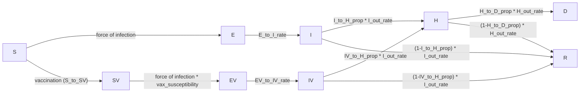
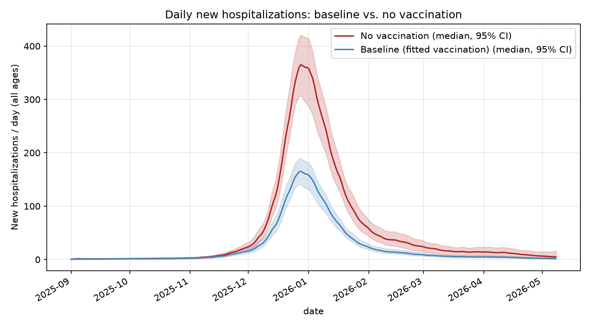
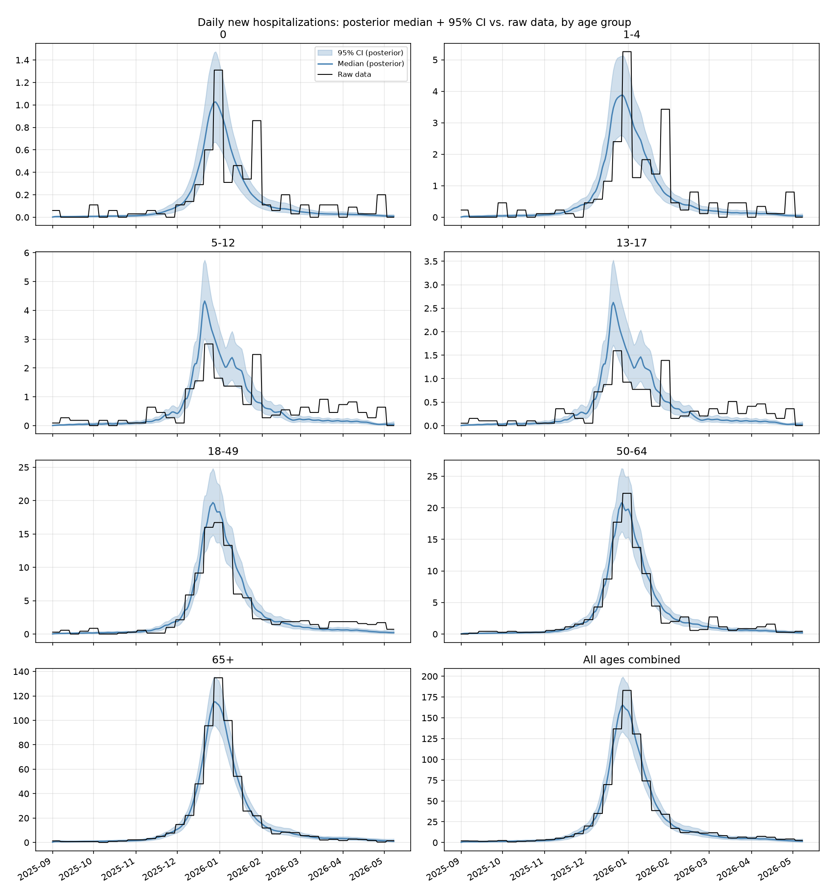
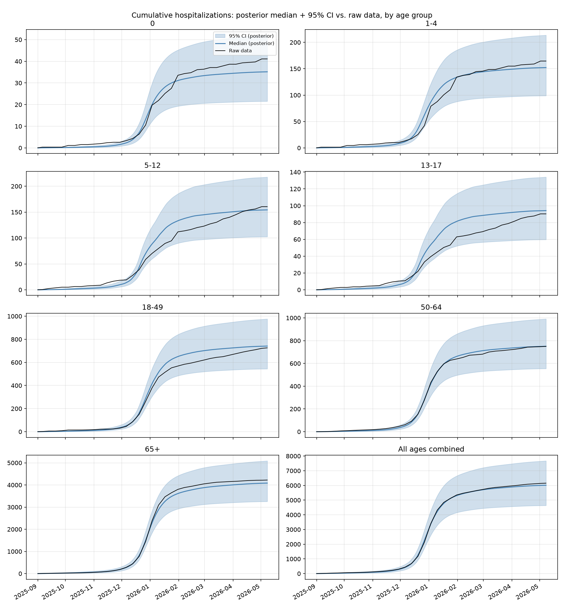

# MA_vax: vaccination-impact analysis report

Massachusetts, 2025–2026 influenza season. Age-structured SEIR model with a
parallel vaccinated arm, calibrated to daily hospital admissions by age
group via Bayesian MCMC. This report documents the model, the fit, and the
resulting vaccination-impact analysis.

Every count in this report is a **hospital admission over the whole 250-day
season** unless stated otherwise. Tables report the absolute number of
hospitalizations averted alongside the percentage and the per-100,000 rates,
so the size of the burden each figure describes is visible next to the rate.

---

## 1. Model structure

### 1.1 Compartments

Nine compartments, each stratified by 7 age groups
(`0`, `1-4`, `5-12`, `13-17`, `18-49`, `50-64`, `65+`):

| Compartment | Meaning |
|---|---|
| `S`  | Susceptible, unvaccinated |
| `E`  | Exposed (latent), unvaccinated |
| `I`  | Infectious, unvaccinated |
| `R`  | Recovered/removed (either arm) |
| `SV` | Susceptible, vaccinated |
| `EV` | Exposed (latent), vaccinated |
| `IV` | Infectious, vaccinated |
| `H`  | Hospitalized (either arm) |
| `D`  | Dead (either arm) |

The vaccinated arm (`SV → EV → IV → H/R`) mirrors the unvaccinated arm
(`S → E → I → H/R`), with its own susceptibility and severity parameters.
`H`, `R`, `D` are shared, pooled compartments — once hospitalized (or
recovered), an individual's vaccination history is no longer tracked.


```mermaid
flowchart LR
    S -- "force of infection" --> E
    S -- "vaccination (S_to_SV)" --> SV
    E -- "E_to_I_rate" --> I
    I -- "I_to_H_prop * I_out_rate" --> H
    I -- "(1-I_to_H_prop) * I_out_rate" --> R
    SV -- "force of infection * vax_susceptibility" --> EV
    EV -- "EV_to_IV_rate" --> IV
    IV -- "IV_to_H_prop * I_out_rate" --> H
    IV -- "(1-IV_to_H_prop) * I_out_rate" --> R
    H -- "H_to_D_prop * H_out_rate" --> D
    H -- "(1-H_to_D_prop) * H_out_rate" --> R
```

### 1.2 Force of infection

Contacts come from fixed age×age contact matrices (Mistry et al. 2021
synthetic contact matrices), with school/work contacts removed on
non-school/work days:

```
C(t) = total_C − (1 − is_school(t))·school_C − (1 − is_work(t))·work_C
beta_adj(t) = beta_baseline · m(t) · (1 + humidity_impact · exp(−180 · humidity(t)))
wtd_inf_prop(t) = (I·I_relative_infectiousness + IV·IV_relative_infectiousness) / population
foi(t) = beta_adj(t) · (C(t) @ wtd_inf_prop(t))
S_to_E   = foi(t) · relative_suscept   · S
SV_to_EV = foi(t) · vax_susceptibility · SV
```

`m(t)` is a smoothly time-varying transmission multiplier (§2.3) that
absorbs behavioral/seasonal variation the mechanistic terms above don't
otherwise capture. `IV_relative_infectiousness = 1.0` — breakthrough
infections (in vaccinated individuals) are assumed exactly as transmissible
as unvaccinated infections. `vax_susceptibility` (age-specific, ≤ 1) is the
residual susceptibility of a vaccinated individual; `1 − vax_susceptibility`
is the model's implied vaccine effectiveness (VE) against infection.

### 1.3 Progression, hospitalization, death

```
E_to_I  = E_to_I_rate · E                 EV_to_IV = EV_to_IV_rate · EV
I_to_H  = I_out_rate · I_to_H_prop · I     IV_to_H  = I_out_rate · IV_to_H_prop · IV
I_to_R  = I_out_rate · (1−I_to_H_prop)·I   IV_to_R  = I_out_rate · (1−IV_to_H_prop)·IV
H_to_D  = H_out_rate · H_to_D_prop · H
H_to_R  = H_out_rate · (1−H_to_D_prop)·H
```

`IV_to_H_prop < I_to_H_prop` for every age group — vaccination reduces
hospitalization risk *given* infection (severity VE), on top of reducing
infection risk.

### 1.4 Vaccination flow

Daily doses (an age-specific proportion of the population, with a 14-day
delay between dose and effective immunity) are applied as an exact `S → SV`
count each day, capped at whatever remains in `S`:

```
base(t) = S + SV
S_to_SV(t) = min(round(vax_prop(t) · base(t)), S)
```

The base pool (`S + SV`) is not eroded by vaccination itself — only
infection depletes it — so a roughly flat input proportion vaccinates a
roughly constant head-count per day, until `S` starts running low late in
the season.

### 1.5 Numerical scheme

Simulations use explicit Euler integration with 7 sub-steps per day. The
ensemble behind every interval in this report is a **posterior parameter
ensemble**: one deterministic simulation per accepted posterior draw (§2.3),
not chain-binomial transition noise. Vaccination is a deterministic scheduled
count in either case, since it comes from an external delivery schedule
rather than a hazard rate.

### 1.6 Initial conditions

At the start of the simulation (2025-09-01): `S = population − E0`,
`E = E0` (age-specific seed counts, scaled by a single fitted multiplier,
§2.3), and all other compartments start at zero.

---

## 2. Parameters

### 2.1 Fixed scalar parameters

| Parameter | Value | Meaning |
|---|---|---|
| `num_days` | 250 | Simulation length (2025-09-01 through 2026-05-08) |
| `relative_suscept` | 1.0 | Susceptibility multiplier, unvaccinated arm |
| `I_relative_infectiousness` | 1.0 | Infectiousness weight, unvaccinated `I` |
| `IV_relative_infectiousness` | 1.0 | Infectiousness weight, vaccinated `IV` |
| `E_to_I_rate` | 0.5 /day | ~2-day latent period |
| `EV_to_IV_rate` | 0.5 /day | Same, vaccinated arm |
| `I_out_rate` | 0.333 /day | ~3-day infectious period |
| `H_out_rate` | 0.17 /day | ~6-day hospital stay |
| `vax_transfer_delay_days` | 14 | Days from dose to modeled immunity |

### 2.2 Age-stratified fixed parameters

| Age group | Population | Hospitalization risk, given infection¹ | Hospitalization risk, given breakthrough infection¹ | Death risk, given hospitalization | Residual susceptibility if vaccinated | Initial infections seeded¹ |
|---|---:|---:|---:|---:|---:|---:|
| 0 | 70,067 | 0.697% | 0.636% | 1.74% | 0.57 | 2 |
| 1-4 | 280,268 | 0.697% | 0.636% | 1.74% | 0.57 | 8 |
| 5-12 | 606,291 | 0.274% | 0.250% | 1.17% | 0.57 | 17 |
| 13-17 | 411,782 | 0.274% | 0.250% | 1.17% | 0.57 | 12 |
| 18-49 | 2,978,204 | 0.561% | 0.511% | 2.63% | 0.79 | 85 |
| 50-64 | 1,424,434 | 1.060% | 0.966% | 6.30% | 0.79 | 41 |
| 65+ | 1,221,349 | 9.091% | 6.273% | 7.99% | 1.00 | 35 |

¹ These are pre-fit baseline values — the calibration scales both hospitalization-risk columns by a fitted age-specific multiplier (§2.3), so the values actually used in the calibrated model are these figures × that multiplier and the vaccine effectiveness against hospitalization remains the same.
A residual susceptibility of 1.00 for 65+ means the fitted baseline assumes **no infection-blocking effect** of vaccination in that age group (only the severity effect applies there). This holds for the `Low VE` sensitivity scenario too, but not for `High VE`, which scales it to 0.86 — see Table S.A.4.

### 2.3 Fitting method

Free parameters were estimated with an affine-invariant ensemble Markov
Chain Monte Carlo sampler (40 walkers, 4000 iterations per walker), run in
parallel over the full 251-day target window. The free parameters and their
priors:

| Parameter | Prior | Role |
|---|---|---|
| `beta_baseline` | Uniform(0.015, 0.06) | Baseline transmission rate |
| `humidity_impact` | Uniform(0, 1) | Strength of humidity forcing |
| Initial-seed multiplier | Log-uniform(0.1, 10) | Multiplies the age-specific initial-infection seed counts |
| Hospitalization-risk multiplier (× 7, one per age group) | Uniform(0.1, 2.0) | Multiplies both hospitalization-risk columns (§2.2) for that age group |
| `m(t)` log-increments (× 18, one per 14-day knot) | Normal(0, 0.25) | Month-to-month-ish random-walk steps in log-transmission (§1.2) |
| `phi` | — | Negative-Binomial dispersion (likelihood nuisance parameter, not a model input) |

**Likelihood**: a Negative-Binomial (NB2) observation model, chosen over
Poisson to allow overdispersion, jointly across 8 targets — daily hospital
admissions **by age group** (7 time series) plus a single scalar
**end-of-season cumulative hospitalizations by age** target. The targets are
not weighted equally: the three age groups carrying most of the burden are
up-weighted (18-49 and 50-64 at weight 2, 65+ at weight 5, the four younger
groups at 1), and the end-of-season cumulative target at weight 10, so the
fit is pulled towards reproducing the season's total burden and its
concentration in older ages rather than treating every age curve alike.

**Posterior sampling**: the first 1700 iterations were discarded as
burn-in, and the remaining chain thinned to every 200th sample, leaving 627
posterior draws. Two point estimates are used in this report:

- **Posterior mean**: the marginal mean of each parameter. Cheap and
  stable, but for a correlated posterior can land on a parameter
  *combination* the sampler never actually visited.
- **"Best" point**: the single posterior draw with the highest
  log-posterior — not the mean of anything, so it preserves whatever
  correlation structure exists between parameters.

These two can disagree materially (§2.4) — a reminder that the marginal
mean of a correlated posterior needn't correspond to a jointly plausible
parameter combination. `m(t)`'s random-walk prior is a smoothness
assumption, not a mechanistic one — it should not be over-interpreted as an
independently-measured behavioral signal, only as "how much transmission
needs to have moved, beyond what humidity/contacts explain, to reconcile
the model with the data."

### 2.4 Fitted parameters

Posterior mean ± 90% credible interval (5th–95th percentile) across the 627
posterior draws, vs. the "best" (highest-posterior-density) point:

| Parameter | Posterior mean | 5% | 95% | "Best" point |
|---|---:|---:|---:|---:|
| `beta_baseline` | 0.0305 | 0.0261 | 0.0359 | 0.0281 |
| `humidity_impact` | 0.591 | 0.234 | 0.916 | 0.881 |
| Initial-seed multiplier | 1.70 | 0.47 | 3.39 | 1.47 |
| Hospitalization-risk multiplier — 0 | 1.51 | 0.95 | 1.93 | 1.63 |
| Hospitalization-risk multiplier — 1-4 | 1.51 | 0.95 | 1.94 | 1.56 |
| Hospitalization-risk multiplier — 5-12 | 1.18 | 0.78 | 1.63 | 1.22 |
| Hospitalization-risk multiplier — 13-17 | 1.03 | 0.62 | 1.48 | 0.99 |
| Hospitalization-risk multiplier — 18-49 | 0.59 | 0.39 | 0.81 | 0.51 |
| Hospitalization-risk multiplier — 50-64 | 0.78 | 0.51 | 1.06 | 0.79 |
| Hospitalization-risk multiplier — 65+ | 1.06 | 0.73 | 1.40 | 1.00 |
| `phi` (NB dispersion) | 78 | 18 | 223 | 344 |

The 18 `m(t)` log-increments aren't independently interpretable as a table
— they're summarized visually through the fit check in §4 instead.

### 2.5 Cumulative vaccination coverage

Cumulative proportion of each age group actually vaccinated over the season
(reported vaccination-schedule data, summed over the season):

| Age group | Population | Cumulative coverage |
|---|---:|---:|
| 0 | 70,067 | 24.1% |
| 1-4 | 280,268 | 48.3% |
| 5-12 | 606,291 | 36.2% |
| 13-17 | 411,782 | 36.5% |
| 18-49 | 2,978,204 | 28.1% |
| 50-64 | 1,424,434 | 38.2% |
| 65+ | 1,221,349 | 60.6% |
| **All (population-weighted)** | **6,992,395** | **37.8%** |

Coverage is well below a 70% mark in **every** age group: 65+ comes closest
at 60.6%, then 1-4 (48.3%), 50-64 (38.2%), 13-17 (36.5%) and 5-12 (36.2%),
with 18-49 (28.1%) and age 0 (24.1%) lowest. This matters for how the
"scale to 70% coverage" rows in the appendix (Tables S.A.3/S.A.6) should be
read: unlike in earlier versions of this analysis, all seven groups are
scaled up, so no column is structurally zero — though the 65+ column still
comes close, because vaccinating 65+ blocks no infection in the fitted
baseline (§2.2) and so only helps 65+ itself.

The figures above are what the vaccination **schedule** reports. The doses that
actually land are fewer — the §1.4 cap declines to vaccinate someone who has
already been infected — putting simulated coverage 0.2 to 1.6 percentage
points lower per age group. Those undelivered doses are not saved: in the
real world they are still bought and administered, into arms that no longer
benefit, at least in our model where the recovered and deceased compartments
are final. The appendix reconciles the two figures age group by age group, and
every "per 100,000 doses" panel in this report divides by the **scheduled**
count for that reason.

---

## 3. Vaccination-impact results

Every table in this section reports a **median and 95% interval across 627
simulations** — one simulation per posterior parameter draw (§2.3),
re-using the same draw for every scenario being compared within a table so
that the comparison is paired (variance from the parameter draw itself
cancels out of the *difference* between scenarios). These intervals
therefore reflect **calibration uncertainty** — how much the vaccination-
impact conclusions would change under a different (but similarly plausible)
fit to the same data — not day-to-day epidemic-process noise.

For scale: over the season the fitted baseline produces a median of **6,070
hospitalizations** across all ages, against **13,370** with no vaccination
at all.

### New daily hospitalizations: baseline vs. no vaccination

Total-population new hospitalizations per day, posterior median and 95%
interval across the 627 parameter draws (§2.3, same posterior-uncertainty
basis as the rest of this section), comparing the fitted baseline
vaccination schedule against a counterfactual with no vaccination at all:



The fitted vaccination program cuts the peak in daily new hospitalizations
to roughly **45%** of what it would otherwise be (median peak ≈ 165/day
baseline vs. ≈ 365/day with no vaccination, both around 2025-12-28) and
reduces the epidemic's height without changing its timing.

### Table S.A.1 — Hospitalizations averted, infection vs. severity protection

Decomposes the total hospitalizations averted by vaccination into two
channels: protection against getting infected at all, and — *given* a
breakthrough infection still happens — protection against that infection
becoming severe enough to need hospitalization.

**Infection protection** (no vaccination → infection-protection-only, i.e. VE against infection retained but VE against severity zeroed out)

| Age group | Hospitalizations Averted | % Hospitalizations Averted | Averted per 100,000 Population | Averted per 100,000 Doses |
|---|---|---|---|---|
| 0 | 40 [24 – 52] | 52.7% [48.2% – 55.3%] | 57.1 [34.2 – 74.3] | 236.6 [141.8 – 307.6] |
| 1-4 | 208 [140 – 261] | 56.9% [52.5% – 59.5%] | 74.3 [49.9 – 93.2] | 153.9 [103.3 – 193.0] |
| 5-12 | 188 [126 – 251] | 54.7% [49.4% – 57.7%] | 31.0 [20.9 – 41.5] | 85.6 [57.5 – 114.4] |
| 13-17 | 115 [74 – 158] | 54.7% [49.5% – 57.8%] | 27.8 [17.9 – 38.4] | 76.3 [49.0 – 105.2] |
| 18-49 | 743 [548 – 950] | 49.8% [44.6% – 52.7%] | 24.9 [18.4 – 31.9] | 88.8 [65.5 – 113.5] |
| 50-64 | 792 [584 – 981] | 50.7% [45.9% – 53.5%] | 55.6 [41.0 – 68.9] | 145.6 [107.4 – 180.4] |
| 65+ | 4,433 [3,698 – 5,162] | 48.1% [43.5% – 50.9%] | 362.9 [302.8 – 422.6] | 598.9 [499.6 – 697.4] |
| **All** | **6,583 [5,440 – 7,404]** | **49.2% [44.4% – 52.0%]** | **94.1 [77.8 – 105.9]** | **249.0 [205.8 – 280.1]** |

**Severity protection** (infection-protection-only → full baseline, i.e. adding back VE against severity)

| Age group | Hospitalizations Averted | % Hospitalizations Averted | Averted per 100,000 Population | Averted per 100,000 Doses |
|---|---|---|---|---|
| 0 | 0 [0 – 1] | 0.5% [0.5% – 0.5%] | 0.5 [0.3 – 0.7] | 2.2 [1.4 – 3.0] |
| 1-4 | 4 [2 – 5] | 1.0% [0.9% – 1.1%] | 1.3 [0.8 – 1.7] | 2.6 [1.8 – 3.4] |
| 5-12 | 3 [2 – 3] | 0.7% [0.7% – 0.8%] | 0.4 [0.3 – 0.5] | 1.1 [0.8 – 1.5] |
| 13-17 | 2 [1 – 2] | 0.8% [0.7% – 0.9%] | 0.4 [0.3 – 0.5] | 1.1 [0.7 – 1.4] |
| 18-49 | 11 [9 – 14] | 0.8% [0.7% – 0.8%] | 0.4 [0.3 – 0.5] | 1.4 [1.1 – 1.6] |
| 50-64 | 16 [13 – 20] | 1.1% [1.0% – 1.2%] | 1.2 [0.9 – 1.4] | 3.0 [2.4 – 3.6] |
| 65+ | 720 [647 – 801] | 7.7% [7.3% – 8.4%] | 59.0 [53.0 – 65.6] | 97.3 [87.4 – 108.2] |
| **All** | **756 [681 – 837]** | **5.6% [5.2% – 6.2%]** | **10.8 [9.7 – 12.0]** | **28.6 [25.8 – 31.7]** |

**Total** (no vaccination → full baseline)

| Age group | Hospitalizations Averted | % Hospitalizations Averted | Averted per 100,000 Population | Averted per 100,000 Doses |
|---|---|---|---|---|
| 0 | 40 [24 – 53] | 53.2% [48.7% – 55.8%] | 57.7 [34.6 – 75.0] | 238.7 [143.2 – 310.6] |
| 1-4 | 212 [142 – 266] | 57.9% [53.5% – 60.4%] | 75.6 [50.8 – 94.9] | 156.5 [105.1 – 196.5] |
| 5-12 | 191 [128 – 255] | 55.4% [50.2% – 58.4%] | 31.4 [21.1 – 42.0] | 86.8 [58.3 – 115.8] |
| 13-17 | 116 [75 – 160] | 55.5% [50.3% – 58.5%] | 28.2 [18.2 – 38.9] | 77.4 [49.9 – 106.6] |
| 18-49 | 754 [558 – 963] | 50.5% [45.5% – 53.4%] | 25.3 [18.8 – 32.3] | 90.1 [66.7 – 115.1] |
| 50-64 | 809 [599 – 1,000] | 51.8% [47.0% – 54.5%] | 56.8 [42.0 – 70.2] | 148.7 [110.0 – 183.9] |
| 65+ | 5,147 [4,398 – 5,959] | 55.9% [51.8% – 58.2%] | 421.4 [360.1 – 487.9] | 695.4 [594.3 – 805.2] |
| **All** | **7,327 [6,169 – 8,190]** | **54.8% [50.5% – 57.4%]** | **104.8 [88.2 – 117.1]** | **277.2 [233.4 – 309.9]** |

Almost all of the averted burden comes from **blocking infection**, not
from reducing severity given a breakthrough: of the 7,327 hospitalizations
averted in total, 6,583 come from the infection channel and 756 from the
severity channel — and 720 of those 756 are in 65+, the one group where the
fitted model gives vaccination no infection-blocking effect at all.

### Table S.A.2 — Hospitalizations averted by age group vaccinated

Each column vaccinates a single age group only (all others left
unvaccinated) and compares to no vaccination at all; "All" is the full
baseline schedule. Rows are the age group in which hospitalizations are
counted, so off-diagonal cells show the indirect (transmission-blocking)
benefit to *other* age groups from vaccinating this one.

**Hospitalizations averted (count)**

| Age group (counted) | 0 vaccinated | 1-4 vaccinated | 5-12 vaccinated | 13-17 vaccinated | 18-49 vaccinated | 50-64 vaccinated | 65+ vaccinated | All vaccinated |
|---|---|---|---|---|---|---|---|---|
| 0 | 7 [4 – 9] | 4 [3 – 5] | 12 [7 – 16] | 9 [5 – 12] | 12 [7 – 15] | 5 [3 – 7] | 0 [-0 – 0] | 40 [24 – 53] |
| 1-4 | 1 [1 – 1] | 83 [56 – 104] | 63 [41 – 79] | 43 [27 – 53] | 53 [35 – 67] | 24 [16 – 31] | 0 [-0 – 0] | 212 [142 – 266] |
| 5-12 | 1 [1 – 1] | 17 [11 – 23] | 102 [69 – 137] | 41 [26 – 55] | 46 [29 – 62] | 21 [14 – 29] | 0 [-0 – 0] | 191 [128 – 255] |
| 13-17 | 0 [0 – 1] | 9 [5 – 13] | 31 [19 – 46] | 57 [37 – 80] | 28 [17 – 40] | 14 [8 – 20] | 0 [-0 – 0] | 116 [75 – 160] |
| 18-49 | 4 [3 – 6] | 72 [50 – 94] | 226 [157 – 298] | 178 [123 – 235] | 295 [214 – 380] | 109 [76 – 143] | 0 [-0 – 0] | 754 [558 – 963] |
| 50-64 | 4 [3 – 5] | 71 [49 – 91] | 232 [159 – 297] | 187 [129 – 241] | 232 [162 – 294] | 241 [179 – 299] | 0 [-0 – 0] | 809 [599 – 1,000] |
| 65+ | 26 [20 – 31] | 445 [353 – 535] | 1,437 [1,134 – 1,728] | 1,137 [896 – 1,373] | 1,382 [1,099 – 1,645] | 740 [592 – 881] | 1,404 [1,245 – 1,591] | 5,147 [4,398 – 5,959] |
| **All** | **44 [35 – 50]** | **708 [556 – 807]** | **2,125 [1,648 – 2,465]** | **1,668 [1,288 – 1,950]** | **2,065 [1,623 – 2,396]** | **1,161 [920 – 1,338]** | **1,404 [1,245 – 1,591]** | **7,327 [6,169 – 8,190]** |

**% reduction in hospitalizations**

| Age group (counted) | 0 vaccinated | 1-4 vaccinated | 5-12 vaccinated | 13-17 vaccinated | 18-49 vaccinated | 50-64 vaccinated | 65+ vaccinated | All vaccinated |
|---|---|---|---|---|---|---|---|---|
| 0 | 9.2% [9.0% – 9.4%] | 5.6% [4.8% – 6.1%] | 16.2% [13.8% – 17.8%] | 12.0% [10.1% – 13.3%] | 15.4% [13.2% – 16.9%] | 7.0% [5.9% – 7.7%] | 0.0% [-0.0% – 0.0%] | 53.2% [48.7% – 55.8%] |
| 1-4 | 0.3% [0.3% – 0.3%] | 22.6% [21.5% – 23.4%] | 17.3% [14.7% – 19.1%] | 11.7% [9.7% – 13.1%] | 14.6% [12.3% – 16.2%] | 6.7% [5.6% – 7.5%] | 0.0% [-0.0% – 0.0%] | 57.9% [53.5% – 60.4%] |
| 5-12 | 0.3% [0.2% – 0.3%] | 4.9% [4.1% – 5.5%] | 29.7% [26.8% – 31.7%] | 11.7% [9.6% – 13.3%] | 13.1% [10.7% – 14.9%] | 6.2% [5.0% – 7.1%] | 0.0% [-0.0% – 0.0%] | 55.4% [50.2% – 58.4%] |
| 13-17 | 0.2% [0.2% – 0.3%] | 4.2% [3.4% – 4.8%] | 15.0% [12.3% – 16.9%] | 27.4% [25.0% – 29.1%] | 13.2% [10.7% – 15.0%] | 6.5% [5.2% – 7.4%] | 0.0% [-0.0% – 0.0%] | 55.5% [50.3% – 58.5%] |
| 18-49 | 0.3% [0.2% – 0.3%] | 4.8% [4.0% – 5.3%] | 15.1% [12.7% – 16.9%] | 11.9% [9.9% – 13.3%] | 19.7% [17.4% – 21.3%] | 7.3% [6.1% – 8.1%] | 0.0% [-0.0% – 0.0%] | 50.5% [45.5% – 53.4%] |
| 50-64 | 0.3% [0.2% – 0.3%] | 4.5% [3.8% – 5.1%] | 14.9% [12.5% – 16.6%] | 12.0% [10.1% – 13.4%] | 14.9% [12.6% – 16.4%] | 15.4% [14.1% – 16.3%] | 0.0% [-0.0% – 0.0%] | 51.8% [47.0% – 54.5%] |
| 65+ | 0.3% [0.2% – 0.3%] | 4.8% [4.1% – 5.3%] | 15.5% [13.3% – 17.1%] | 12.3% [10.5% – 13.6%] | 15.0% [12.8% – 16.4%] | 8.0% [6.9% – 8.8%] | 15.2% [15.0% – 15.3%] | 55.9% [51.8% – 58.2%] |
| **All** | **0.3% [0.3% – 0.4%]** | **5.3% [4.5% – 5.7%]** | **15.8% [13.5% – 17.4%]** | **12.4% [10.5% – 13.7%]** | **15.4% [13.3% – 16.9%]** | **8.7% [7.5% – 9.5%]** | **10.5% [10.0% – 11.1%]** | **54.8% [50.5% – 57.4%]** |

**Hospitalizations averted per 100,000 population**

| Age group (counted) | 0 vaccinated | 1-4 vaccinated | 5-12 vaccinated | 13-17 vaccinated | 18-49 vaccinated | 50-64 vaccinated | 65+ vaccinated | All vaccinated |
|---|---|---|---|---|---|---|---|---|
| 0 | 10.0 [6.1 – 13.2] | 6.0 [3.6 – 7.8] | 17.5 [10.3 – 22.5] | 13.0 [7.7 – 16.6] | 16.7 [9.9 – 21.5] | 7.5 [4.5 – 9.7] | 0.0 [-0.0 – 0.0] | 57.7 [34.6 – 75.0] |
| 1-4 | 0.4 [0.3 – 0.5] | 29.5 [19.9 – 37.2] | 22.6 [14.6 – 28.2] | 15.2 [9.6 – 19.0] | 19.0 [12.3 – 23.9] | 8.7 [5.6 – 11.0] | 0.0 [-0.0 – 0.0] | 75.6 [50.8 – 94.9] |
| 5-12 | 0.1 [0.1 – 0.2] | 2.8 [1.8 – 3.8] | 16.9 [11.3 – 22.6] | 6.7 [4.3 – 9.1] | 7.5 [4.8 – 10.2] | 3.5 [2.3 – 4.8] | 0.0 [-0.0 – 0.0] | 31.4 [21.1 – 42.0] |
| 13-17 | 0.1 [0.1 – 0.2] | 2.1 [1.3 – 3.1] | 7.6 [4.5 – 11.1] | 14.0 [9.0 – 19.3] | 6.7 [4.0 – 9.8] | 3.3 [2.0 – 4.8] | 0.0 [-0.0 – 0.0] | 28.2 [18.2 – 38.9] |
| 18-49 | 0.1 [0.1 – 0.2] | 2.4 [1.7 – 3.2] | 7.6 [5.3 – 10.0] | 6.0 [4.1 – 7.9] | 9.9 [7.2 – 12.8] | 3.7 [2.5 – 4.8] | 0.0 [-0.0 – 0.0] | 25.3 [18.8 – 32.3] |
| 50-64 | 0.3 [0.2 – 0.4] | 5.0 [3.4 – 6.4] | 16.3 [11.2 – 20.9] | 13.2 [9.0 – 16.9] | 16.3 [11.4 – 20.7] | 16.9 [12.5 – 21.0] | 0.0 [-0.0 – 0.0] | 56.8 [42.0 – 70.2] |
| 65+ | 2.1 [1.7 – 2.5] | 36.4 [28.9 – 43.8] | 117.7 [92.8 – 141.5] | 93.1 [73.4 – 112.4] | 113.1 [90.0 – 134.7] | 60.6 [48.5 – 72.1] | 114.9 [101.9 – 130.3] | 421.4 [360.1 – 487.9] |
| **All** | **0.6 [0.5 – 0.7]** | **10.1 [7.9 – 11.5]** | **30.4 [23.6 – 35.3]** | **23.9 [18.4 – 27.9]** | **29.5 [23.2 – 34.3]** | **16.6 [13.2 – 19.1]** | **20.1 [17.8 – 22.8]** | **104.8 [88.2 – 117.1]** |

**Hospitalizations averted per 100,000 doses**

Each cell divides hospitalizations averted in the **row's** age group by the
doses scheduled for the **column's** age group, so off-diagonal cells are the
indirect benefit per dose spent on the vaccinated group. The `All vaccinated` column
has no single targeted group, so there each row keeps its own age group's
dose count, matching Table S.A.1's per-dose columns.

| Age group (counted) | 0 vaccinated | 1-4 vaccinated | 5-12 vaccinated | 13-17 vaccinated | 18-49 vaccinated | 50-64 vaccinated | 65+ vaccinated | All vaccinated |
|---|---|---|---|---|---|---|---|---|
| 0 | 41.4 [25.2 – 54.7] | 3.1 [1.8 – 4.0] | 5.6 [3.3 – 7.2] | 6.0 [3.6 – 7.8] | 1.4 [0.8 – 1.8] | 1.0 [0.6 – 1.3] | 0.0 [-0.0 – 0.0] | 238.7 [143.2 – 310.6] |
| 1-4 | 6.7 [4.4 – 8.5] | 61.2 [41.2 – 77.0] | 28.8 [18.6 – 36.0] | 28.4 [17.9 – 35.5] | 6.4 [4.1 – 8.0] | 4.5 [2.9 – 5.6] | 0.0 [-0.0 – 0.0] | 156.5 [105.1 – 196.5] |
| 5-12 | 5.2 [3.3 – 7.0] | 12.7 [8.1 – 17.1] | 46.6 [31.3 – 62.2] | 27.2 [17.4 – 36.7] | 5.5 [3.5 – 7.4] | 4.0 [2.5 – 5.4] | 0.0 [-0.0 – 0.0] | 86.8 [58.3 – 115.8] |
| 13-17 | 2.9 [1.7 – 4.3] | 6.4 [3.8 – 9.5] | 14.3 [8.5 – 20.7] | 38.2 [24.7 – 53.0] | 3.3 [2.0 – 4.8] | 2.5 [1.5 – 3.7] | 0.0 [-0.0 – 0.0] | 77.4 [49.9 – 106.6] |
| 18-49 | 24.9 [17.4 – 32.7] | 52.8 [36.8 – 69.5] | 103.1 [71.3 – 135.5] | 118.5 [81.7 – 156.2] | 35.3 [25.5 – 45.4] | 20.0 [13.9 – 26.3] | 0.0 [-0.0 – 0.0] | 90.1 [66.7 – 115.1] |
| 50-64 | 23.8 [16.5 – 30.6] | 52.3 [35.9 – 66.9] | 105.6 [72.4 – 135.3] | 124.7 [85.5 – 160.2] | 27.7 [19.3 – 35.2] | 44.3 [32.9 – 54.9] | 0.0 [-0.0 – 0.0] | 148.7 [110.0 – 183.9] |
| 65+ | 151.5 [120.2 – 181.7] | 328.8 [260.9 – 394.9] | 654.1 [515.9 – 786.4] | 756.9 [596.4 – 913.8] | 165.1 [131.3 – 196.6] | 136.0 [108.8 – 162.0] | 189.6 [168.2 – 215.0] | 695.4 [594.3 – 805.2] |
| **All** | **258.8 [204.7 – 295.1]** | **522.7 [410.5 – 596.4]** | **967.2 [749.8 – 1121.8]** | **1109.9 [857.3 – 1297.4]** | **246.8 [193.9 – 286.3]** | **213.4 [169.2 – 245.9]** | **189.6 [168.2 – 215.0]** | **277.2 [233.4 – 309.9]** |

Off-diagonal entries confirm real indirect effects — e.g. vaccinating 5-12
alone reduces hospitalizations in 0 by 16.2% and in 1-4 by 17.3%, both
larger than several of those groups' own-age direct effects, consistent
with school-age children acting as a major transmission hub in the contact
structure. 65+ is the only group with zero indirect effect on
every other group.

In absolute terms the indirect benefit dwarfs the direct one for the school-age
columns: vaccinating 5-12 alone averts 2,125 hospitalizations across the
population, only 102 of them in 5-12 itself and 1,437 of them in 65+.

Per dose, the same story: vaccinating 13-17 averts 756.9 [596.4 – 913.8]
hospitalizations per 100,000 doses in the 65+ group alone, against 38.2
[24.7 – 53.0] in 13-17 itself. This is why the `All` row —
hospitalizations averted across the whole population per dose — ranks
13-17 (1109.9) and 5-12 (967.2) far above the groups that carry the burden
directly.

### Table S.A.4 — Vaccine-effectiveness sensitivity scenarios

Implied vaccine effectiveness under three illustrative VE presets — a
parameter table, not a simulation result. `Baseline VE (fitted)` is the model's
fitted VE (included here as the reference point, not itself a sensitivity
scenario); `Low VE`/`High VE` bracket it and correspond to the estimated
lower and upper bound of VE. The ratio of low/high VE to baseline remains
constant across parameter sets.

| Scenario | Age group | VE against infection | VE against hospitalization (overall) | VE against hospitalization, given infection |
|---|---|---|---|---|
| Low VE | 0 | 33% | 33% | 0% |
| Low VE | 1-4 | 33% | 33% | 0% |
| Low VE | 5-12 | 33% | 33% | 0% |
| Low VE | 13-17 | 33% | 33% | 0% |
| Low VE | 18-49 | 6% | 10% | 4% |
| Low VE | 50-64 | 6% | 10% | 4% |
| Low VE | 65+ | 0% | 21% | 21% |
| Baseline VE (fitted) | 0 | 43% | 48% | 9% |
| Baseline VE (fitted) | 1-4 | 43% | 48% | 9% |
| Baseline VE (fitted) | 5-12 | 43% | 48% | 9% |
| Baseline VE (fitted) | 13-17 | 43% | 48% | 9% |
| Baseline VE (fitted) | 18-49 | 21% | 28% | 9% |
| Baseline VE (fitted) | 50-64 | 21% | 28% | 9% |
| Baseline VE (fitted) | 65+ | 0% | 31% | 31% |
| High VE | 0 | 51% | 78% | 55% |
| High VE | 1-4 | 51% | 78% | 55% |
| High VE | 5-12 | 51% | 78% | 55% |
| High VE | 13-17 | 51% | 78% | 55% |
| High VE | 18-49 | 34% | 44% | 16% |
| High VE | 50-64 | 34% | 44% | 16% |
| High VE | 65+ | 14% | 39% | 29% |

Also note **65+ has 0% VE against infection in the fitted baseline and in
`Low VE`** — residual susceptibility is 1.00 for that age group in both
(§2.2), so only the severity-protection channel operates there. `High VE` is
the exception: it scales residual susceptibility to 0.86, giving 65+ a 14% VE
against infection, so that scenario is the only one in which vaccinating 65+
blocks any transmission at all. This is why 65+ shows an all-zero indirect
effect on every other age group throughout Table S.A.2, which is built on the
fitted baseline.

### Table S.A.5 — Hospitalizations averted across VE scenarios

Compares each VE sensitivity scenario (§ above) against no vaccination at all.

**Hospitalizations averted (count)**

| Age group | Low VE | Baseline VE (fitted) | High VE |
|---|---|---|---|
| 0 | 27 [16 – 34] | 40 [24 – 53] | 51 [31 – 66] |
| 1-4 | 145 [97 – 181] | 212 [142 – 266] | 264 [179 – 334] |
| 5-12 | 130 [87 – 174] | 191 [128 – 255] | 239 [162 – 316] |
| 13-17 | 79 [49 – 111] | 116 [75 – 160] | 146 [94 – 198] |
| 18-49 | 464 [331 – 599] | 754 [558 – 963] | 952 [719 – 1,211] |
| 50-64 | 490 [349 – 616] | 809 [599 – 1,000] | 1,024 [777 – 1,256] |
| 65+ | 3,435 [2,876 – 4,002] | 5,147 [4,398 – 5,959] | 6,325 [5,483 – 7,281] |
| **All** | **4,810 [3,959 – 5,471]** | **7,327 [6,169 – 8,190]** | **9,050 [7,766 – 10,049]** |

**% reduction in hospitalizations**

| Age group | Low VE | Baseline VE (fitted) | High VE |
|---|---|---|---|
| 0 | 35.0% [31.2% – 37.4%] | 53.2% [48.7% – 55.8%] | 66.8% [63.0% – 69.1%] |
| 1-4 | 39.7% [35.8% – 42.1%] | 57.9% [53.5% – 60.4%] | 72.4% [68.9% – 74.4%] |
| 5-12 | 37.8% [33.3% – 40.7%] | 55.4% [50.2% – 58.4%] | 69.0% [64.7% – 71.6%] |
| 13-17 | 37.7% [33.2% – 40.6%] | 55.5% [50.3% – 58.5%] | 69.4% [65.1% – 71.9%] |
| 18-49 | 31.0% [26.8% – 33.7%] | 50.5% [45.5% – 53.4%] | 63.9% [59.3% – 66.5%] |
| 50-64 | 31.4% [27.4% – 34.0%] | 51.8% [47.0% – 54.5%] | 65.5% [61.3% – 67.9%] |
| 65+ | 37.3% [33.9% – 39.5%] | 55.9% [51.8% – 58.2%] | 68.6% [65.1% – 70.7%] |
| **All** | **36.0% [32.3% – 38.3%]** | **54.8% [50.5% – 57.4%]** | **67.8% [64.1% – 70.0%]** |

**Hospitalizations averted per 100,000 population**

| Age group | Low VE | Baseline VE (fitted) | High VE |
|---|---|---|---|
| 0 | 38.1 [22.5 – 49.0] | 57.7 [34.6 – 75.0] | 72.4 [43.8 – 94.7] |
| 1-4 | 51.8 [34.5 – 64.6] | 75.6 [50.8 – 94.9] | 94.3 [63.8 – 119.2] |
| 5-12 | 21.5 [14.3 – 28.7] | 31.4 [21.1 – 42.0] | 39.4 [26.7 – 52.1] |
| 13-17 | 19.1 [12.0 – 26.9] | 28.2 [18.2 – 38.9] | 35.5 [22.9 – 48.1] |
| 18-49 | 15.6 [11.1 – 20.1] | 25.3 [18.8 – 32.3] | 32.0 [24.1 – 40.7] |
| 50-64 | 34.4 [24.5 – 43.2] | 56.8 [42.0 – 70.2] | 71.9 [54.6 – 88.2] |
| 65+ | 281.3 [235.5 – 327.7] | 421.4 [360.1 – 487.9] | 517.8 [448.9 – 596.1] |
| **All** | **68.8 [56.6 – 78.2]** | **104.8 [88.2 – 117.1]** | **129.4 [111.1 – 143.7]** |

Even under the pessimistic `Low VE` assumption, the current vaccination
schedule still averts ~36% of hospitalizations overall (4,810 admissions) —
against ~55% (7,327) at fitted VE and ~68% (9,050) at high VE. The
schedule's *coverage* (§2.5) matters roughly as much as the assumed per-dose
effectiveness across this VE range.

---

## 4. Baseline fit check — posterior-uncertainty simulation vs. raw data

This section reads the baseline (fitted-vaccination) scenario from the
posterior parameter ensemble — all 627 draws (§2.3) — and reports the median
and 95% interval across draws, to check the calibrated model against the
raw data it was fit to.

### Cumulative hospitalizations, by age group

Sum of simulated (posterior median and 95% interval) vs. raw daily hospital
admissions, over the range of dates common to both series (2025-09-01 –
2026-05-08):

| Age group | Simulated (median) | Simulated 95% interval | Raw data | % difference (median) |
|---|---:|---:|---:|---:|
| 0 | 35.7 | 22.5 – 48.5 | 41.1 | -13.0% |
| 1-4 | 153.5 | 103.8 – 200.6 | 164.6 | -6.8% |
| 5-12 | 156.4 | 110.6 – 203.8 | 160.5 | -2.6% |
| 13-17 | 95.1 | 63.0 – 122.7 | 90.3 | +5.3% |
| 18-49 | 746.3 | 581.6 – 894.8 | 726.0 | +2.8% |
| 50-64 | 753.2 | 594.6 – 911.0 | 749.6 | +0.5% |
| 65+ | 4,124.8 | 3,699.5 – 4,554.8 | 4,222.3 | -2.3% |
| **All** | **6,070.0** | **5,569.0 – 6,549.0** | **6,154.4** | **-1.4%** |

The fit tracks the data closely overall (-1.4% on the total, raw value
within the 95% interval for every age group) — the largest relative miss is
in the smallest group (age 0, -13.0%, but only ~5 admissions off in
absolute terms).

### Daily new hospitalizations by age group



### Cumulative hospitalizations by age group



The posterior interval captures the single main epidemic wave (peaking
around late December/early January) well across all age groups.

---

## 5. Data sources

| Input | Source |
|---|---|
| Age-specific vaccination coverage | MIDAS Flu Scenario Modeling Hub resources, age-specific coverage dataset |
| Hospital admissions (calibration target) | MIDAS Flu Scenario Modeling Hub, target-data time series |
| Population by age group | US Census (`tidycensus`) |
| Contact matrices | Mistry et al. 2021 synthetic contact matrices |
| Absolute humidity | gridMET daily specific-humidity data, averaged over Massachusetts |
| School/work calendar | Constructed school/work-day calendar for the state, for each day of the season |

---

## 6. Notes

- **The confidence intervals in §3 reflect calibration uncertainty, not
  epidemic-process noise** — they come from re-running each scenario under
  627 different (but similarly plausible) posterior parameter draws, each
  with deterministic transitions.
- **`m(t)` is a statistical smoothing device, not a mechanistic term** — the
  14-day-knot random walk in this fit absorbs whatever transmission
  variation the mechanistic model (contacts, humidity) doesn't explain; it
  should not be read as an independently-measured behavioral signal.
- **The "scale to 70% coverage" scenarios (Tables S.A.3/S.A.6, appendix) now
  raise every age group** — at the current schedule no age group reaches 70%
  (§2.5), so unlike in earlier versions of this analysis none of them is
  left at its baseline schedule, and the appendix's per-additional-dose
  denominators are non-zero for all seven.
- **"Per 100,000 doses" counts doses the schedule reports, not doses the model
  delivers** — 3.2% of scheduled doses go to people already infected (see the
  dose-accounting appendix). Those are wasted, not unspent, so they belong in
  a cost-effectiveness denominator; excluding them would flatter each scenario
  in proportion to how large its epidemic was.

---

## Appendix: Tables S.A.3 and S.A.6

### Table S.A.3 — Additional hospitalizations averted at 70% coverage

Each column scales a single age group's vaccination schedule up to 70%
cumulative coverage; "All" scales every age group. Compared against the
baseline vaccination scenario. Per §2.5, every one of the seven groups is
below 70% at baseline, so every column raises real doses — the 65+ column is
small not because it is already covered but because vaccinating 65+ blocks
no infection in the fitted baseline, leaving only the severity channel and
no benefit to any other age group.

**Hospitalizations averted (count)**

| Age group (counted) | 0 vaccinated | 1-4 vaccinated | 5-12 vaccinated | 13-17 vaccinated | 18-49 vaccinated | 50-64 vaccinated | 65+ vaccinated | All vaccinated |
|---|---|---|---|---|---|---|---|---|
| 0 | 7 [4 – 9] | 1 [1 – 1] | 6 [4 – 8] | 4 [3 – 6] | 9 [6 – 12] | 2 [2 – 3] | 0 [-0 – 0] | 21 [14 – 29] |
| 1-4 | 1 [1 – 1] | 19 [13 – 25] | 27 [18 – 34] | 19 [13 – 24] | 37 [25 – 47] | 10 [7 – 13] | 0 [-0 – 0] | 85 [57 – 110] |
| 5-12 | 1 [1 – 1] | 4 [3 – 6] | 47 [33 – 62] | 19 [13 – 25] | 35 [24 – 45] | 10 [7 – 13] | 0 [-0 – 0] | 89 [63 – 116] |
| 13-17 | 1 [0 – 1] | 2 [1 – 3] | 15 [10 – 20] | 27 [18 – 35] | 21 [14 – 28] | 6 [4 – 8] | 0 [-0 – 0] | 55 [36 – 71] |
| 18-49 | 5 [4 – 6] | 19 [15 – 24] | 115 [89 – 142] | 92 [71 – 114] | 231 [183 – 280] | 54 [42 – 67] | 0 [-0 – 0] | 409 [325 – 493] |
| 50-64 | 4 [3 – 5] | 18 [14 – 22] | 114 [90 – 137] | 94 [73 – 113] | 183 [144 – 220] | 109 [86 – 131] | 0 [-0 – 0] | 406 [321 – 493] |
| 65+ | 25 [23 – 28] | 104 [93 – 117] | 633 [566 – 717] | 510 [455 – 577] | 981 [881 – 1,100] | 317 [284 – 356] | 102 [91 – 113] | 2,113 [1,895 – 2,359] |
| **All** | **44 [39 – 48]** | **169 [151 – 182]** | **961 [866 – 1,050]** | **768 [689 – 840]** | **1,501 [1,369 – 1,636]** | **511 [462 – 555]** | **102 [91 – 113]** | **3,184 [2,929 – 3,452]** |

**% reduction in hospitalizations**

| Age group (counted) | 0 vaccinated | 1-4 vaccinated | 5-12 vaccinated | 13-17 vaccinated | 18-49 vaccinated | 50-64 vaccinated | 65+ vaccinated | All vaccinated |
|---|---|---|---|---|---|---|---|---|
| 0 | 19.1% [18.8% – 19.3%] | 2.9% [2.7% – 3.1%] | 16.3% [14.9% – 17.1%] | 12.3% [11.2% – 13.0%] | 25.0% [23.3% – 26.1%] | 6.9% [6.3% – 7.3%] | 0.0% [-0.0% – 0.0%] | 59.9% [58.2% – 61.4%] |
| 1-4 | 0.7% [0.6% – 0.7%] | 12.4% [12.1% – 12.7%] | 17.5% [16.1% – 18.3%] | 12.1% [11.0% – 12.9%] | 23.9% [22.2% – 25.1%] | 6.7% [6.1% – 7.1%] | 0.0% [-0.0% – 0.0%] | 55.5% [53.5% – 57.2%] |
| 5-12 | 0.6% [0.5% – 0.6%] | 2.7% [2.5% – 2.9%] | 30.2% [28.8% – 31.3%] | 12.5% [11.3% – 13.3%] | 22.2% [20.3% – 23.5%] | 6.4% [5.7% – 6.8%] | 0.0% [-0.0% – 0.0%] | 57.2% [55.0% – 59.0%] |
| 13-17 | 0.6% [0.5% – 0.6%] | 2.3% [2.1% – 2.5%] | 15.7% [14.2% – 16.7%] | 28.4% [27.0% – 29.3%] | 22.4% [20.4% – 23.7%] | 6.7% [6.0% – 7.2%] | 0.0% [-0.0% – 0.0%] | 57.7% [55.6% – 59.6%] |
| 18-49 | 0.6% [0.6% – 0.7%] | 2.6% [2.3% – 2.8%] | 15.6% [14.1% – 16.4%] | 12.4% [11.2% – 13.2%] | 31.0% [29.4% – 32.2%] | 7.3% [6.7% – 7.8%] | 0.0% [-0.0% – 0.0%] | 54.8% [52.6% – 56.5%] |
| 50-64 | 0.6% [0.5% – 0.6%] | 2.5% [2.2% – 2.6%] | 15.2% [13.8% – 16.0%] | 12.5% [11.3% – 13.2%] | 24.3% [22.6% – 25.5%] | 14.5% [13.8% – 14.9%] | 0.0% [-0.0% – 0.0%] | 53.9% [51.8% – 55.5%] |
| 65+ | 0.6% [0.6% – 0.7%] | 2.5% [2.3% – 2.7%] | 15.5% [14.2% – 16.3%] | 12.5% [11.4% – 13.1%] | 24.0% [22.4% – 25.1%] | 7.8% [7.2% – 8.1%] | 2.5% [2.4% – 2.5%] | 51.5% [49.5% – 53.1%] |
| **All** | **0.7% [0.7% – 0.8%]** | **2.8% [2.6% – 2.9%]** | **15.9% [14.6% – 16.7%]** | **12.7% [11.6% – 13.4%]** | **24.8% [23.2% – 26.0%]** | **8.5% [7.8% – 8.9%]** | **1.7% [1.6% – 1.8%]** | **52.6% [50.6% – 54.2%]** |

**Hospitalizations averted per 100,000 population**

| Age group (counted) | 0 vaccinated | 1-4 vaccinated | 5-12 vaccinated | 13-17 vaccinated | 18-49 vaccinated | 50-64 vaccinated | 65+ vaccinated | All vaccinated |
|---|---|---|---|---|---|---|---|---|
| 0 | 9.7 [6.1 – 13.1] | 1.5 [0.9 – 2.0] | 8.3 [5.1 – 11.0] | 6.3 [3.8 – 8.3] | 12.7 [7.9 – 17.0] | 3.5 [2.2 – 4.7] | 0.0 [-0.0 – 0.0] | 30.5 [19.3 – 41.1] |
| 1-4 | 0.4 [0.3 – 0.5] | 6.8 [4.6 – 8.8] | 9.5 [6.5 – 12.2] | 6.6 [4.5 – 8.5] | 13.1 [8.8 – 16.7] | 3.7 [2.5 – 4.7] | 0.0 [-0.0 – 0.0] | 30.3 [20.5 – 39.4] |
| 5-12 | 0.2 [0.1 – 0.2] | 0.7 [0.5 – 0.9] | 7.8 [5.5 – 10.1] | 3.2 [2.2 – 4.2] | 5.7 [4.0 – 7.4] | 1.6 [1.1 – 2.1] | 0.0 [-0.0 – 0.0] | 14.7 [10.5 – 19.2] |
| 13-17 | 0.1 [0.1 – 0.2] | 0.5 [0.3 – 0.7] | 3.6 [2.4 – 4.8] | 6.5 [4.3 – 8.5] | 5.1 [3.4 – 6.8] | 1.5 [1.0 – 2.0] | 0.0 [-0.0 – 0.0] | 13.3 [8.8 – 17.3] |
| 18-49 | 0.2 [0.1 – 0.2] | 0.6 [0.5 – 0.8] | 3.9 [3.0 – 4.8] | 3.1 [2.4 – 3.8] | 7.8 [6.2 – 9.4] | 1.8 [1.4 – 2.2] | 0.0 [-0.0 – 0.0] | 13.7 [10.9 – 16.5] |
| 50-64 | 0.3 [0.2 – 0.4] | 1.3 [1.0 – 1.6] | 8.0 [6.3 – 9.6] | 6.6 [5.2 – 7.9] | 12.9 [10.1 – 15.4] | 7.6 [6.1 – 9.2] | 0.0 [-0.0 – 0.0] | 28.5 [22.5 – 34.6] |
| 65+ | 2.1 [1.8 – 2.3] | 8.5 [7.6 – 9.6] | 51.8 [46.4 – 58.7] | 41.7 [37.2 – 47.3] | 80.3 [72.2 – 90.1] | 25.9 [23.2 – 29.2] | 8.3 [7.5 – 9.3] | 173.0 [155.1 – 193.1] |
| **All** | **0.6 [0.6 – 0.7]** | **2.4 [2.2 – 2.6]** | **13.7 [12.4 – 15.0]** | **11.0 [9.9 – 12.0]** | **21.5 [19.6 – 23.4]** | **7.3 [6.6 – 7.9]** | **1.5 [1.3 – 1.6]** | **45.5 [41.9 – 49.4]** |

**Hospitalizations averted per 100,000 additional doses**

Denominators are the *additional* doses each scenario schedules, which reduces
to `max(0, 70% − baseline coverage) × population`: 32,126 doses for age 0,
60,818 for 1-4, 204,670 for 5-12, 137,978 for 13-17, 1,247,872 for 18-49,
453,063 for 50-64 and 114,828 for 65+. Being a property of the schedule, this
is exact and identical across all 627 parameter draws. The `All ages` column
raises all seven groups at once, so its denominator is the **total** 2,251,355
additional doses.

Because every column divides all of its rows by that one dose count, the age
rows within a column decompose its `All` row by where the averted burden lands
— and so sum to it, up to small differences from these cells being medians of
per-replicate ratios rather than ratios of medians.

| Age group (counted) | 0 vaccinated | 1-4 vaccinated | 5-12 vaccinated | 13-17 vaccinated | 18-49 vaccinated | 50-64 vaccinated | 65+ vaccinated | All vaccinated |
|---|---|---|---|---|---|---|---|---|
| 0 | 21.2 [13.4 – 28.7] | 1.7 [1.1 – 2.3] | 2.8 [1.7 – 3.8] | 3.2 [2.0 – 4.2] | 0.7 [0.4 – 1.0] | 0.5 [0.3 – 0.7] | 0.0 [-0.0 – 0.0] | 0.9 [0.6 – 1.3] |
| 1-4 | 3.4 [2.3 – 4.3] | 31.2 [21.1 – 40.6] | 13.0 [8.9 – 16.7] | 13.5 [9.2 – 17.2] | 2.9 [2.0 – 3.7] | 2.3 [1.5 – 2.9] | 0.0 [-0.0 – 0.0] | 3.8 [2.6 – 4.9] |
| 5-12 | 2.9 [2.0 – 3.8] | 6.9 [4.8 – 9.1] | 23.0 [16.3 – 30.0] | 14.1 [9.7 – 18.3] | 2.8 [1.9 – 3.6] | 2.2 [1.5 – 2.9] | 0.0 [-0.0 – 0.0] | 4.0 [2.8 – 5.2] |
| 13-17 | 1.6 [1.1 – 2.2] | 3.6 [2.4 – 4.8] | 7.3 [4.7 – 9.6] | 19.5 [12.9 – 25.5] | 1.7 [1.1 – 2.2] | 1.4 [0.9 – 1.9] | 0.0 [-0.0 – 0.0] | 2.4 [1.6 – 3.2] |
| 18-49 | 14.9 [11.5 – 18.4] | 31.6 [24.3 – 39.1] | 56.1 [43.4 – 69.3] | 66.7 [51.3 – 82.4] | 18.5 [14.7 – 22.4] | 12.0 [9.3 – 14.8] | 0.0 [-0.0 – 0.0] | 18.2 [14.4 – 21.9] |
| 50-64 | 14.0 [10.9 – 16.9] | 30.4 [23.7 – 36.6] | 55.8 [43.8 – 66.9] | 67.9 [53.3 – 81.6] | 14.7 [11.6 – 17.6] | 24.0 [19.0 – 29.0] | 0.0 [-0.0 – 0.0] | 18.0 [14.3 – 21.9] |
| 65+ | 78.6 [70.2 – 88.5] | 170.5 [152.2 – 192.7] | 309.2 [276.8 – 350.3] | 369.3 [329.5 – 418.4] | 78.6 [70.6 – 88.2] | 69.9 [62.6 – 78.6] | 88.7 [79.6 – 98.6] | 93.9 [84.2 – 104.8] |
| **All** | **136.9 [122.8 – 148.2]** | **277.4 [248.7 – 300.1]** | **469.5 [423.3 – 512.9]** | **556.5 [499.2 – 609.1]** | **120.3 [109.7 – 131.1]** | **112.9 [102.0 – 122.5]** | **88.7 [79.6 – 98.6]** | **141.4 [130.1 – 153.3]** |

Per additional dose, raising **13-17** to 70% is the best buy: 556.5
[499.2 – 609.1] hospitalizations averted per 100,000 doses, followed by 5-12
(469.5) — against 141.4 for the all-ages push, 136.9 for age 0, 120.3 for
18-49 and 88.7 for 65+. And 510 of the 768 admissions that the 13-17 push
averts land in **65+**, not in 13-17 itself. 18-49 dominates the *absolute*
totals (1,501 averted) only because it absorbs 1,247,872 of the 2,251,355
additional doses.

### Table S.A.6 — Additional hospitalizations averted at 70% coverage, across VE scenarios

For each VE sensitivity scenario, compares that scenario's own baseline
vaccination to the 70%-coverage target applied to every age group.

**Hospitalizations averted (count)**

| Age group | Low VE | Baseline VE (fitted) | High VE |
|---|---|---|---|
| 0 | 19 [12 – 26] | 21 [14 – 29] | 19 [12 – 25] |
| 1-4 | 78 [53 – 99] | 85 [57 – 110] | 68 [46 – 90] |
| 5-12 | 82 [56 – 107] | 89 [63 – 116] | 75 [53 – 98] |
| 13-17 | 50 [32 – 67] | 55 [36 – 71] | 46 [30 – 59] |
| 18-49 | 329 [249 – 411] | 409 [325 – 493] | 366 [285 – 438] |
| 50-64 | 335 [257 – 406] | 406 [321 – 493] | 356 [283 – 430] |
| 65+ | 1,794 [1,567 – 2,056] | 2,113 [1,895 – 2,359] | 1,845 [1,644 – 2,055] |
| **All** | **2,699 [2,359 – 2,969]** | **3,184 [2,929 – 3,452]** | **2,772 [2,540 – 3,005]** |

**% reduction in hospitalizations**

| Age group | Low VE | Baseline VE (fitted) | High VE |
|---|---|---|---|
| 0 | 39.1% [36.5% – 40.7%] | 59.9% [58.2% – 61.4%] | 73.5% [71.9% – 74.9%] |
| 1-4 | 35.3% [32.4% – 37.1%] | 55.5% [53.5% – 57.2%] | 67.6% [65.7% – 69.4%] |
| 5-12 | 37.8% [34.6% – 39.7%] | 57.2% [55.0% – 59.0%] | 69.0% [67.0% – 70.9%] |
| 13-17 | 38.0% [34.8% – 40.0%] | 57.7% [55.6% – 59.6%] | 69.9% [67.9% – 71.8%] |
| 18-49 | 31.9% [28.8% – 33.8%] | 54.8% [52.6% – 56.5%] | 67.0% [65.2% – 68.7%] |
| 50-64 | 31.3% [28.3% – 33.1%] | 53.9% [51.8% – 55.5%] | 66.1% [64.3% – 67.7%] |
| 65+ | 31.0% [28.3% – 32.7%] | 51.5% [49.5% – 53.1%] | 62.8% [61.1% – 64.5%] |
| **All** | **31.6% [28.7% – 33.3%]** | **52.6% [50.6% – 54.2%]** | **64.2% [62.5% – 65.9%]** |

**Hospitalizations averted per 100,000 population**

| Age group | Low VE | Baseline VE (fitted) | High VE |
|---|---|---|---|
| 0 | 27.5 [16.9 – 36.5] | 30.5 [19.3 – 41.1] | 26.6 [17.0 – 36.0] |
| 1-4 | 27.7 [18.9 – 35.1] | 30.3 [20.5 – 39.4] | 24.3 [16.4 – 32.1] |
| 5-12 | 13.5 [9.2 – 17.7] | 14.7 [10.5 – 19.2] | 12.4 [8.8 – 16.2] |
| 13-17 | 12.2 [7.9 – 16.3] | 13.3 [8.8 – 17.3] | 11.1 [7.4 – 14.3] |
| 18-49 | 11.0 [8.4 – 13.8] | 13.7 [10.9 – 16.5] | 12.3 [9.6 – 14.7] |
| 50-64 | 23.5 [18.0 – 28.5] | 28.5 [22.5 – 34.6] | 25.0 [19.8 – 30.2] |
| 65+ | 146.9 [128.3 – 168.3] | 173.0 [155.1 – 193.1] | 151.1 [134.6 – 168.2] |
| **All** | **38.6 [33.7 – 42.5]** | **45.5 [41.9 – 49.4]** | **39.6 [36.3 – 43.0]** |

The absolute gain from the 70% push peaks at the *fitted* VE rather than at
high VE (3,184 vs. 2,772 averted): under `High VE` the scenario's own
baseline schedule already suppresses so much of the epidemic that there is
less burden left for the extra doses to avert.

---

## Appendix: dose accounting — scheduled vs. delivered doses

Two different dose counts appear in this model, and the per-100,000-doses
panels depend on which one is used.

**Scheduled** doses are what the vaccination schedule reports: the daily
vaccination proportions of §2.5, summed over the season and multiplied by
population. **Delivered** doses are what the model records as an actual
`S → SV` transition. They differ because of the cap in §1.4 — a dose is only
delivered if the intended recipient is still in `S`. Someone already infected,
recovered, or hospitalized is skipped.

That gap is not a saving. In the real world the dose is still bought, shipped
and injected; it simply arrives after the recipient has already been infected
and buys no protection. Counting only delivered doses would therefore
understate the true cost of every scenario — and understate it *most* for the
scenarios with the largest epidemics, which is exactly backwards for a
cost-effectiveness denominator. Every "per 100,000 doses" figure in this
report divides by the scheduled count.

Baseline schedule, median across the 627 posterior draws:

| Age group | Population | Scheduled doses | Delivered doses | Wasted doses | % wasted | Scheduled coverage | Delivered coverage |
|---|---|---|---|---|---|---|---|
| 0 | 70,067 | 16,921 | 16,726 | 195 | 1.2% | 24.1% | 23.9% |
| 1-4 | 280,268 | 135,369 | 133,722 | 1,647 | 1.2% | 48.3% | 47.7% |
| 5-12 | 606,291 | 219,734 | 213,727 | 6,007 | 2.7% | 36.2% | 35.3% |
| 13-17 | 411,782 | 150,270 | 147,131 | 3,139 | 2.1% | 36.5% | 35.7% |
| 18-49 | 2,978,204 | 836,870 | 802,991 | 33,879 | 4.0% | 28.1% | 27.0% |
| 50-64 | 1,424,434 | 544,041 | 525,012 | 19,029 | 3.5% | 38.2% | 36.9% |
| 65+ | 1,221,349 | 740,116 | 720,282 | 19,834 | 2.7% | 60.6% | 59.0% |
| **All** | **6,992,395** | **2,643,322** | **2,559,591** | **83,731** | **3.2%** | **37.8%** | **36.6%** |

Waste tracks infection attack rate, as expected: it is lowest in the youngest
groups (1.2% in 0 and 1-4) and highest in 18-49 (4.0%) and 50-64 (3.5%), which
between them account for 52,908 of the 83,731 wasted doses. Overall 3.2% of
the season's scheduled doses land in arms that no longer benefit, pulling
realized coverage from 37.8% down to 36.6%.

A second consequence, relevant to why the per-dose tables are built the way
they are: delivered doses are an *output* of the simulation, so they vary with
the parameter draw even when the schedule is identical, and they leak between
age groups, since a milder epidemic in one group leaves more susceptibles for
the cap to reach in another. Scheduled doses have neither property.
